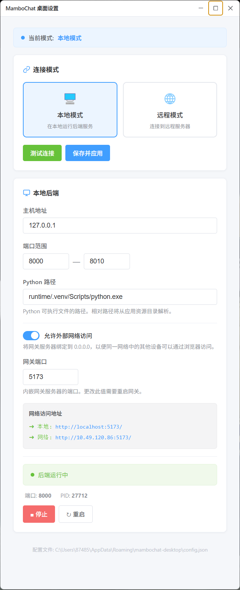
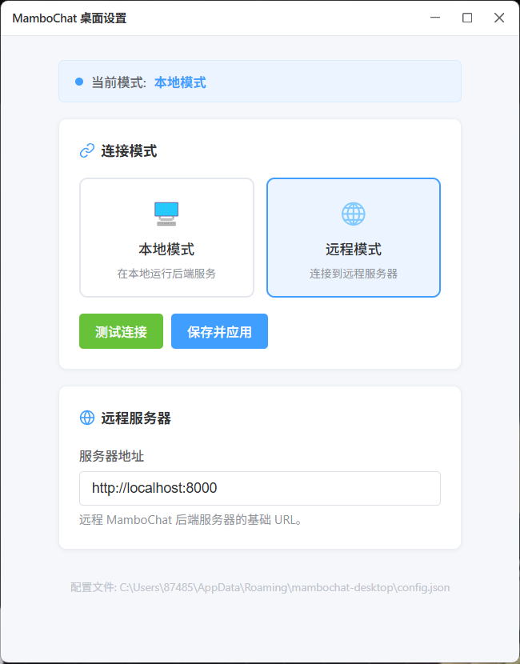

## 桌面端设置指南

MamboChat 桌面客户端提供了独立的设置窗口，用于管理运行模式、后端服务等配置。下面将介绍如何使用各项功能。

---

### 打开设置窗口

你可以在应用主界面的托盘菜单中打开它。

> **首次启动提示**：第一次启动本地模式时，系统需要解压内嵌的 Python 运行时环境（约数百 MB），该过程可能需要几分钟时间，请耐心等待。解压完成后，后续启动将直接使用已解压的环境，不再重复此过程。

---

### 1. 选择运行模式

页面顶部会显示当前使用的运行模式，提供两种选择：

| 模式 | 说明 |
|------|------|
| **本地模式** | 使用内嵌的 Python 环境，在本机自动启动后端服务。数据存储在本地，无需额外安装任何东西，开箱即用 |
| **远程模式** | 连接到远程服务器上已运行的 MamboChat 后端。适用于多设备共享或服务器部署场景 |

---

### 2. 本地模式配置

选择"本地模式"后，你可以配置以下选项：

**基本设置**

- **Host（地址）**：后端监听地址，默认为 `127.0.0.1`（仅本机访问）
- **端口范围**：默认 `8000 — 8010`。如果起始端口被占用，系统会自动尝试下一个端口
- **Python 路径**：内嵌 Python 解释器的路径，通常无需修改

**外部访问（可选）**

如果你希望局域网内的其他设备也能访问你的 MamboChat，可以开启"允许外部访问"：

- 开启后，后端和前端网关将绑定到 `0.0.0.0`
- 页面会显示当前机器的局域网地址，其他设备通过该地址即可访问
- 你还可以自定义网关端口（默认 `5173`）

> **安全提示**：开启外部访问后，同一网络内的设备都可以访问你的 MamboChat 实例，请确保你处于可信的网络环境中。

---

### 3. 远程模式配置

选择"远程模式"后，只需填写一项：

- **服务器 URL**：远程后端的完整地址，格式为 `http://<IP 或域名>:<端口>`，例如 `http://192.168.1.100:8000`

填写完成后，可以点击 **测试连接** 按钮，验证该地址是否可达。

---

### 4. 后端服务管理（本地模式）

在本地模式下，页面下方提供了后端进程的管理功能：

| 状态 | 说明 |
|------|------|
| ● 运行中 | 后端正常运行中，显示实际端口号和进程 ID |
| ○ 已停止 | 后端未运行 |
| ● 启动中... | 正在启动过程中，请稍候 |
| ● 错误 | 启动或运行时出错，会显示具体错误信息 |

**控制按钮说明：**

- **▶ 启动**：使用当前配置启动后端服务
- **■ 停止**：停止正在运行的后端服务
- **↻ 重启**：停止后重新启动（修改配置后建议使用此按钮使配置生效）

> 切换到远程模式时，本地后端会自动停止；切回本地模式时需要手动点击启动。

---

### 5. 保存配置

完成所有配置后，点击 **保存配置** 按钮，设置会被持久化保存，并根据需要自动重启后端或网关服务以使配置生效。
