# Mambo Agent 使用教程

Mambo Agent 是 MamboChat 的复杂功能型智能体，具备文件读写、命令执行、嵌套子智能体调用等能力，支持实时文件展示、AI 安全预审、长期记忆、对话自动压缩、资源版本快照等特性，可用于代码开发、远程服务器运维与复杂任务执行。

> 基础操作（服务商配置、会话使用、知识库等）见[使用教程](使用教程.md)。

## 1. 创建 Mambo Agent

(1) 进入配置页面的"Agent 管理"区域，Agent 以树形目录组织（支持文件夹分类），点击"新建 Agent"创建，类型选择 **Mambo Agent**。

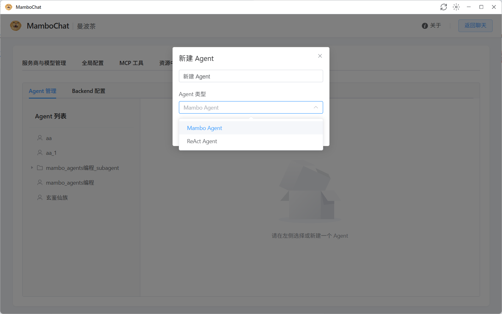

(2) 完成基础配置：绑定模型、配置系统提示词、挂载资源 / MCP 工具 / 子智能体 / Backend 等。  
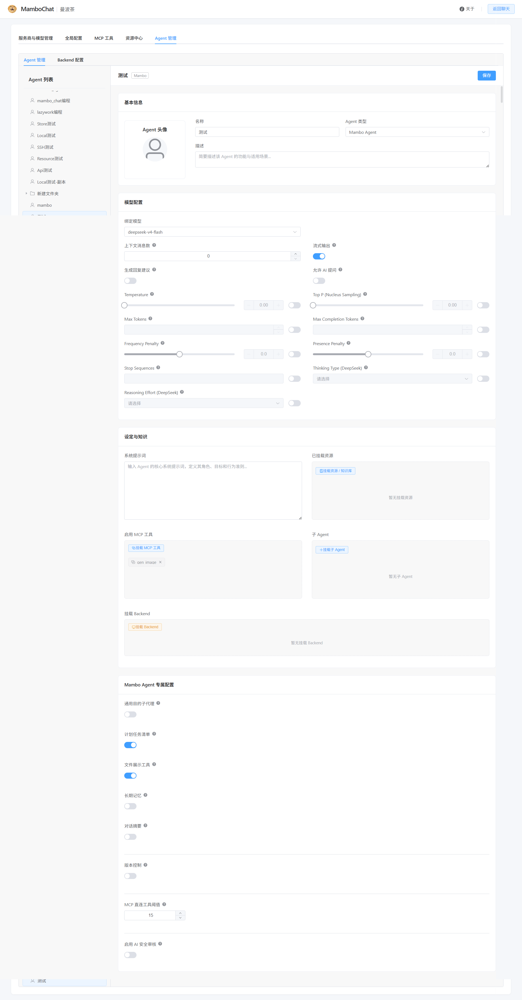

## 2. Mambo Agent 专属配置

Mambo Agent 提供以下专属能力（均可在编辑器中按需启用）：

- **通用目的子代理**：启用后可调用通用子代理协助完成任务
- **计划任务清单**：多步骤任务使用结构化计划；开启对话压缩后，即使对话被压缩，进行中的计划也不会丢失
- **文件展示工具（show）**：默认开启，AI 读取文件/图片时可实时展示给你看
- **长期记忆**：可挂载一个资源文件作为专属记忆资源，AI 能记住长期偏好，并把新学到的内容写回记忆
- **对话摘要（自动压缩）**：按触发条件（比例 / Token 数 / 消息数）自动摘要历史对话，可配置保留消息数量，并支持将摘要持久化到 Backend
- **版本控制**：AI 每次写入 / 修改 / 删除文件自动保留版本，随时可回滚
- **MCP 直连工具阈值**：默认 15，工具数量低于阈值时直接暴露给 AI，超过阈值时自动切换为按需查询模式
- **AI 安全审核**：可指定审核模型（留空复用主模型）与审核范围，AI 先预审工具调用，仅危险操作需要你确认；支持自定义审核提示词
- **任务循环**：让 Agent 围绕目标自动多轮执行，直到目标完成、完成条件全部满足或达到轮数上限；支持"交给 AI 自己规划"与"按我的规则执行"两种模式（详见第 10 节）

## 3. 导入导出 Agent

- **导出**：在 Agent 树上右键选择"导出"，可将该 Agent（含子智能体及其依赖的模型、资源、MCP、后端配置）打包为 `.mamboagent` 文件，方便分享与迁移  
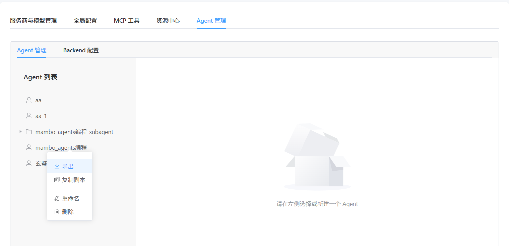  
- **导入**：选择 `.mamboagent` 文件，按向导完成预检与导入（可预览改名建议、缺失 API Key 提示等）  
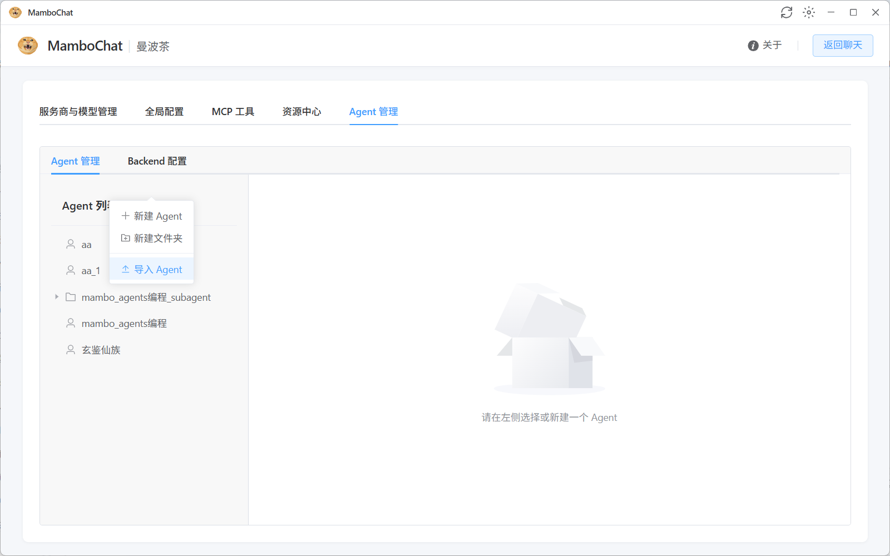  

## 4. 使用 Mambo Agent

在新建会话时直接关联 Agent。启用后，该会话的所有对话将由 Agent 驱动，自动调用工具完成复杂任务；工具调用过程以气泡形式展示，子智能体执行过程可在"子代理追踪"面板实时查看；启用版本控制的 Agent，会在聊天工具栏出现"版本历史"按钮。
### 进行聊天
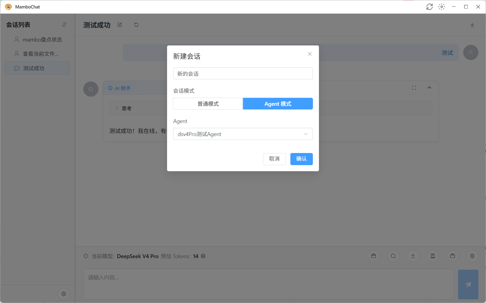

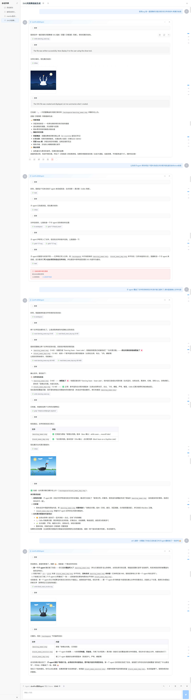

### 分派子智能体任务时，可观察 subagent（task 工具）的具体行为
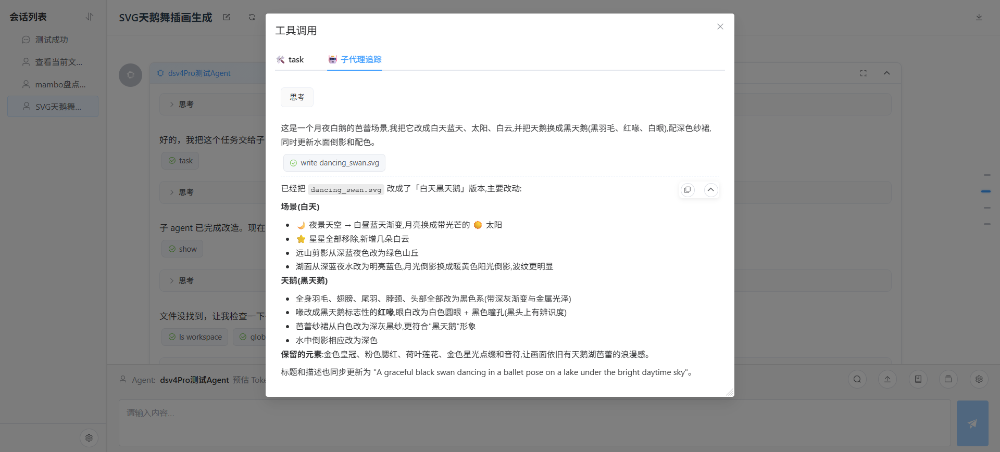

### 文件变更有备份，可主动回滚
Agent 若启用版本控制功能，可手动回滚修改至任意消息阶段。  

## 5. Backend 配置

Backend 为 Mambo Agent 提供可操作的目标环境（远程服务器、本地电脑、资源目录等），支持文件读写与命令执行。共有四种类型：

| 类型 | 说明 | 适用场景                                |
|---|---|-------------------------------------|
| **SSH** | 通过 SSH/SFTP 连接远程 Linux 服务器 | 远程服务器运维                             |
| **API** | 桌面客户端内置，通过 WebSocket 反向连接服务器 | 操作本地电脑文件、无公网 IP 的环境                 |
| **Resource** | 基于资源中心 folder 类型资源的虚拟文件系统 | 需要安全、直观的文件操作环境，如用于角色扮演中的设定文件的底层文件系统 |
| **Local** | 直接操作部署本机的目标文件目录 | 本地开发调试                              |

各类型均可配置编辑白名单/黑名单（虚拟路径前缀，二者互斥）限制 Agent 可操作的目录范围；SSH / API / Local 类型还可配置"Execute 命令执行"开关（启用 / 需审核）。

### SSH Backend — 连接远程服务器

(1) 在配置页面的"Backend 管理"中新增 SSH 类型 Backend，填写连接信息：主机地址、端口、用户名、认证方式（密码或密钥，密码留空则使用系统公钥免密登录）。可点击"查看系统公钥"一键复制系统公钥，配置到服务器即可免密连接。

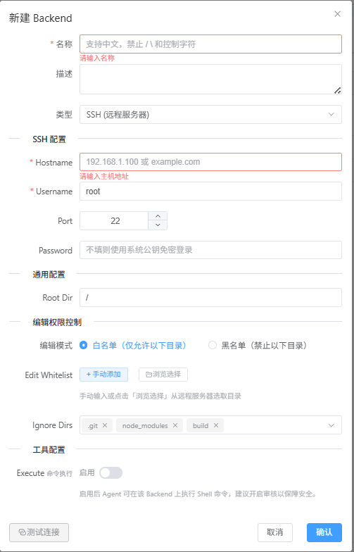

(2) 测试连接成功后，将该 Backend 关联到 Agent 即可使用。Agent 将通过 SFTP/SSH 远程读写文件、执行命令、浏览目录结构。

### API Backend — 桌面客户端反向连接

如果希望 Agent 操作你本地电脑的文件，或者你的机器没有公网 IP，可以使用 API Backend 模式——该功能已内置于**桌面客户端**：

(1) 在桌面客户端中选择远程模式并完成 API Client 注册，客户端将通过 WebSocket 主动连接服务器，可穿透 NAT。  
- 注册到远端并连接  
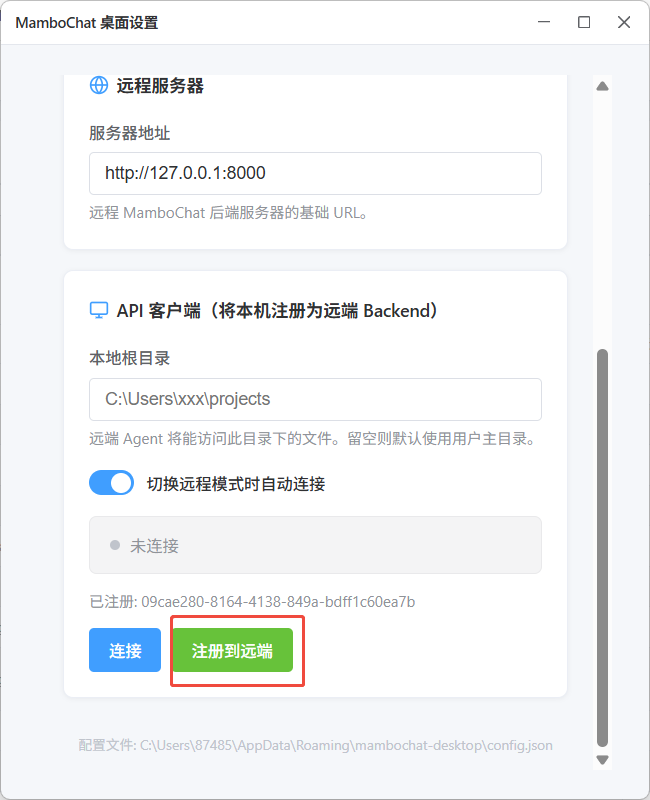  
- 远端 Backend 配置页面新增一个 API Backend 实例   
  
(2) 连接成功后，将生成的 API Backend 挂载到 Mambo Agent 中，即可像操作远程服务器一样操作你本地的文件系统。
> 请确保远端服务可信后进行注册

### Resource Backend — 资源虚拟文件系统
在 Backend 管理中新增 Resource 类型 Backend，选择资源中心的 folder 类型资源，其内容将映射为虚拟文件系统供 Agent 操作。
> **注意**：此 Backend 没有 execute 工具

### Local Backend — 本地文件系统

在 Backend 管理中新增 Local 类型 Backend，指定本机目标目录（root dir），Agent 可直接读写该目录并执行命令。

> **注意**：Local Backend 直接访问服务器本机文件系统，不合规操作可能导致平台 Web 服务崩溃，请谨慎使用。

### 挂载逻辑  
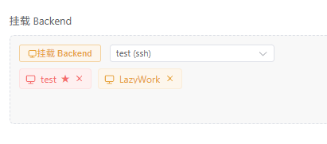  
一个 Agent 可以同时挂载多个 Backend，它们会按以下方式呈现给 AI：

- **默认 Backend**：AI 的主工作目录是 `/workspace`，它映射到默认 Backend 指向的真实位置（如远程服务器的某个目录、你本地电脑的某个目录等）。AI 平时读写文件、执行命令都发生在这里。
- **其他 Backend**：每个按名称挂载为一个独立目录 `/.mambo/<后端名称>/`，AI 可以像切换文件夹一样访问它们。例如你挂载了"服务器A"和"服务器B"两个 SSH Backend，默认是服务器A，那么服务器B就在 `/.mambo/服务器B/` 下。
- **`/.mambo` 本身**：一个虚拟的临时草稿区，不映射任何真实文件，AI 用它存放中间文件、临时结果，无需你关注。
- **Skills**：挂载的技能包会出现在 `/.mambo/skills/` 下，AI 会自动读取并使用其中的技能说明，无需你手动管理。

如果**没有设置默认 Backend**，系统会自动把第一个挂载的 Backend 作为主工作目录；如果**一个 Backend 都没挂载**，AI 仍可在 `/workspace` 和 `/.mambo` 下读写文件，但这些文件只保存在平台的虚拟存储中（按会话隔离），不映射任何真实文件系统，AI 无法操作你的电脑或服务器。

## 6. Tab 补全

当会话为 Agent 模式且 Agent 挂载了 Resource Backend 时，输入框（Monaco 编辑器）会在输入过程中自动弹出补全建议：以 `/` 开头的路径补全，以及基于挂载资源的"内容续写"；也可以按 Tab 键强制打开补全。普通文本框与移动端不支持此功能。
> 此功能在"角色扮演"需求时，用于输入设定名称，指定设定文件位置尤为有效。  
> 如果有常用句式，亦可写入到 Resource 页面，并挂载 Resource Backend 到 Agent 中，以方便输入。  
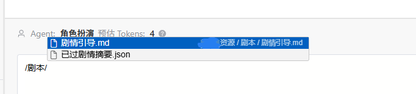

## 7. show 工具（实时文件展示）

show 是 Mambo Agent 的内置展示工具（默认开启，可在"专属配置"中关闭），用于把文件（文本、图片等）实时展示在聊天界面中。当 AI 读取或生成了文件，调用 show 后文件会以消息卡片的形式出现在对话里，方便你直观查看。

### 工具参数

| 参数 | 说明 |
|---|---|
| `path` | 文件的虚拟路径，例如 `/workspace/image.png` |
| `mode` | 展示模式（见下表），默认 `Normal` |
| `wait_timeout` | 文件尚未生成完成时最多等待的秒数（10~600，每 3 秒轮询一次）；设为 `0` 表示文件不存在则立即失败 |

展示模式：

| 模式 | 说明 |
|---|---|
| `Normal` | 默认，以普通文件卡片内联展示 |
| `Mini_Avatar` | 将图片作为该条消息的 AI 头像 |
| `Gal_Avatar` | 将图片固定在消息区左侧（立绘），AI 消息自动右移避让 |
| `Group` | 连续的多张图片分组展示，可置顶其中一张 |
| `Spark` | 隐藏其他内容（文本/思考/工具），只展示以 Spark / Group 模式展示的图片文件 |

### 引导 LLM 使用 show 工具
1. 比如说让 Agent 在文件系统中输出一段小说文本，那么我们就可以让他直接展示在页面上，比起让 Agent 同时打印在页面上，节省了输出一份文件内容的 token 和等待时间。
2. 如果需要更有沉浸感，可以让 LLM 调用 show 时，配置为 Spark 模式，如此在生成完毕后不会显示 Agent Loop 过程。
3. 如果需要更更有沉浸感，对于角色表情，可预存在 Backend 中，在 skills 中要求 Agent 每次对话都调用 show Gal_Avatar 模式，此时人物立绘将出现在左侧。
4. 对于生图需求，我们有 `wait_timeout` 参数，可以在 skills 中要求 Agent 调用 MCP 异步生图工具（如 ComfyUI）后，用 show 工具异步等待图片生成完成，这样就不需要阻塞等待生图工具返回。

GAL 模式示例：  

## 8. MCP 直连工具阈值（按需查询）

"MCP 直连工具阈值"（默认 15）控制 MCP 工具的暴露方式：挂载的 MCP 工具总数**低于或等于阈值**时，所有工具直接暴露给 AI，模型可像普通工具一样直接调用（工具名为 `服务器名__工具名`，如 `filesystem__read_file`）；**超过阈值**时，为避免大量工具撑爆提示词，系统自动切换为"按需查询"模式，只向 AI 提供两个 meta-tool（元工具，即用于查询和调用其他工具的工具）。

### 按需查询模式的两个工具

| 工具 | 作用 | 参数 |
|---|---|---|
| `mcp_get_tool_description` | 查询一个或多个 MCP 工具的完整参数 Schema（纯内存查询，无需连接服务器） | `tool_requests`：`[[server_name, tool_name], ...]` |
| `mcp_call_tool` | 执行指定 MCP 服务器上的工具（每次调用临时建立连接 → 执行 → 断开） | `server_name`、`tool_name`、`arguments`（JSON 对象） |

### 工作流程

按需查询模式下，系统会在提示词中注入可用 MCP 服务器与工具清单（名称与描述），AI 按以下流程使用工具：

1. 先用 `mcp_get_tool_description` 查询感兴趣工具的完整参数 Schema
2. 根据返回的 Schema 构造正确的参数
3. 调用 `mcp_call_tool` 执行

例如 AI 需要调用 `filesystem` 服务器上的 `read_file` 工具时，会先查询 `[["filesystem", "read_file"]]`，再以 `server_name="filesystem"`、`tool_name="read_file"`、`arguments={...}` 执行调用。

### 注意事项

- 阈值在 Agent 编辑器的"MCP 直连工具阈值"中配置，数值越低越倾向于按需查询模式
- 按需查询模式下每次 `mcp_call_tool` 都会建立临时连接，响应速度略慢于直接模式
- 连接失败的 MCP 服务器会标记为 unavailable 并给出原因，不会中断 Agent 运行
- 无论处于哪种模式，AI 安全审核与 HITL（人工介入）配置中的工具名保持一致（`服务器名__工具名`），无需关心当前模式

## 9. AI 安全审核

AI 安全审核（AI 安全预审）是 Mambo Agent 的安全机制：在需要人工确认的工具执行前，先由指定的审核模型对工具调用进行安全预审，只有被判定为危险的调用才会弹窗请你确认，低风险操作自动放行，减少人工打断。

### 配置

在 Mambo Agent 编辑器的"专属配置"中启用"AI 安全审核"：

| 配置项 | 说明 |
|---|---|
| **审核模型** | 指定用于预审的模型，留空则复用 Agent 主模型 |
| **审核范围** | 选择纳入审核的工具（来源：已设为"需审核"的 MCP 工具 + Backend 中开启"需审核"的 Execute 命令执行），可多选 |
| **自定义审核提示词** | 自定义审核标准，留空使用内置默认提示词 |

> 审核范围中的工具需要先在 MCP 工具管理中将对应工具设为"需审核"（`require_review`），或在 Backend 配置中开启"Execute 命令执行 - 需审核"。

### 工作流程

1. AI 发起一个属于"审核范围"的工具调用
2. 审核模型对该调用进行安全预审，输出结构化结论：是否安全、风险等级（low / medium / high / critical）与原因
3. **通过**：工具自动执行，消息上显示 🛡️ 通过徽标，无需打扰你
4. **未通过**：暂停执行，弹出人工审核窗口（🛡️ 未通过），你可以选择"同意调用 / 修改并同意 / 拒绝调用"；审核失败（如审核模型不可用）也会按未通过处理，升级为人工审核

### 内置审核标准（默认提示词要点）

- **通常安全**：读取文件、列目录、项目内搜索、在项目工作区内写入/编辑文件、非破坏性 git 操作（status / diff / log）、只读系统查询
- **通常危险**：删除文件或目录、修改系统配置文件（/etc/*、注册表）、安装/卸载软件、修改系统服务或计划任务、访问或导出密钥等凭据、强制推送 git、修改工作区外的文件、向外部服务器发送数据
- **决策规则**：不确定时倾向于标记为不安全，交由你确认

### 建议

- 建议将删除、命令执行等高风险工具纳入"审核范围"，只读类工具可不纳入以减少打扰
- 自定义审核提示词可补充你的具体安全要求（例如禁止访问某个目录、禁止执行某类命令）

## 10. 任务循环 (Goal Loop)

任务循环让 Agent 围绕目标**自动多轮执行**，直到目标完成、完成条件全部满足或达到轮数上限，适合长程任务（如批量处理、持续监控、多步骤流水线）。在 Mambo Agent 编辑器的"专属配置"中启用"任务循环"。

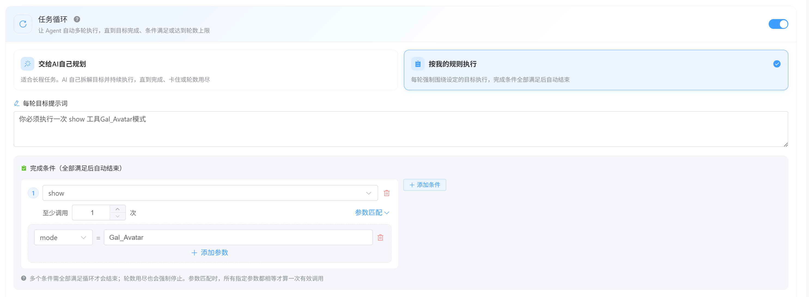

### 两种循环模式

| 模式 | 说明 | 适用场景 |
|---|---|---|
| **交给 AI 自己规划 (llm)** | AI 自己拆解目标并持续执行，直到完成、卡住或轮数用尽 | 长程任务，目标明确但步骤未知 |
| **按我的规则执行 (preset)** | 每轮强制围绕设定的目标执行，完成条件全部满足后自动结束 | 需要固定流程 / 验收标准的任务 |

### 交给 AI 自己规划 (llm)

- **最大执行轮数**：到达上限后自动停止，防止无限执行（默认 32）
- **卡住判定阈值**：AI 至少工作满设定轮数后，才允许宣告"卡住了"无法继续进行（默认 3）

### 按我的规则执行 (preset)

- **每轮目标提示词**：每轮都会注入给 AI 的目标，例如"每一轮先调用安全检查工具，再继续执行"
- **完成条件**：多个条件需**全部满足**循环才会结束；轮数用尽也会强制停止
    - **工具**：选择要统计的工具（MCP 工具为 `服务器名__工具名` 格式，如 `filesystem__read_file`；也可直接输入）
    - **至少调用次数**：该工具在当前轮内至少调用的次数
    - **参数匹配**（可选）：指定参数名与参数值，所有指定参数都相等才算一次有效调用

### 聊天中的轮次展示

任务循环执行时，聊天界面会按轮次显示分隔线（"第 X 轮 / 共 Y 轮"），方便观察 Agent 每一轮的目标与进展。

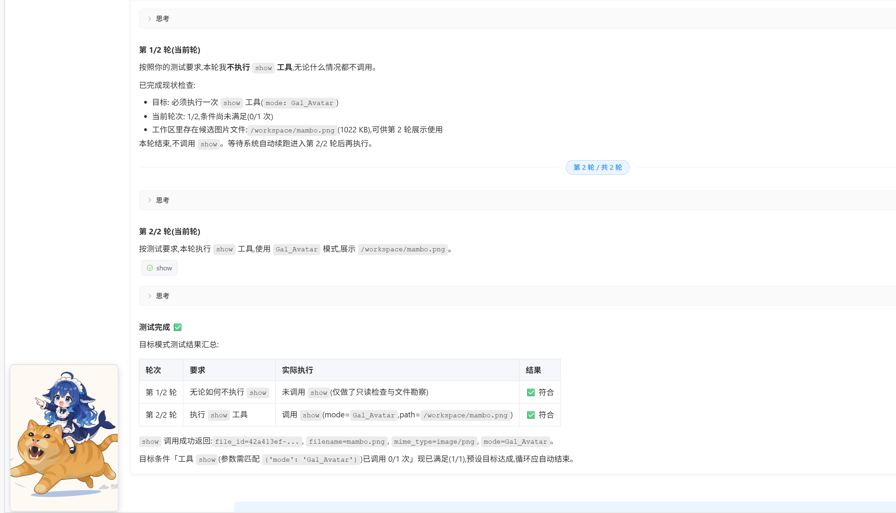

### 建议

- llm 模式适合探索性任务；preset 模式适合有明确验收标准的任务（例如"每轮先安全检查 → 执行 → 校验结果"）
- 轮数上限建议根据任务复杂度设置，避免无限执行消耗 Token
- 可与 AI 安全审核、版本控制等能力组合使用，让长程执行更安全
