# Mambo Agent Guide

Mambo Agent is MamboChat's complex functional agent. It supports file read/write, command execution, and nested sub-agent calls, with features such as real-time file display, AI safety pre-review, long-term memory, automatic conversation compression, and resource version snapshots — suitable for code development, remote server operations, and complex task execution.

> For basic operations (provider configuration, conversations, Knowledge Base, etc.), see the [Tutorial](Tutorial_EN.md).

## 1. Creating a Mambo Agent

(1) Go to the "Agent Management" area of the settings page — Agents are organized in a tree structure (folders supported). Click "New Agent" and select **Mambo Agent** as the type.

(2) Complete the basic configuration: bind a model, configure the System Prompt, and mount resources / MCP tools / sub-agents / Backends, etc.  
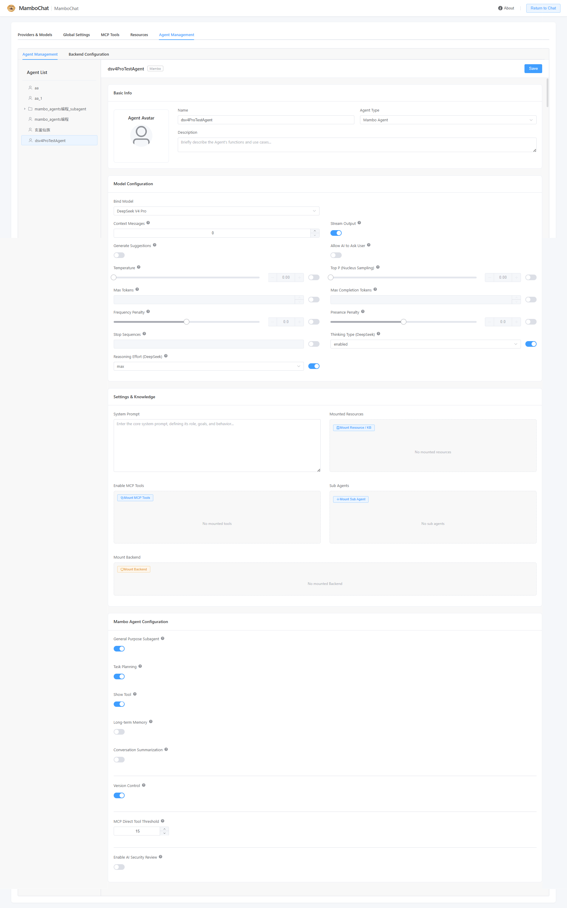

## 2. Mambo Agent Exclusive Configuration

Mambo Agent offers the following exclusive capabilities (all can be enabled on demand in the editor):

- **General-purpose sub-agent**: when enabled, the agent can call a general-purpose sub-agent to assist with tasks
- **Planned task list**: structured plans for multi-step tasks; with conversation compression enabled, in-progress plans survive even if the conversation is compressed
- **File display tool (show)**: enabled by default; when the AI reads files/images, they are displayed to you in real time
- **Long-term memory**: mount a resource file as a dedicated memory resource; the AI remembers long-term preferences and writes newly learned content back to memory
- **Conversation summarization (auto-compression)**: automatically summarizes history based on trigger conditions (ratio / token count / message count); configurable retained message count, with optional persistence of summaries to a Backend
- **Version control**: the AI automatically keeps a version every time it writes / modifies / deletes files — rollback at any time
- **MCP direct tool threshold**: default 15; when the tool count is below the threshold, tools are exposed directly to the AI; above the threshold, it switches to on-demand query mode automatically
- **AI safety review**: specify a review model (leave empty to reuse the main model) and review scope; the AI pre-reviews tool calls first, and only dangerous operations require your confirmation; custom review prompts are supported

## 3. Importing/Exporting Agents

- **Export**: right-click the Agent in the tree and select "Export" to package the Agent (including sub-agents and their dependent models, resources, MCP, and Backend configuration) into a `.mamboagent` file for sharing and migration
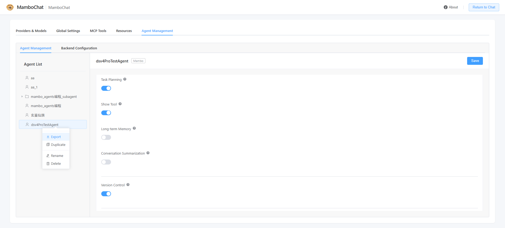
- **Import**: select a `.mamboagent` file and follow the wizard to pre-check and import (with rename suggestions for conflicts, missing API Key warnings, etc.)
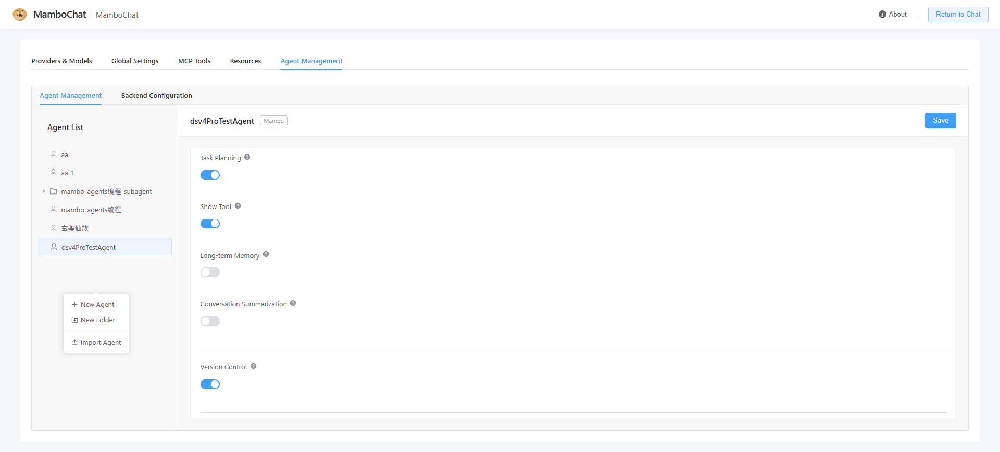

## 4. Using a Mambo Agent

Associate the Agent directly when creating a new chat. Once enabled, all conversations in that session are driven by the Agent, which automatically calls tools to complete complex tasks; tool calls are shown as bubbles, and sub-agent execution can be monitored in the "Sub-agent Trace" panel in real time. If the Agent has version control enabled, a "Version History" button appears in the chat toolbar.

### Chatting
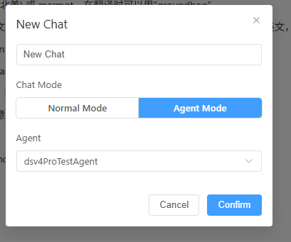
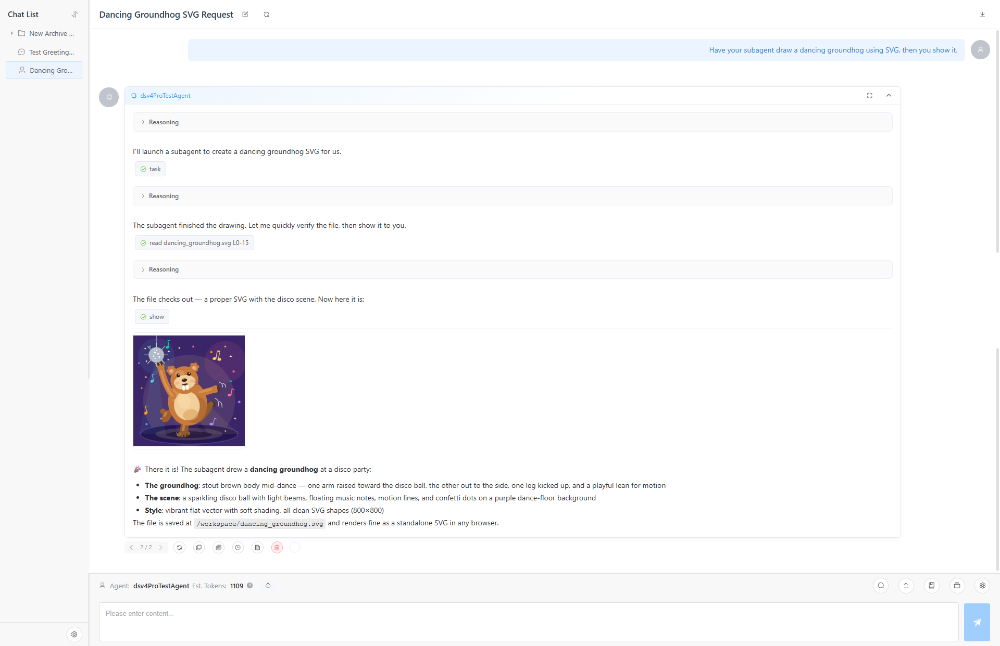

### When delegating sub-agent tasks, you can observe the specific behavior of the subagent (task tool)
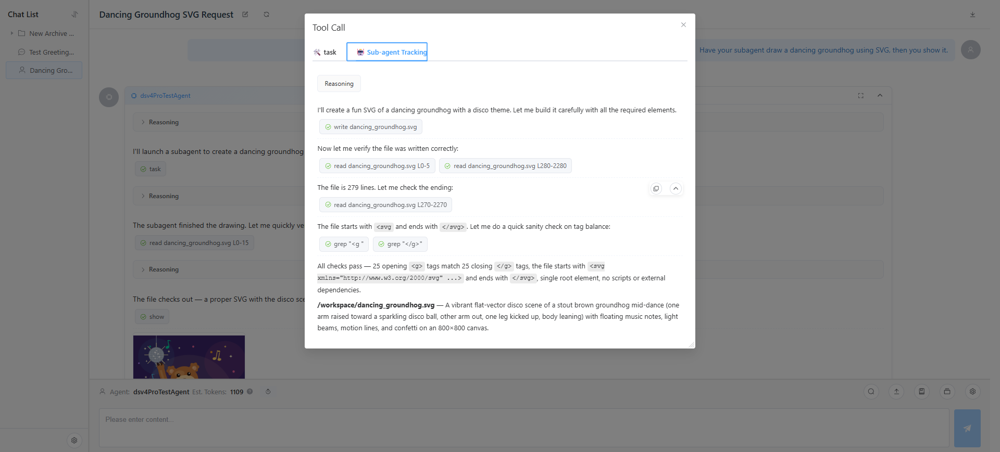

### File changes are backed up — rollback anytime
If the Agent has version control enabled, you can manually roll back changes to any message stage.  
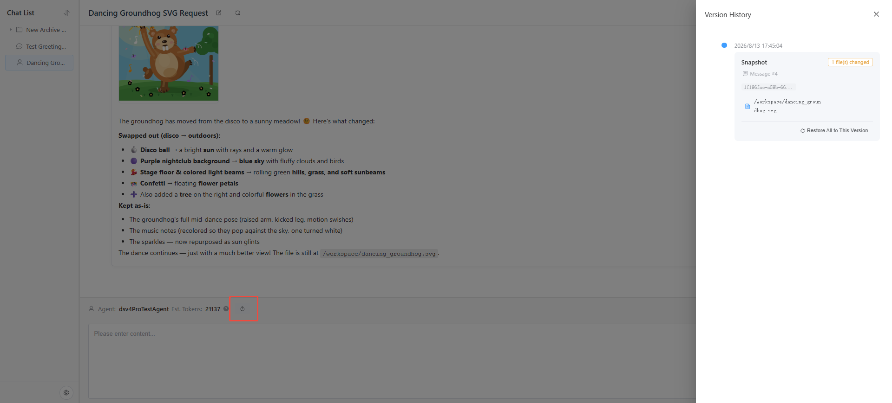

## 5. Backend Configuration

A Backend provides the target environment for the Mambo Agent to operate on (remote servers, your local machine, resource directories, etc.), supporting file read/write and command execution. There are four types:

| Type | Description | Use Cases |
|---|---|---|
| **SSH** | Connect to a remote Linux server via SSH/SFTP | Remote server operations |
| **API** | Built into the desktop client; reverse-connects to the server via WebSocket | Operating local machine files, environments without a public IP |
| **Resource** | A virtual file system based on folder-type resources in the Resource Center | Safe, intuitive file operations, e.g., as the underlying file system for setting files in role-playing |
| **Local** | Directly operates a target directory on the deployment machine | Local development and debugging |

Each type can be configured with an edit allowlist/denylist (virtual path prefixes, mutually exclusive) to restrict the directories the Agent can operate on; SSH / API / Local types can also configure the "Execute command execution" switch (enabled / requires review).

### SSH Backend — Connect to a Remote Server

(1) In the "Backend Management" area of the settings page, add an SSH-type Backend and fill in the connection info: host address, port, username, and authentication method (password or key; leave the password empty to use the system public key for passwordless login). Click "View System Public Key" to copy the system public key in one click and configure it on the server for passwordless connection.

(2) After the test connection succeeds, associate this Backend with the Agent. The Agent will remotely read/write files, execute commands, and browse directory structures via SFTP/SSH.

### API Backend — Desktop Client Reverse Connection

If you want the Agent to operate on your local machine's files, or your machine has no public IP, use the API Backend mode — this feature is built into the **desktop client**:

(1) In the desktop client, choose remote mode and complete API Client registration; the client actively connects to the server via WebSocket, penetrating NAT.
- Register to the remote and connect

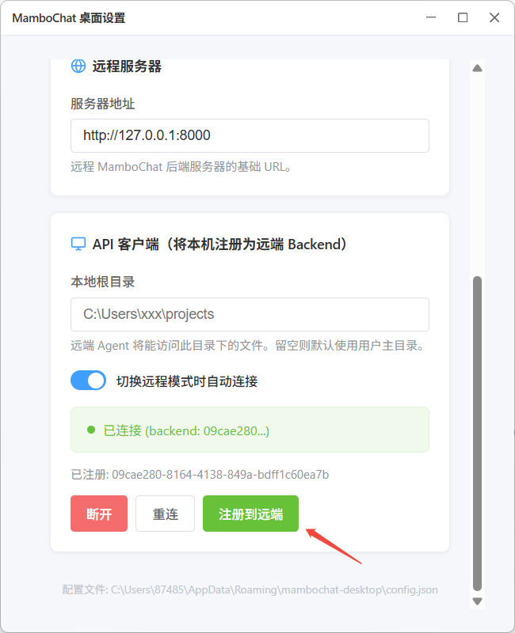
- Add a new API Backend instance on the remote Backend configuration page
  
(2) After connecting, mount the generated API Backend to the Mambo Agent, and you can operate your local file system like operating a remote server.
> Only register with trusted remote services.

### Resource Backend — Resource Virtual File System
In Backend Management, add a Resource-type Backend and select a folder-type resource from the Resource Center; its content is mapped to a virtual file system for the Agent to operate on.
> **Note**: this Backend has no execute tool.

### Local Backend — Local File System

In Backend Management, add a Local-type Backend and specify a target directory (root dir) on the machine; the Agent can directly read/write this directory and execute commands.

> **Note**: Local Backend directly accesses the server's local file system; non-compliant operations may crash the platform's Web service — use with caution.

### Mounting Logic
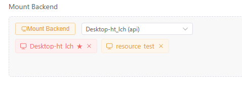  
An Agent can mount multiple Backends simultaneously. They are presented to the AI as follows:

- **Default Backend**: the AI's main working directory is `/workspace`, which maps to the real location the default Backend points to (e.g., a directory on a remote server or your local machine). The AI reads/writes files and executes commands here.
- **Other Backends**: each is mounted by name as an independent directory `/.mambo/<backend-name>/`, accessible like switching folders. For example, if you mount two SSH Backends "Server A" and "Server B" with Server A as the default, Server B lives under `/.mambo/Server B/`.
- **`/.mambo` itself**: a virtual temporary draft area that maps to no real files; the AI uses it for intermediate files and temporary results — no attention needed.
- **Skills**: mounted skill packs appear under `/.mambo/skills/`; the AI automatically reads and uses their instructions — no manual management needed.

If **no default Backend is set**, the system automatically uses the first mounted Backend as the main working directory; if **no Backend is mounted at all**, the AI can still read/write files under `/workspace` and `/.mambo`, but these files are only stored in the platform's virtual storage (isolated per session), mapping to no real file system — the AI cannot operate your computer or server.

## 6. Tab Completion

When the session is in Agent mode and the Agent has a Resource Backend mounted, the input box (Monaco Editor) automatically shows completion suggestions while typing: path completion for entries starting with `/`, and "content continuation" based on mounted resources. Pressing Tab also forces the completion to open. Plain text boxes and mobile are not supported.
> This feature is especially useful for "role-playing" scenarios, e.g., typing a setting name to point to a setting file.
> Frequently used phrases can also be written into a Resource page and mounted as a Resource Backend on the Agent for easy input.
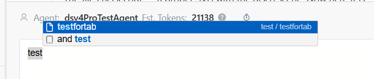

## 7. show Tool (Real-time File Display)

show is a built-in display tool of Mambo Agent (enabled by default; can be disabled in "Exclusive Configuration"). It displays files (text, images, etc.) in the chat interface in real time. When the AI reads or generates a file and calls show, the file appears in the conversation as a message card for convenient viewing.

### Tool Parameters

| Parameter | Description |
|---|---|
| `path` | The file's virtual path, e.g., `/workspace/image.png` |
| `mode` | Display mode (see below), default `Normal` |
| `wait_timeout` | Max seconds to wait for a file still being generated (10–600, polling every 3 seconds); `0` means fail immediately if the file does not exist |

Display modes:

| Mode | Description |
|---|---|
| `Normal` | Default; inline display as a normal file card |
| `Mini_Avatar` | Use the image as the AI avatar of that message |
| `Gal_Avatar` | Pin the image on the left of the message area (portrait); AI messages automatically shift right |
| `Group` | Group consecutive images; one can be pinned to the top |
| `Spark` | Hide other content (text/thinking/tools), showing only image files displayed in Spark / Group mode |

### Guiding the LLM to use the show tool
1. For example, ask the Agent to output a piece of novel text into the file system — it can display it directly on the page, saving the token cost and waiting time of printing the file content again.
2. For more immersion, configure the LLM to use Spark mode when calling show, so the Agent Loop process is not displayed after generation.
3. For even more immersion with character expressions, pre-store them in the Backend and require the Agent in skills to call show with Gal_Avatar mode in every conversation — the character portrait then appears on the left.
4. For image generation, use the `wait_timeout` parameter: in skills, require the Agent to call an async MCP image generation tool (e.g., ComfyUI) and then use show to wait asynchronously for the image — no need to block on the image tool's return.

GAL mode example:  
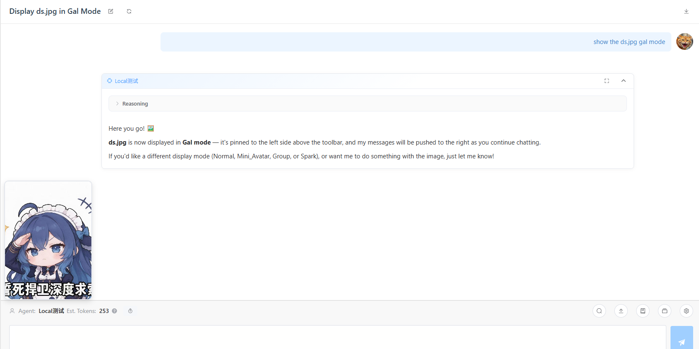

## 8. MCP Direct Tool Threshold (On-demand Query)

The "MCP Direct Tool Threshold" (default 15) controls how MCP tools are exposed: when the total number of mounted MCP tools is **at or below** the threshold, all tools are exposed directly to the AI, which can call them like normal tools (tool names are `server-name__tool-name`, e.g., `filesystem__read_file`); when **above** the threshold, to avoid blowing up the prompt with too many tools, the system automatically switches to "on-demand query" mode, providing only two meta-tools to the AI (meta-tools are tools used to query and call other tools).

### The two tools in on-demand query mode

| Tool | Purpose | Parameters |
|---|---|---|
| `mcp_get_tool_description` | Query the full parameter Schema of one or more MCP tools (pure in-memory query, no server connection needed) | `tool_requests`: `[[server_name, tool_name], ...]` |
| `mcp_call_tool` | Execute a tool on a specified MCP server (each call establishes a temporary connection → executes → disconnects) | `server_name`, `tool_name`, `arguments` (JSON object) |

### Workflow

In on-demand query mode, the system injects the available MCP servers and tool list (names and descriptions) into the prompt. The AI uses tools as follows:

1. First use `mcp_get_tool_description` to query the full parameter Schema of interesting tools
2. Construct correct arguments from the returned Schema
3. Call `mcp_call_tool` to execute

For example, when the AI needs to call `read_file` on the `filesystem` server, it first queries `[["filesystem", "read_file"]]`, then executes with `server_name="filesystem"`, `tool_name="read_file"`, `arguments={...}`.

### Notes

- The threshold is configured in the "MCP Direct Tool Threshold" field of the Agent editor; lower values favor on-demand query mode
- In on-demand query mode, every `mcp_call_tool` establishes a temporary connection, so responses are slightly slower than direct mode
- MCP servers that fail to connect are marked unavailable with a reason and do not interrupt Agent operation
- Regardless of mode, tool names in AI safety review and HITL (human intervention) configuration stay the same (`server-name__tool-name`), so you don't need to care about the current mode

## 9. AI Safety Review

AI safety review (AI safety pre-review) is a security mechanism of Mambo Agent: before a tool call requiring human confirmation, a designated review model pre-reviews the call for safety. Only calls judged dangerous pop up for your confirmation; low-risk operations pass automatically, reducing interruptions.

### Configuration

Enable "AI Safety Review" under "Exclusive Configuration" in the Mambo Agent editor:

| Config Item | Description |
|---|---|
| **Review model** | The model used for pre-review; leave empty to reuse the Agent's main model |
| **Review scope** | Select the tools to include in review (sources: MCP tools set to "requires review" + Backend Execute command execution with "requires review" enabled); multi-select |
| **Custom review prompt** | Custom review criteria; leave empty for the built-in default prompt |

> Tools in the review scope must first be set to "requires review" (`require_review`) in MCP tool management, or have "Execute command execution - requires review" enabled in Backend configuration.

### Workflow

1. The AI initiates a tool call within the review scope
2. The review model pre-reviews the call and outputs a structured conclusion: safe or not, risk level (low / medium / high / critical), and reason
3. **Passed**: the tool executes automatically, showing a 🛡️ passed badge — no interruption
4. **Failed**: execution pauses and a manual review window pops up (🛡️ failed); you can choose "Approve / Modify and approve / Reject"; review failures (e.g., review model unavailable) are also treated as failed and escalated to manual review

### Built-in review criteria (default prompt highlights)

- **Usually safe**: reading files, listing directories, searching within the project, writing/editing files in the project workspace, non-destructive git operations (status / diff / log), read-only system queries
- **Usually dangerous**: deleting files or directories, modifying system configuration files (/etc/*, registry), installing/uninstalling software, modifying system services or scheduled tasks, accessing or exporting credentials like keys, force-pushing git, modifying files outside the workspace, sending data to external servers
- **Decision rule**: when uncertain, lean toward marking unsafe and defer to your confirmation

### Recommendations

- Add high-risk tools such as deletion and command execution to the "review scope"; read-only tools can be excluded to reduce interruptions
- Custom review prompts can add your specific security requirements (e.g., forbid access to a directory, forbid certain command classes)
