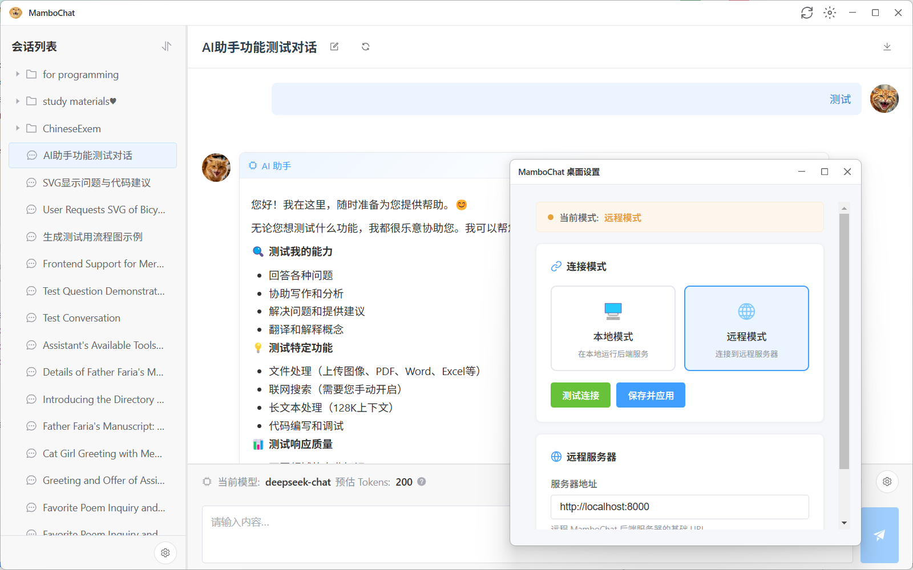

#  MamboChat


[](../docker-compose.yml)

**MamboChat** is an open-source web harness platform supporting Linux/Windows deployment. It integrates multiple service provider APIs for synchronized access from desktop and mobile browsers, stores data on the server so that configuration and conversation history are shared across devices, while also featuring vite coding and role-play capabilities.

[中文文档](../README.md) | [English Documentation](./README_EN.md)

## ✨ Core Features

**Feature Preview & Usage**: [User Guide](./Tutorial_EN.md)

*   **🤖 Multi-Model Aggregation**
    *   Support for multiple providers including OpenAI, Google, DeepSeek, etc. See [Verification Records](./CheckRecord_EN.md) for model compatibility.
    *   Custom API Host and proxy configuration.
    *   Automatic model capability detection (context length, vision, thinking mode) for hassle-free integration of Chinese models.
    *   Unified management for chat and embedding models.
    *   Model favorites and grouping.
*   **🤖 Mambo Agent**
    *   **Complex Task Execution**: Capable of reading/writing files, executing commands, nested sub-agent invocation, and performing remote server operations.
    *   **Real-time File Preview**: Files and images are displayed in real time as the AI reads them, with GalGame mode for image display.
    *   **AI Safety Pre-review**: Optionally designate a review model — only risky operations require manual confirmation. Review conditions are customizable.
    *   **Resource Version Snapshots**: Automatic versioning on file writes/edits/deletes, with rollback at any time.
    *   **Long-term Memory**: Mount a dedicated memory resource so the AI remembers long-term preferences and writes back newly learned content.
    *   **Auto Conversation Compression**: Chain summaries compress conversation history without losing in-progress plans.
    *   **Smart MCP Integration**: Tools are exposed directly when few; automatically switches to on-demand query mode when many.
    *   Agents can be equipped with resources, MCP tools, Skill packs, and collaborate with SSH / Local / Resource / API Backends.
*   **🔧 LLM Runtime Environments (Backend)**
    *   **SSH Backend**: Connect to remote Linux servers via SSH/SFTP, enabling the Agent to directly operate remote files and execute commands.
    *   **API Client/Backend**: Run a Windows client locally that connects back to the server via WebSocket, allowing a public Agent to operate your local machine from behind a NAT network.
    *   **Resource Backend**: Provides a virtual file system backed by the resource management page — intuitive and absolutely safe.
    *   **Local Backend**: Directly operate the target file directory where the deployment lives, with command execution and the built-in Mambo CLI.
*   **📚 Local Knowledge Base (RAG)**
    *   Upload documents in Markdown, TXT, PDF, Word, and other formats.
    *   Built-in file chunking, vector embedding, and semantic search (BM25 + vector retrieval + RRF).
    *   Dynamically mount knowledge bases during conversations. Multiple knowledge bases can be mounted simultaneously.
*   **🔌 MCP (Model Context Protocol) Support**
    *   Supports custom MCP servers (Stdio/SSE connections).
    *   Supports MCP tool review mode (Human-in-the-Loop), allowing manual confirmation before tool execution.
    *   Automatically switches tool exposure based on tool count thresholds (direct exposure when few, on-demand query when many).
*   **🛠️ Resource & Prompt Management**
    *   Unified management for System Prompts, Message Templates, and Skill packs.
    *   Version control and rollback for resources.
*   **📦 Skill Packs**
    *   Create and import Skills to extend Agent capabilities.
    *   Import from local files, ZIP archives, or GitHub repositories.
*   **💬 Robust Conversation Experience**
    *   Stream responses with Markdown and code highlighting, supporting mermaid and svg code block image rendering.
    *   **Multimodal Support**: Image/file upload and parsing. Support for image generation models.
    *   **Session Management**: Folder categorization, drag-and-drop sorting, search, and batch archiving.
    *   **Editor Mode**: Integrated Monaco Editor.
    *   **Message Branching**: Edit and regenerate messages while preserving the full edit history — conversations are never lost.
    *   **Conversation Copying**: Duplicate conversations (with optional truncation) to explore new directions from existing dialogues.
    *   **Session Import/Export**: Export conversations as JSON for backup, and re-import them anytime.
    *   **Context Compression**: Compresses conversation history to save tokens.
    *   **Web Search**: Toggle web search per session ("read-only" and "search + read" modes); network requests can go through a proxy.
    *   **Tab Completion**: Tab completion powered by the Resource Backend.
    *   **Message Log Viewer**: Intuitive request/response log viewer for a deeper understanding of Agent logic.
*   **⌨️ mambo CLI**
    *   The `mambo` CLI enables the LLM to manage providers/models, resources, Skills, MCP, and Agent configuration.
*   **⚙️ Global Personalization**
    *   Custom avatars for users and AI.
    *   Global proxy configuration.
*   **📱 Multi-Device Support**
    *   Full mobile interface with automatic adaptation for desktop and mobile browsers.
    *   Chinese and English language switching.

## 🚀 Quick Start (Docker)

Use the provided `docker-compose.yml` to launch the service instantly.

### Prerequisites
*   Docker Engine
*   Docker Compose

### Installation

1.  **Clone the Repository**
    ```bash
    git clone https://github.com/RAmenLch/mambochat.git
    cd mambochat
    ```

2.  **Start Services**
    ```bash
    docker compose up -d --build
    ```

3.  **Access the Application**
    Visit `http://localhost:24911` in your browser.

    *   **Persistence**:
        *   `./DB`: SQLite database files.
        *   `./uploads`: Uploaded files and avatars.

## 🚀 Quick Start (Windows Desktop Client)

MamboChat provides a Windows desktop client installer — just install it and you're ready to go, no manual Python setup required.

### Installation Steps

1. **Download the installer**
   Get the latest version from the [Releases](https://github.com/RAmenLch/mambochat/releases) page (`MamboChat-Setup-x.x.x.exe`).

2. **Run the installer**
   Double-click `MamboChat-Setup-1.3.0.exe` and follow the wizard (you can choose a custom install directory).

3. **Launch MamboChat**
   After installation, start MamboChat via the desktop shortcut or Start Menu.
   

4. **Desktop Client Settings**
   [Desktop Client Configuration Guide](./DesktopSettings_EN.md)

> The desktop client comes bundled with a complete Python runtime, frontend resources, backend code, and MCP Server — ready to use out of the box.
> All user data (databases, uploaded files, config files) is stored under `%APPDATA%/MamboChat/`.


## 💻 Local Development Guide

If you need to do secondary development, you can start the frontend and backend services separately.

### Backend

1.  Navigate to the backend directory:
    ```bash
    cd backend
    ```
2.  Install dependencies:
    ```bash
    uv pip install -r pyproject.toml
    ```
3.  Set environment variables and start:
    ```bash
    export PYTHONPATH=$PYTHONPATH:$(pwd)/..
    uvicorn backend.main:app --reload --port 8000
    ```

### Frontend

1.  Navigate to the frontend directory:
    ```bash
    cd frontend/mambo
    ```
2.  Install dependencies:
    ```bash
    npm install
    ```
3.  Start the development server:
    ```bash
    npm run dev
    ```

### Build Desktop Client from Source

1. **Prepare environment** (download Python/Node.js runtimes, install frontend/backend dependencies, build frontend):
   ```bash
   build_and_start.bat
   ```
   > This script will automatically initialize the environment and start services. Once both frontend and backend are running, close the two service windows.

2. **Configure environment variables**:
   Before running `npm` commands, make sure Node.js and npm are in your system `PATH`. If the `build_and_start.bat` script does not automatically add the downloaded Node.js to `PATH`, you need to manually add the `runtime/node` directory to your system environment variables; otherwise, subsequent `npm install` and related commands will fail.

3. **Build the desktop client**:
   ```bash
   cd desktop
   npm install
   npm run dist:win    # Outputs NSIS installer + portable edition to release/
   ```

## 🤝 Contributing

Contributions are welcome! Whether you have ideas, found a bug, or want to add a feature, feel free to submit a Pull Request or create an Issue.

## 👨‍💻 Roadmap
- [ ] Abstract key functionalities to support plugin capabilities
- [ ] Enhance Agent capabilities
- [ ] Build a role-playing plugin
- [ ] Ongoing bug fixes and optimizations.
