## 1. AI Model & Provider Configuration

### Configuring Providers and Models

(1) **Enter Settings**

Click the gear icon (configuration button) in the top-right corner to enter the system settings page.

<!-- TODO: Screenshot: Settings button and settings page -->
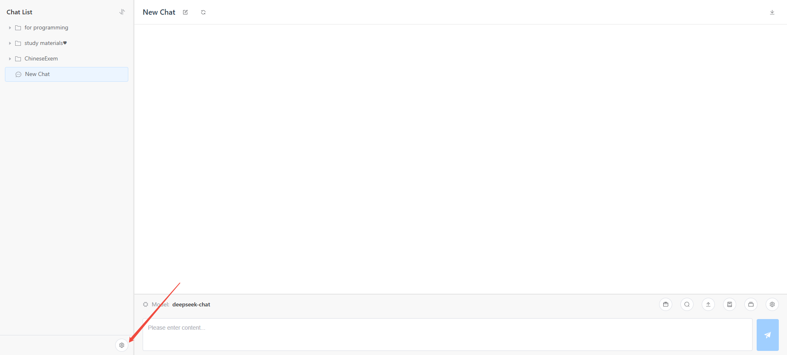

(2) **Add Provider**

In the "Provider Management" section, click "Add Provider", then fill in the provider name, API Host, API Key, and other information.

<!-- TODO: Screenshot: Add Provider form -->
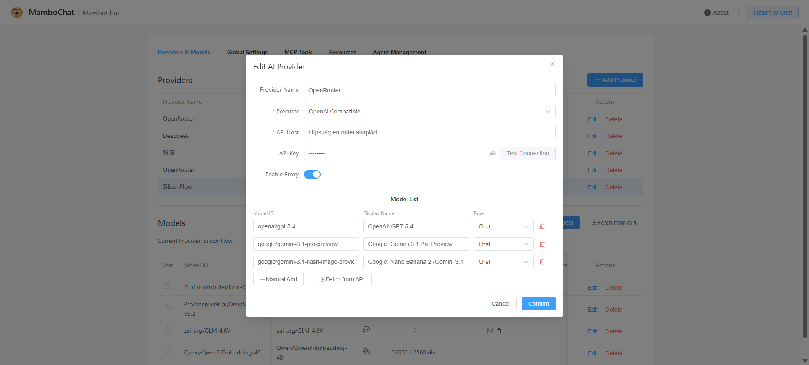

(3) **Configure Model Parameters** (Optional)

After creating a provider, you can further configure model parameters. OpenRouter's models API typically returns detailed information, so manual configuration is often unnecessary; for other platforms, it is recommended to configure parameters here or enable multimodal image input.

<!-- TODO: Screenshot: Model parameter configuration panel -->
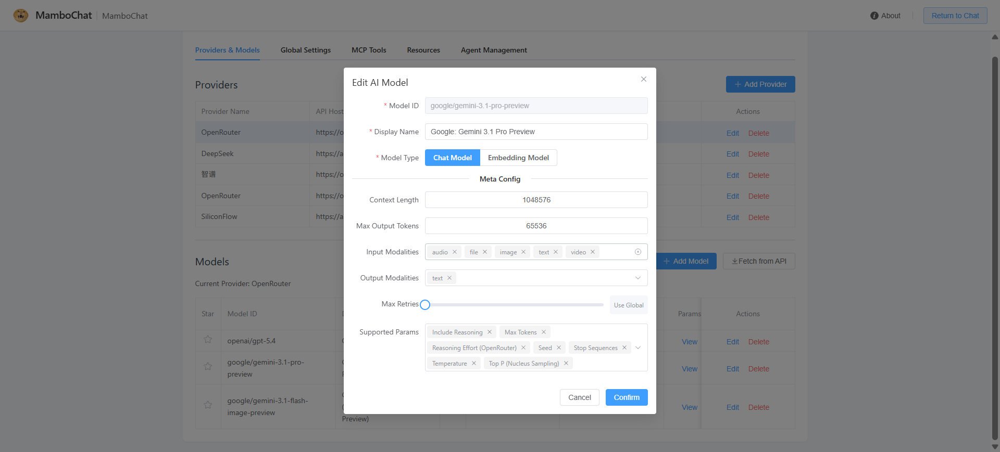

---

## 2. Conversations

### Basic Operations

(1) **New Chat**

Right-click in the left chat list and select "New Chat", or click the "+" button at the top of the chat list.

<!-- TODO: Screenshot: Creating a new chat -->
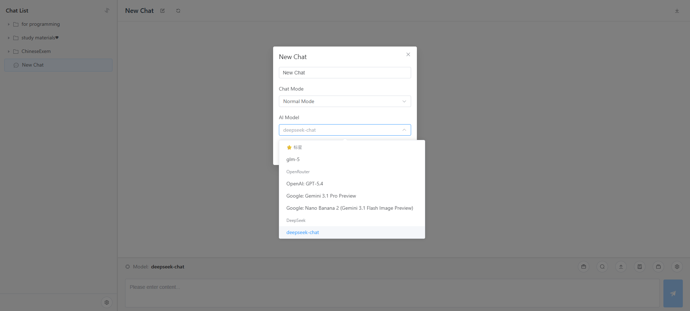

(2) **Chat Settings**

Click the settings icon next to the chat title. Here you can configure System Prompts, mount resources (Knowledge Base / Message Templates), enable MCP servers, and more.

<!-- TODO: Screenshot: Chat settings panel -->
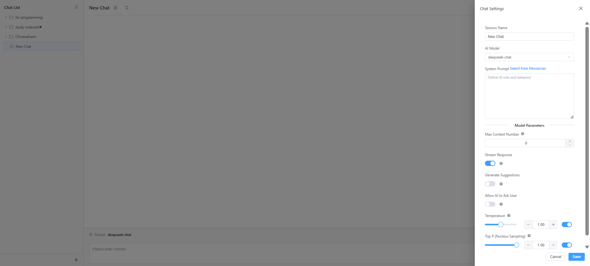

(3) **Folder Organization**

Right-click the chat list to create folders, then drag-and-drop chats into different folders for organized management.

<!-- TODO: Screenshot: Folder grouping with drag-and-drop -->
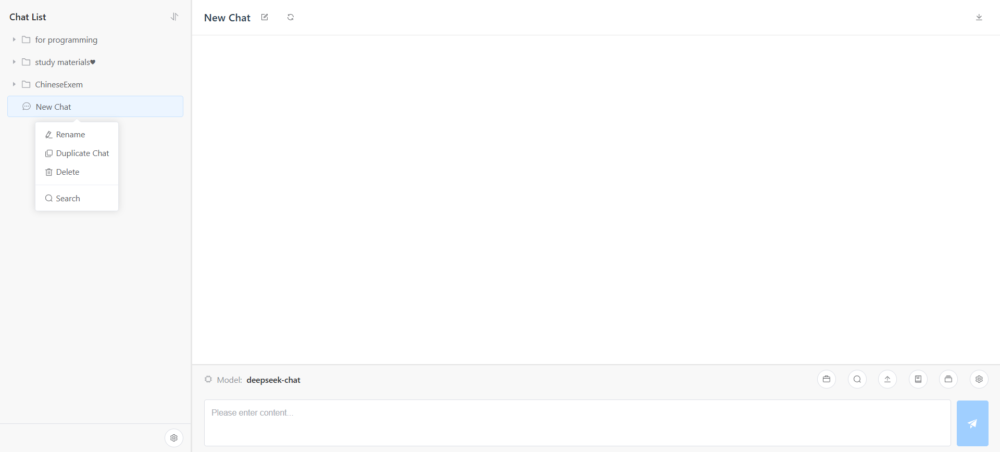

### Multimodal Conversations

(4) **Image Upload & Parsing**

Before sending images, ensure that the current model has enabled image input modality — set the input modality to include `image` in the model configuration. You can then upload images via the input area, and the AI will analyze them.

<!-- TODO: Screenshot: Image upload and AI image response -->
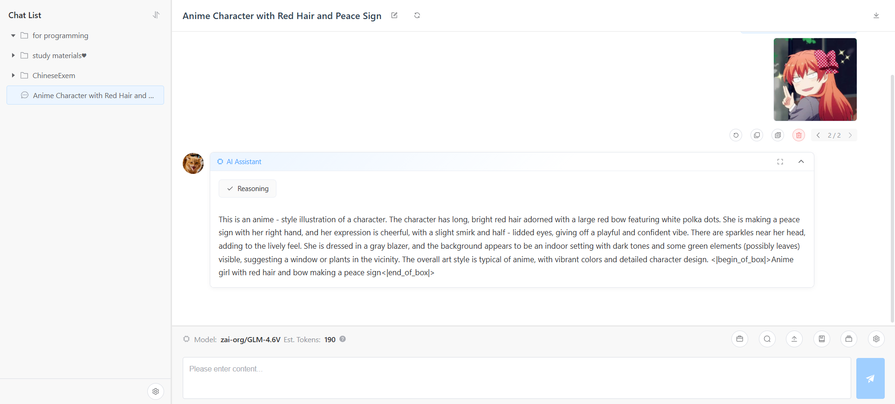

(5) **File Upload & Multimodal Output**

Supports uploading text files for the AI to read, as well as output from image generation models.

<!-- TODO: Screenshot: File upload and image output -->
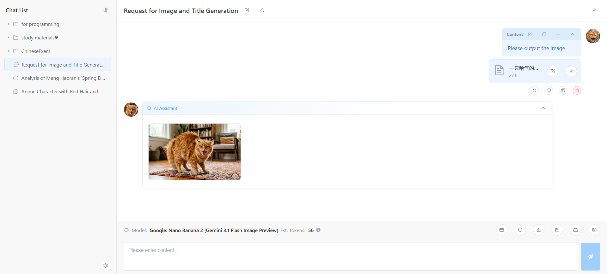

### Advanced Features

(6) **Message Branching**

When editing a message or regenerating a response, the system does not overwrite the original content but instead creates a new message branch. Use the branch toggle on the message to switch between versions — the full conversation history is preserved.

<!-- TODO: Screenshot: Switching message branches -->
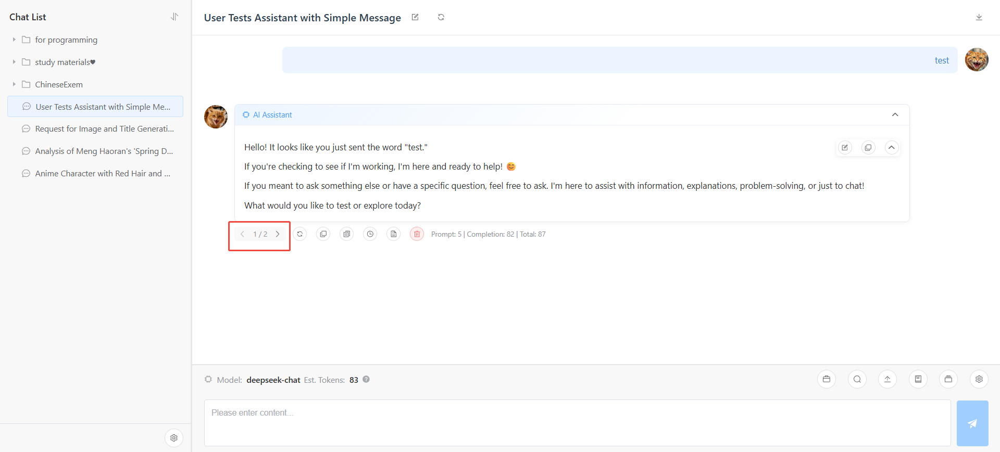

(7) **Context Compression**

When a conversation becomes too long, causing increased Token costs or attention dilution, use context compression. The compression prompt can be customized in global settings. Once triggered, the system automatically summarizes historical dialogue to free up context space.

<!-- TODO: Screenshot: Before and after context compression -->
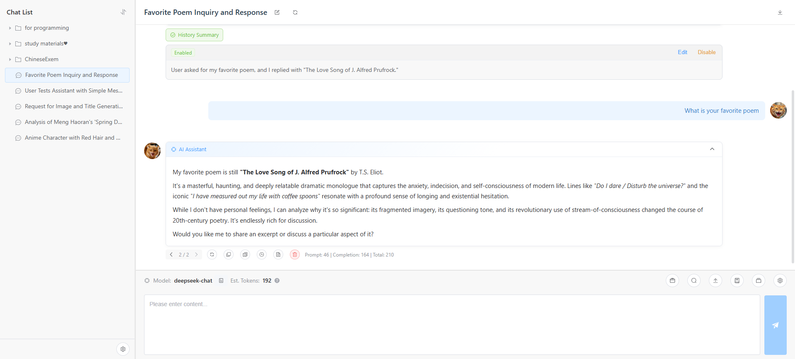

(8) **Conversation Copying & Archiving**

- **Copy Conversation**: Duplicate the current conversation up to a specified message, allowing new exploration based on existing dialogue.
- **Batch Archive**: Select multiple conversations and move them into a folder at once.

<!-- TODO: Screenshot: Conversation copy and batch archive -->


---

## 3. Global Settings

The global settings page manages system-level default parameters, including:

- Default model / Title generation model
- Default temperature, Top P, max retries, and other LLM parameters
- Global proxy address
- User avatar & AI avatar
- Editor preferences (Monaco Editor, etc.)
- Send message shortcut (Enter / Ctrl+Enter)
- Interface language (Chinese / English)

<!-- TODO: Screenshot: Global Settings - Basic settings -->


<!-- TODO: Screenshot: Global Settings - Avatar & advanced settings -->


---

## 4. Resource Library

### System Prompts

(1) **Create Resource**

Create a new System Prompt resource in the Resource Center, write its content, and save.

<!-- TODO: Screenshot: Creating a System Prompt resource -->
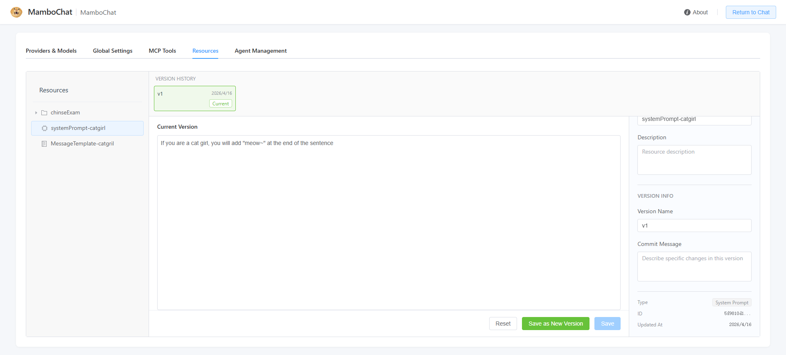

(2) **Mount Resource**

In chat settings, mount an existing System Prompt resource to the current session. This is especially convenient when your system prompts have complex logic that needs to be reused across multiple sessions.

<!-- TODO: Screenshot: Mounting a System Prompt resource -->
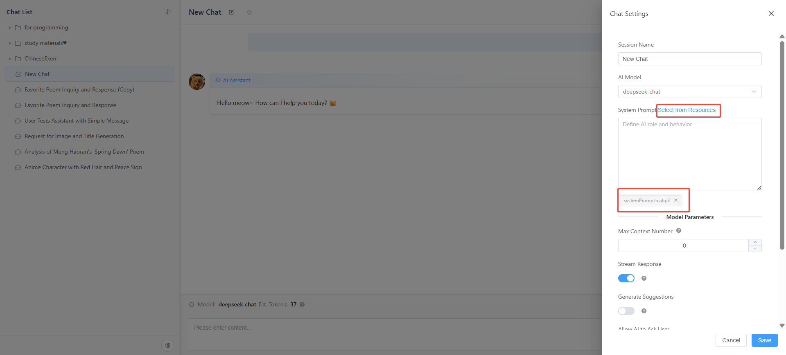

(3) **Version Control**

Resources support version management and rollback. Each modification saves as a new version, and you can revert to any previous version at any time.

<!-- TODO: Screenshot: Resource version management interface -->
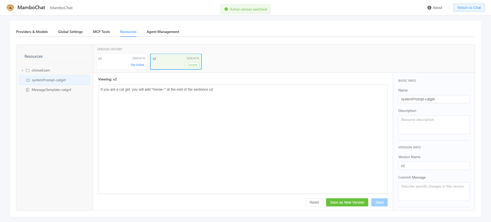

### Message Templates

A Message Template is a highly efficient, special type of System Prompt — it gets inserted into the latest user message, ensuring the model's attention is tightly focused on the template's content.

(1) **How It Works**

LLMs naturally focus on the beginning and end of context, while the middle tends to be overlooked. MamboChat's Message Templates place key settings in the latest message, and by setting "Participation Length" to 1, the template only takes effect for the current turn — avoiding history bloat while reinforcing specific settings.

(2) **Create & Mount**

Create a Message Template resource, then mount it above the input box in any chat session to activate it.

<!-- TODO: Screenshot: Mounting a Message Template -->
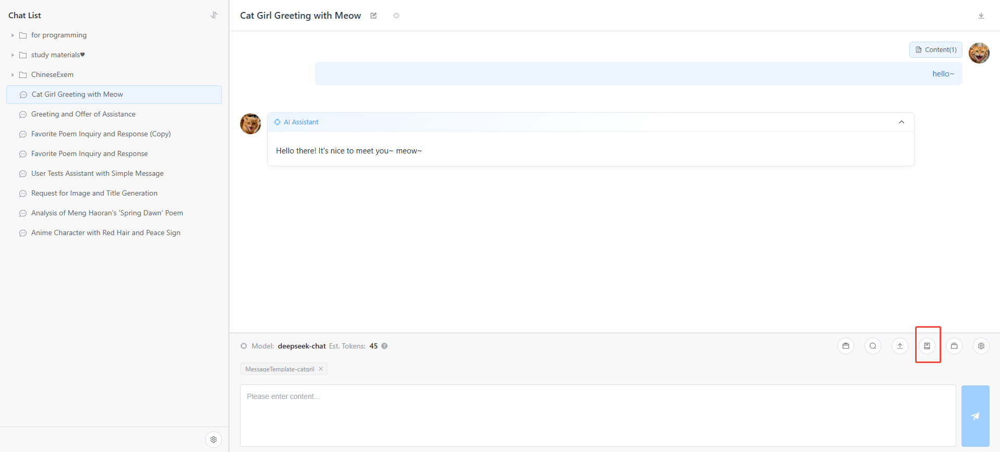

(3) **Flexible Usage**

Switch mounted templates dynamically during a conversation. For example, only mount a coding-related template when code output is needed, and unmount it for regular conversation.

<!-- TODO: Screenshot: Switching mounted Message Templates -->
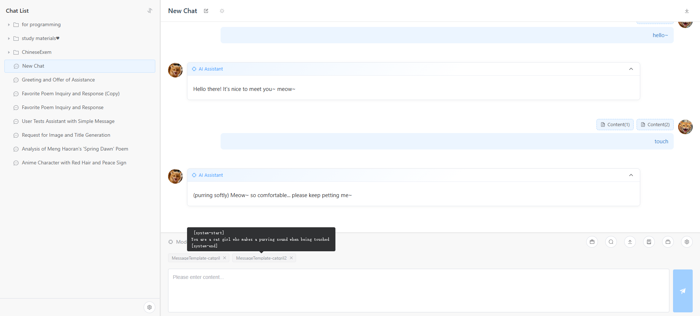

### Skill Packs

Skills are packages used to extend Agent capabilities — they define tools, prompts, and workflows.

(1) **Create Skill**

Create a new Skill-type resource in the Resource Center, and write a YAML configuration file defining the skill's behavior.

<!-- TODO: Screenshot: Creating a new Skill -->
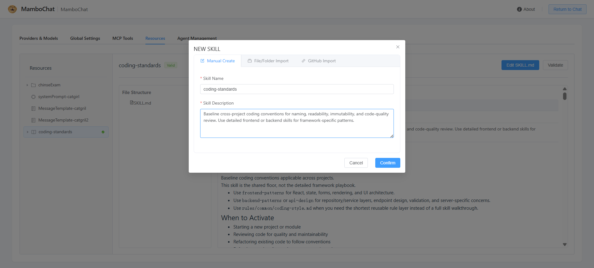

(2) **Import Skill**

Besides manual creation, Skills can be imported from:
- Local `.yaml` files
- ZIP archives
- GitHub repository URLs

<!-- TODO: Screenshot: Importing a Skill (ZIP/GitHub) -->


(3) **Mount to Agent**

Once created, attach the Skill in the Agent settings to let the Agent use it.

<!-- TODO: Screenshot: Mounting Skill to an Agent -->
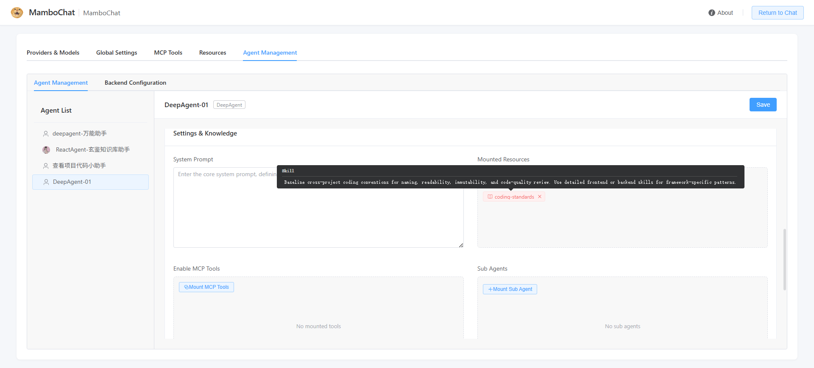

---

## 5. Knowledge Base

(1) **Configure Vector Model**

Before using the Knowledge Base for the first time, configure an Embedding vector model in global settings. For higher dimension support, modify `SUP_DIM` in `kb_service.py` and restart the service.

<!-- TODO: Screenshot: Vector model configuration -->
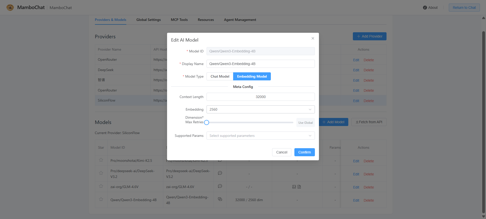

(2) **Create Knowledge Base & Upload Documents**

After creating a Knowledge Base, upload documents in Markdown, TXT, PDF, Word, or other supported formats.

<!-- TODO: Screenshot: Creating a Knowledge Base and uploading documents -->


(3) **Configure Chunking Strategy & Start Embedding**

Configure document chunking strategy (chunk size, overlap length, etc.), start the vectorization task, and wait for completion.

<!-- TODO: Screenshot: Chunking strategy config and embedding progress -->
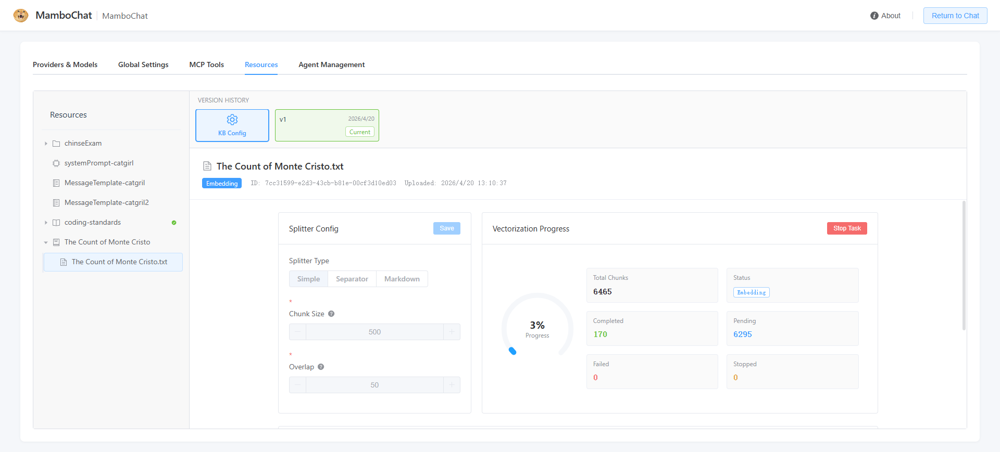

(4) **Verify Retrieval Results**

Use the retrieval test function to verify chunking quality. The system uses BM25 + Vector Search + RRF (Reciprocal Rank Fusion) hybrid retrieval, balancing keyword matching and semantic similarity.

<!-- TODO: Screenshot: Retrieval test results -->
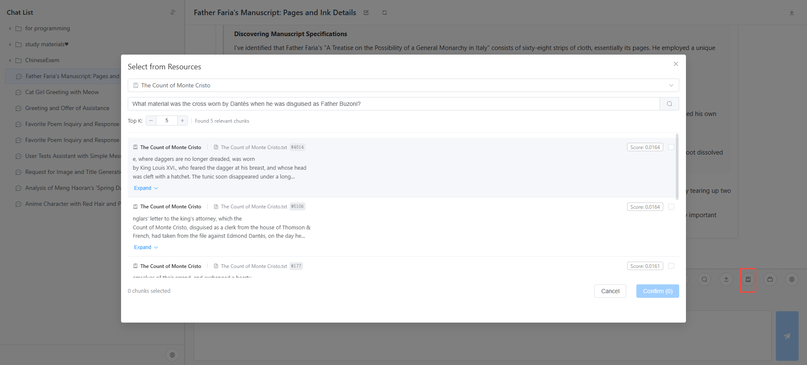

(5) **AI Auto-Retrieval** (Recommended)

No need to manually search — simply mount the Knowledge Base to your chat session. The AI assistant will automatically call the Knowledge Base when needed and generate answers. Multiple Knowledge Bases can be mounted simultaneously.

<!-- TODO: Screenshot: Mounting Knowledge Base in a chat -->
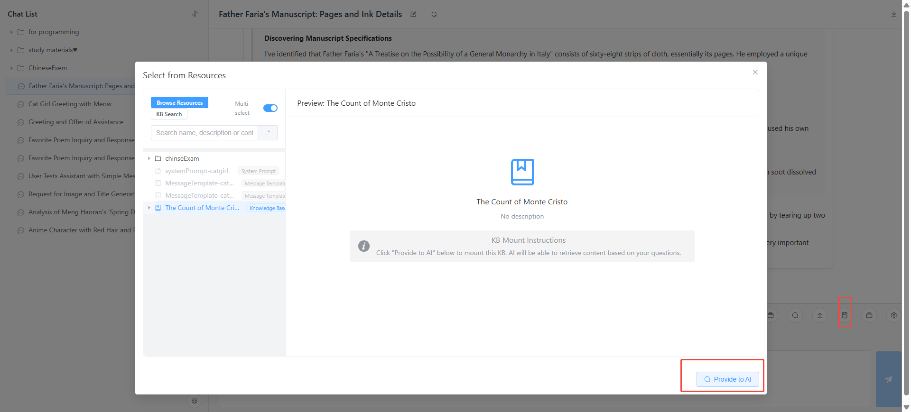

<!-- TODO: Screenshot: AI auto-retrieving from Knowledge Base and responding -->
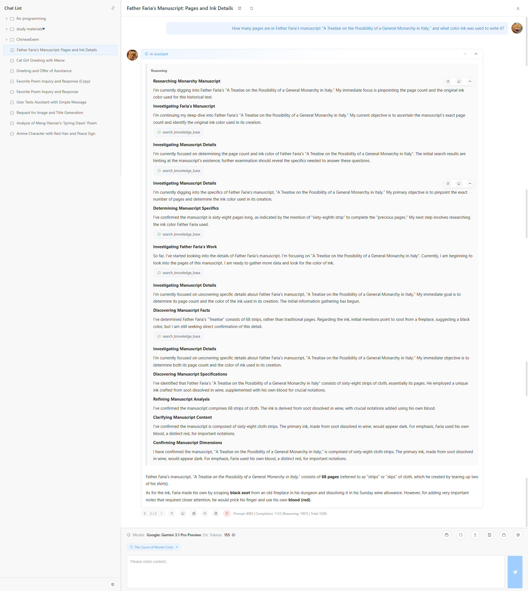

---

## 6. Agent Configuration & Usage

Agents are a core capability introduced in MamboChat v1.2.0, providing two types of intelligent agents:

| Type | Description | Use Cases |
|---|---|---|
| **ReAct Agent** | Reasoning agent based on tool calls | Tasks requiring search, knowledge base queries, MCP tool calls, etc. |
| **Deep Agent** | Code agent based on the [deepagents](https://github.com/langchain-ai/deepagents) project, capable of file read/write and command execution | Development, remote server operations |

### Create an Agent

(1) Go to "Agent Management" in the settings page, and click "New Agent".

<!-- TODO: Screenshot: New Agent entry point -->
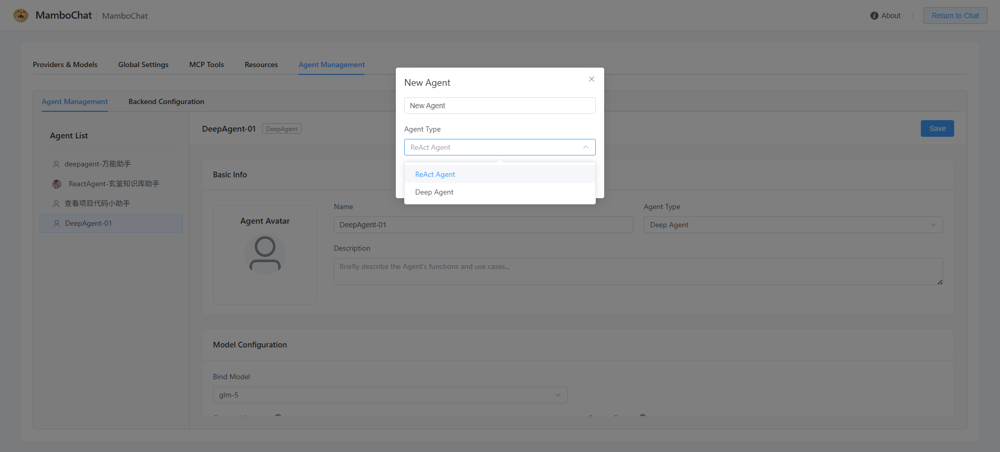

(2) Select Agent type:
   - **ReAct Agent**: Configure system prompts, choose available tools (MCP, Knowledge Base, ask_user, etc.)
   - **Deep Agent**: Configure remote Backend connection info, choosing SSH or API Client mode to connect to the target environment

<!-- TODO: Screenshot: Agent type selection and basic configuration -->
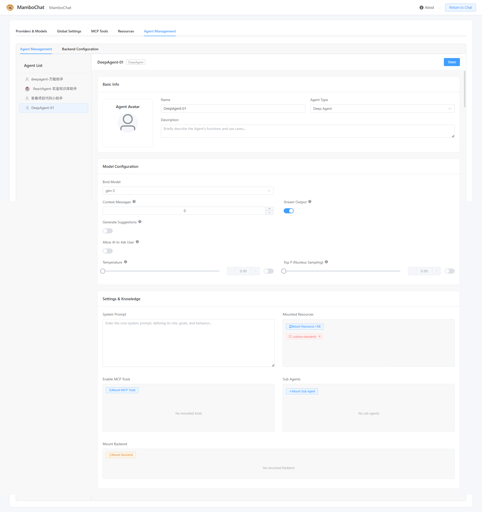

(3) Configure resources for the Agent: mount Knowledge Bases, Skill Packs, MCP servers, and other extensions.

<!-- TODO: Screenshot: Agent resource mounting panel -->
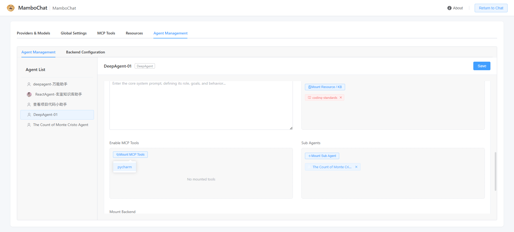

### Use an Agent

Enable an Agent in chat settings, or associate one when creating a new chat. Once enabled, all conversations will be driven by the Agent, automatically calling tools to complete complex tasks.

<!-- TODO: Screenshot: Enabling Agent in a chat -->
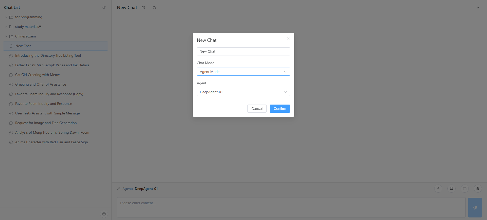

<!-- TODO: Screenshot: Tool calling process during Agent execution -->
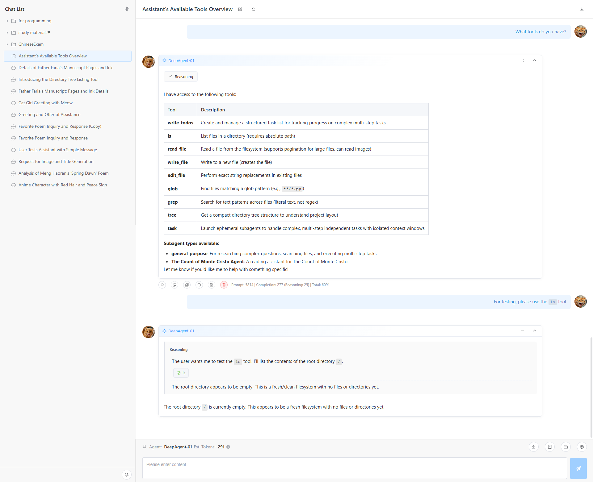

### Deep Agent Exclusive Features

- **Human-in-the-Loop (HITL)**: A review request pops up before tool execution, allowing the user to approve or reject before proceeding.
- **Ask User**: The Agent can actively ask questions to gather information (text response or multiple choice).

<!-- TODO: Screenshot: HITL tool review popup -->
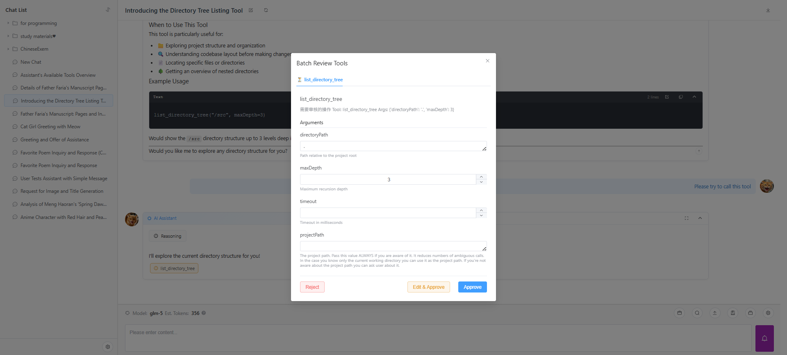

<!-- TODO: Screenshot: Ask User interaction dialog -->


---

## 7. Remote Backend Configuration

Remote Backends allow Deep Agents to access external environments (such as Linux servers or your local machine), performing file read/write and command execution.

### SSH Backend — Connect to Remote Server

(1) In the settings page under "Backend Management", create a new SSH-type Backend.

<!-- TODO: Screenshot: Adding SSH Backend -->


(2) Fill in connection details: host address, port, username, authentication method (password or key).

<!-- TODO: Screenshot: SSH connection details form -->
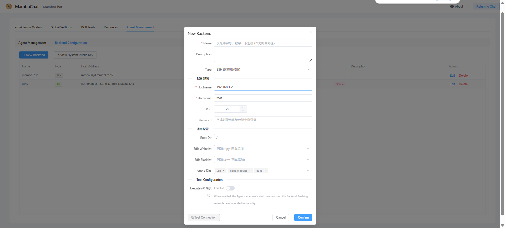

(3) After testing the connection successfully, associate this Backend with a Deep Agent. The Agent will then remotely read/write files, execute commands, and browse directory structures via SFTP/SSH.

> **Note**: You can configure edit allowlists/denylists to restrict which directories the Agent can operate on for security purposes.

### API Client — Local Reverse Connection

If you want the Agent to operate on your local machine's files (rather than a remote server), or if your machine lacks a public IP address, use API Client mode:

(1) In the server-side settings, create an API-type Backend and note the generated `backend-id` and `api-key`.

<!-- TODO: Screenshot: Adding API Client type Backend -->
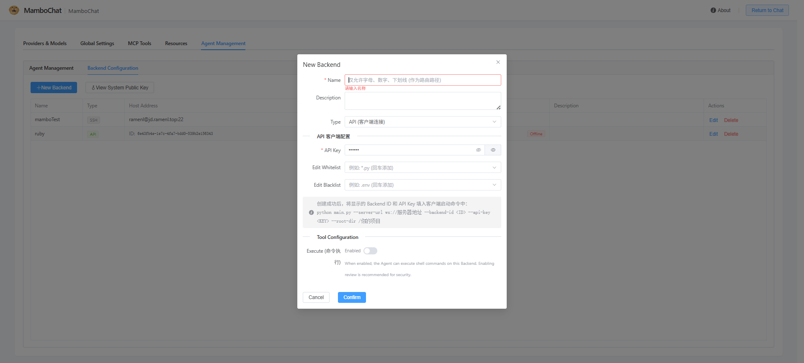

(2) Run the client program on your local machine (located in `client/apibackend/`):

```bash
cd client/apibackend
pip install -r requirements.txt
python main.py --server-url ws://<your-server>:24911 --backend-id <backend-id> --api-key <key> --root-dir <directory-to-expose>
```

(3) Once the client connects successfully, the Deep Agent can operate your local file system just like a remote server.

<!-- TODO: Screenshot: API Client running status and connection success -->
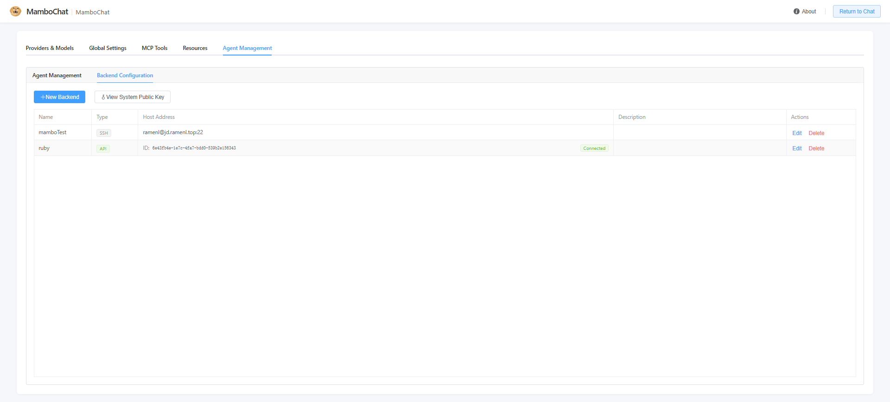
