## 1. AI Model & Provider Configuration  
### Configuring Providers and Models  
(1) **Enter Settings**  
Click the configuration button to enter the system settings page.  
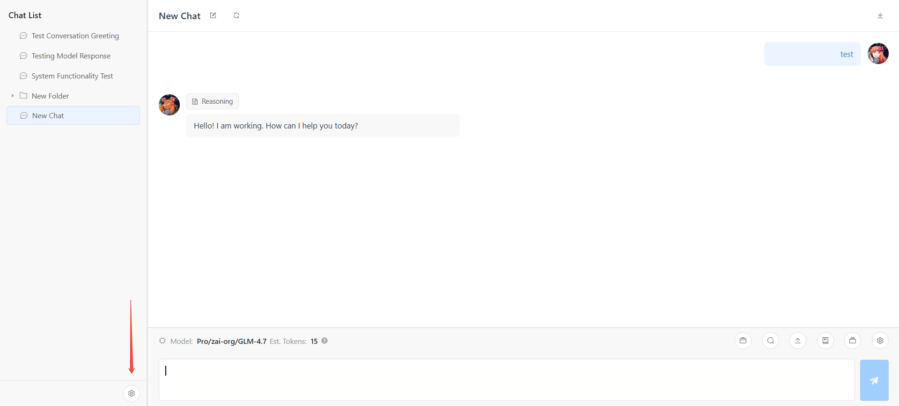  
(2) **Add Provider**  
Click the "Add Provider" button.  
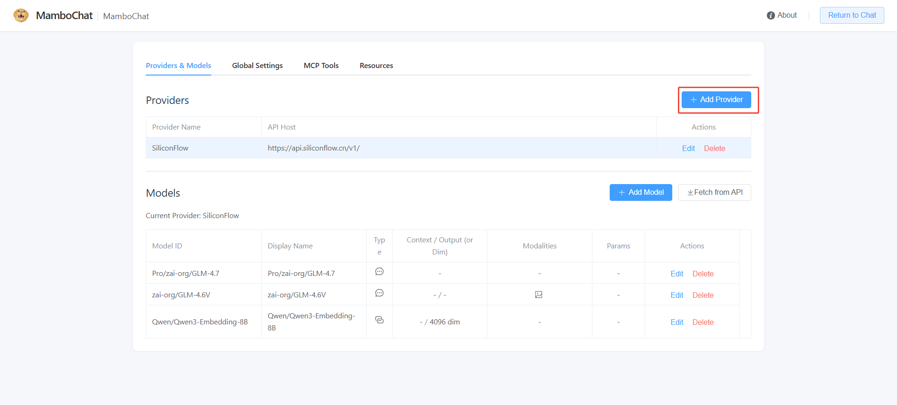  
(3) **Configure Provider**  
Fill in the provider's configuration details.  
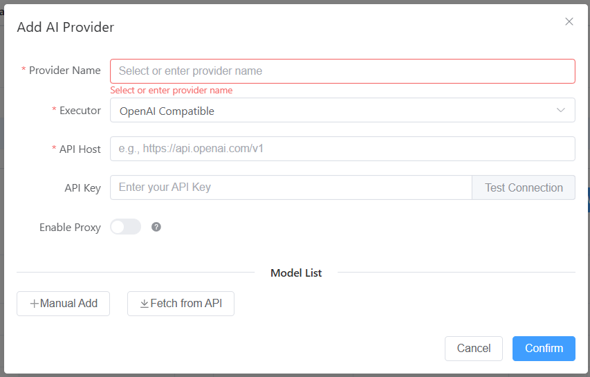  
(4) **Model Configuration (Optional)**  
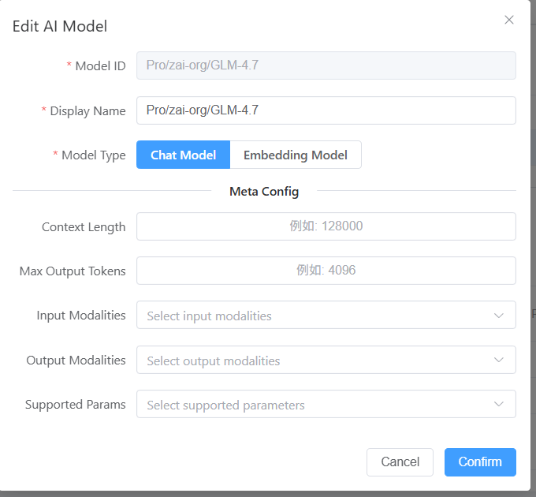
> **Note**: OpenRouter's API usually returns detailed model info, so extra config might not be needed. For other platforms, this step is recommended to set parameters or enable multimodal features like image input (MamboChat v1.1.1 currently supports image input only).  

## 2. Conversations  
(1) **New Chat**  
Right-click in the chat list and select "New Chat".  
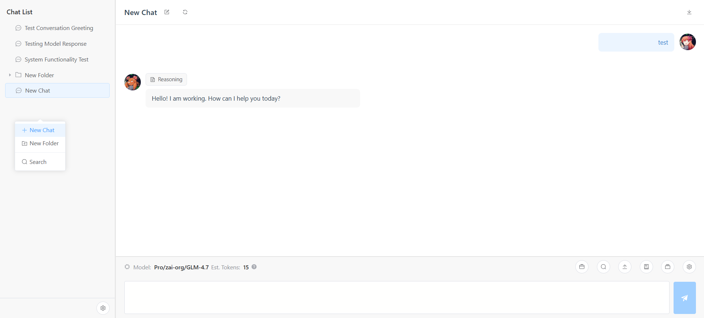  
(2) **Chat Settings**  
Click the chat settings button to set System Prompts and other features.  
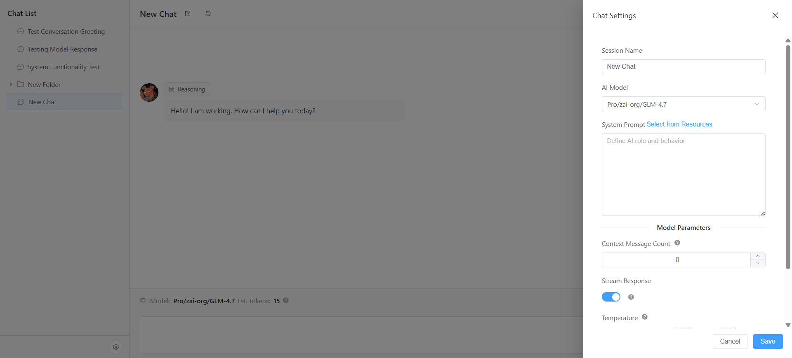  
(3) **Chat Partitions**  
Use Chat Partitions to organize your chats.  
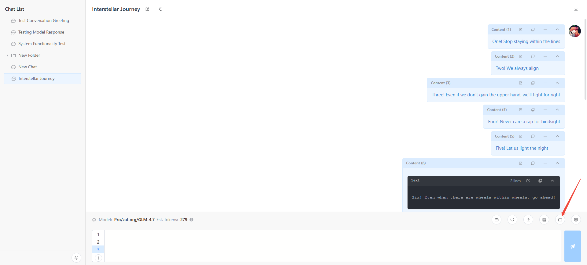  
(4) **File Upload & Multimodal Output**  
Supports text file uploads and multimodal content generation.(Text File and Image File)  
  
(5) **Image Upload & Parsing**  
**Critical**: You must configure `image` in the input modality settings, or image data will not be sent to the API.  
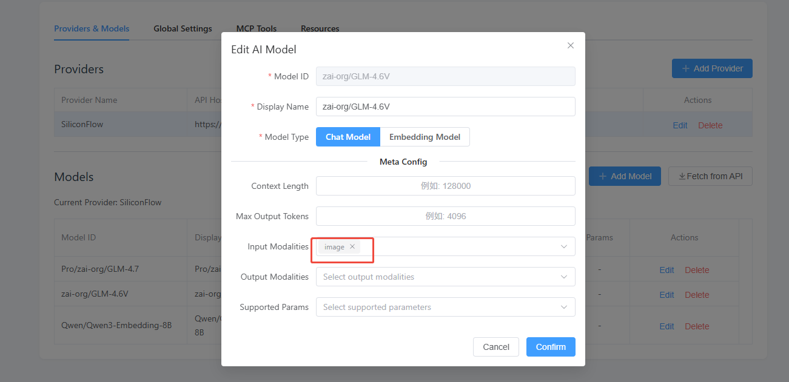  
Once configured, you can send images to the AI.  
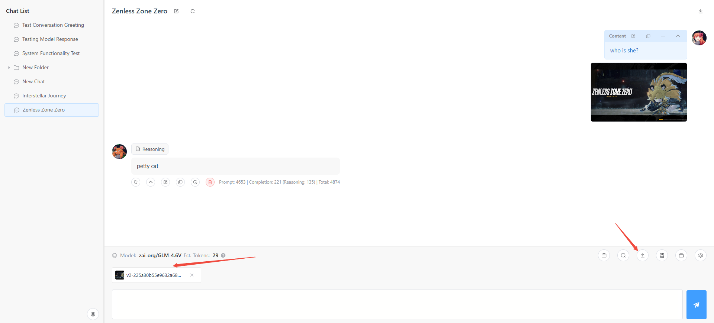  
(6) **Context Compression**  
Edit the prompt used for context compression in the global settings.  
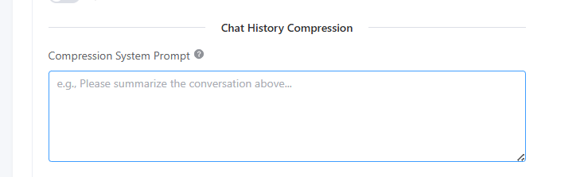  
When a conversation gets long:  
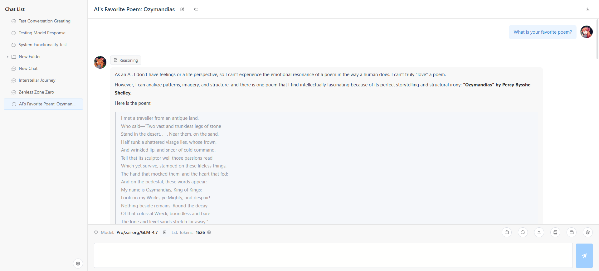  
Use context compression to seamlessly optimize costs and maintain focus. Click "Compress History" to asynchronously generate a summary. After clicking the "Enable" button, the summary will replace this message and the history above it and be sent to the llm-api. 
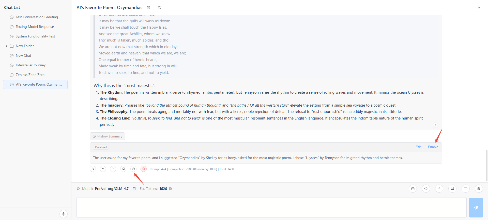  

## 3. Global Settings  
Manage global parameters here.  
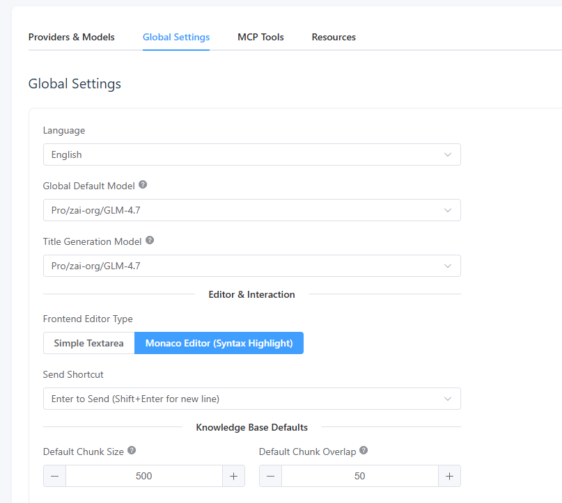  
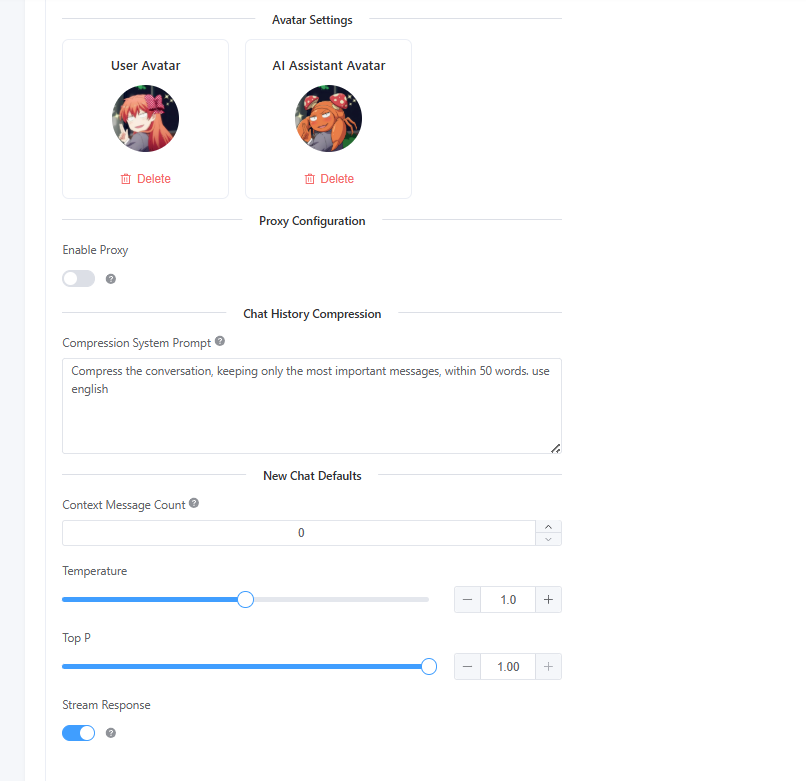  

## 4. Resource Library  
### System Prompts  
(1) **Create Resource**  
Create a new System Prompt resource.  
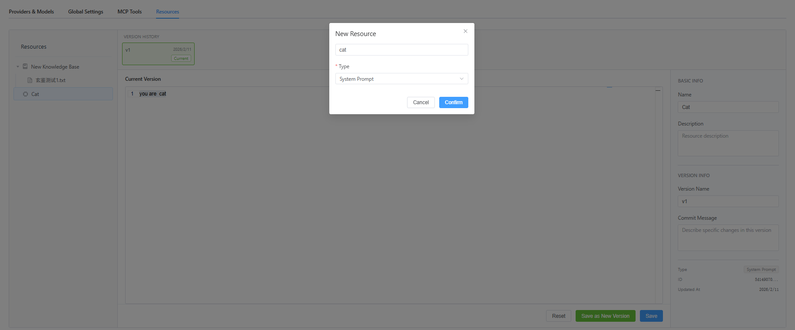  
(2) **Mount Resource**  
Mount the resource to the System Prompt slot.  
  
(3) **Use Case**  
Ideal for complex logic that needs to be reused across sessions.  
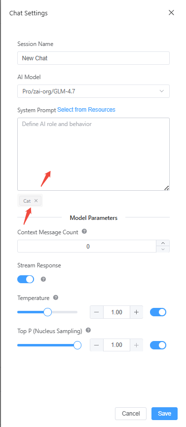  

### Message Templates  
(1) **Create Template**  
Create a new Message Template resource.  
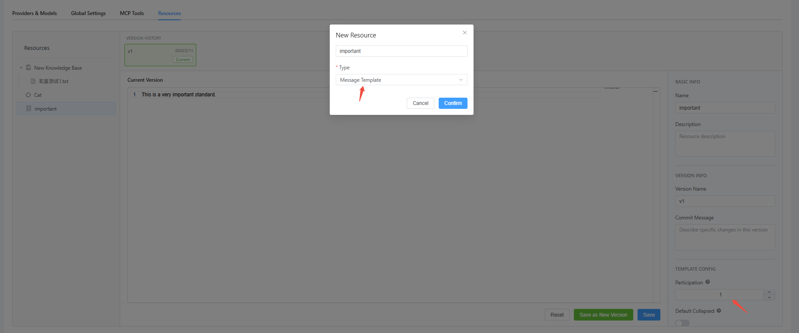  
(2) **Mount Template**  
Mount the template in the chat interface.  
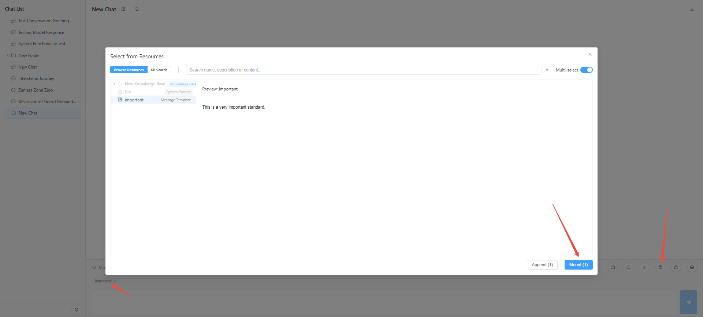  
(3) **Principle & Function**  
I. **Model Attention Distribution**  
  
LLMs typically focus on the beginning and end of the context, often ignoring the middle. The system prompt (beginning) is more likely to be "forgotten" than the latest messages.  
II. **Template Principle**  
Placing critical settings in the latest message is effective but causes token bloat if repeated in history.  
MamboChat solves this: setting "Participation Length" to 1 ensures the template is only sent in the *current* turn and removed in the next.  
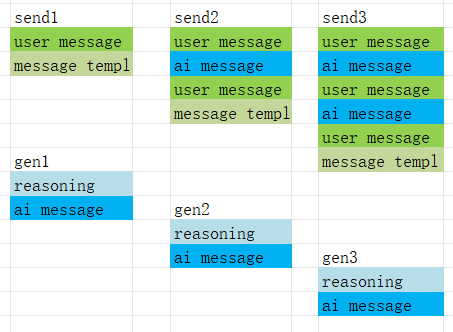  
This makes templates a highly efficient, dynamic system prompt.  
(4) **Flexible Usage**  
Adjust templates on the fly using the input bar.  
  
Example: Mount a "Coding Style" template only when generating code.  
  

### Knowledge Base  
(1) **Create & Upload**  
Configure the vector model (modify `SUP_DIM` in [kb_service.py](../backend/services/kb_service.py) for higher dimensions if needed).  
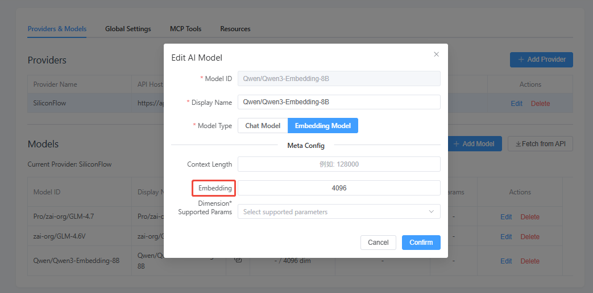  
Enter dimensions based on your API model.  
  
Create a Knowledge Base and upload a document.  
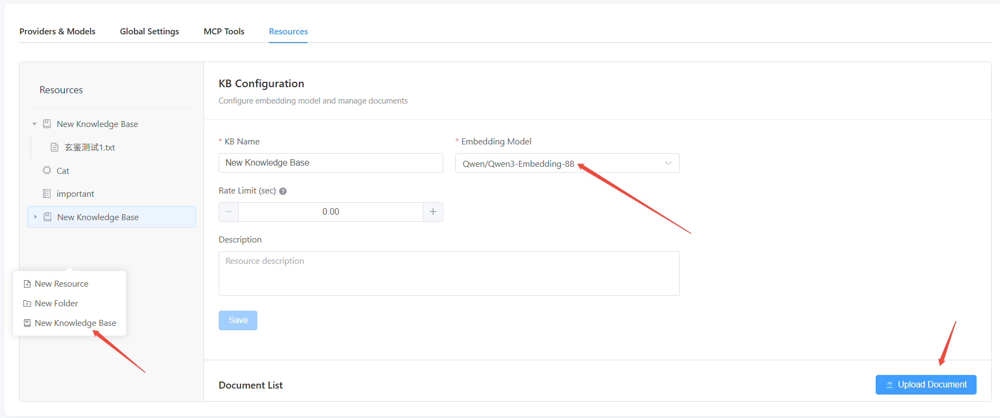  
(2) **Embedding**  
Configure chunking strategy and start the embedding task.  
  
(3) **Verify Retrieval**  
Test the retrieval (uses BM25 + Vector Search + RRF).  
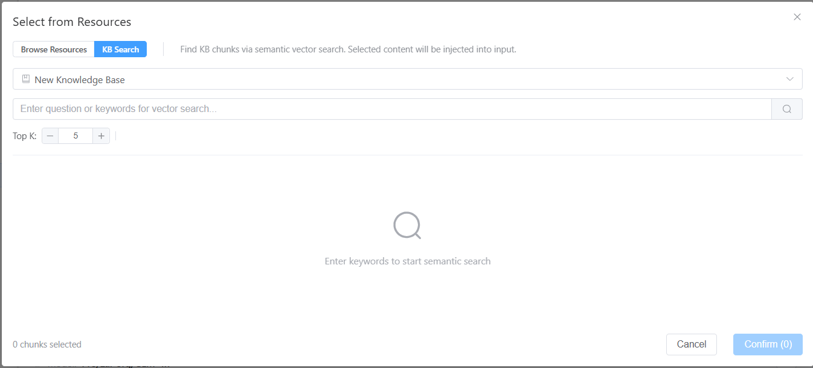  
(4) **AI Auto-Retrieval**  
Let the AI handle it. Mount the Knowledge Base to your current chat.  
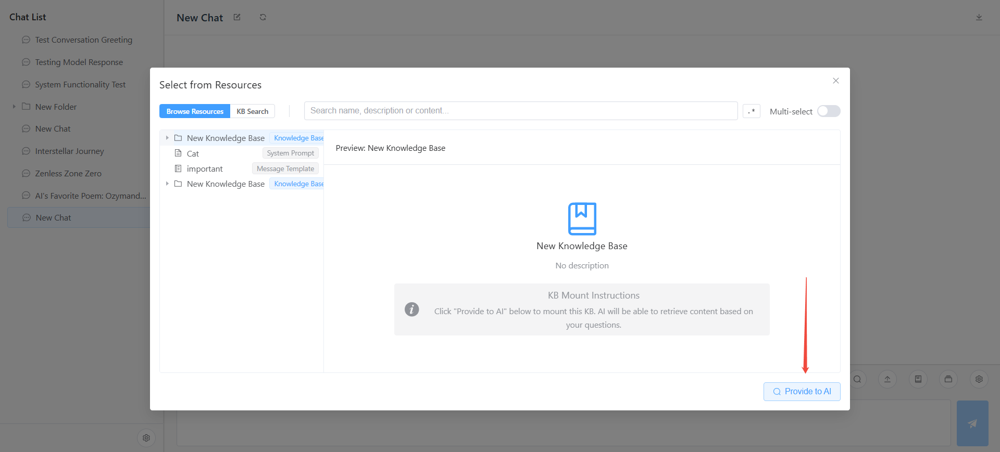  
Ask a question, and the AI will automatically retrieve relevant info.  
  

## 5. MCP Configuration  
Configure remote or local MCP servers in settings.  
  
> **Note**: When using Docker, be mindful of network and volume isolation.  

Enable it in the chat interface to use.  

