## 1. AI Model & Provider Configuration

### Configuring Providers and Models
(1) **Enter Settings**

Click the gear icon (configuration button) in the bottom-left corner to enter the system settings page.  


(2) **Add Provider**

In the "Provider Management" section, click "Add Provider", then fill in the provider name, API Host, API Key, and other information.


(3) **Configure Model Parameters** (Optional)

After creating a provider, you can further configure model parameters. OpenRouter's models API typically returns detailed information, so manual configuration is often unnecessary; for other platforms, it is recommended to configure parameters here or enable multimodal image input.


---

## 2. Conversations

### Basic Operations

(1) **New Chat**

Right-click in the left chat list and select "New Chat".


(2) **Chat Settings**

Click the settings icon next to the chat title. Here you can modify the model, configure the System Prompt, set LLM API parameters, and more.


(3) **Folder Organization**

Right-click the chat list to create folders, then drag-and-drop chats into different folders for organized management.


### Multimodal Conversations

(4) **Image Upload & Parsing**

Before sending images, ensure that the current model has enabled image input modality — set the input modality to include `image` in the model configuration. You can then upload images via the input area, and the AI will analyze and respond to them.

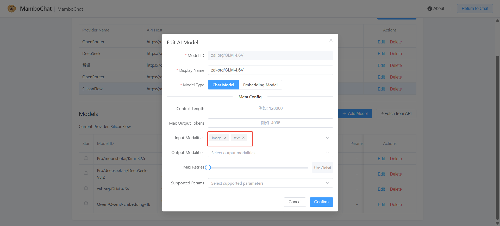


Similarly, after configuring `file`, `audio`, and other modalities, multimodal models can respond to PDF files and multimedia content.
> Note: Requires the model itself to support these modalities.

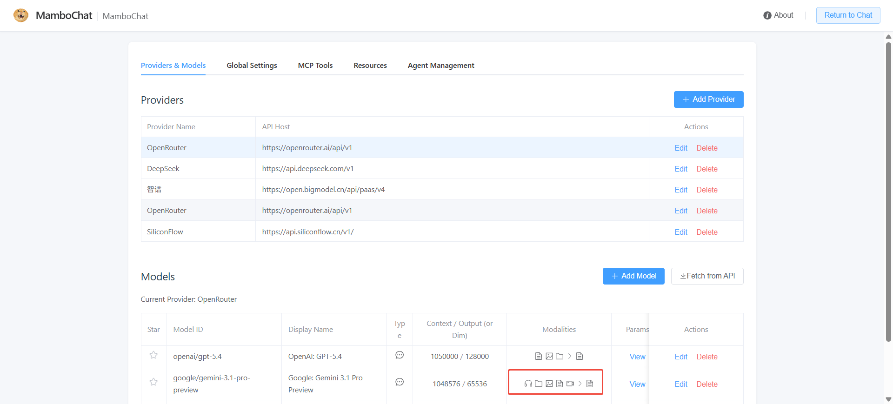
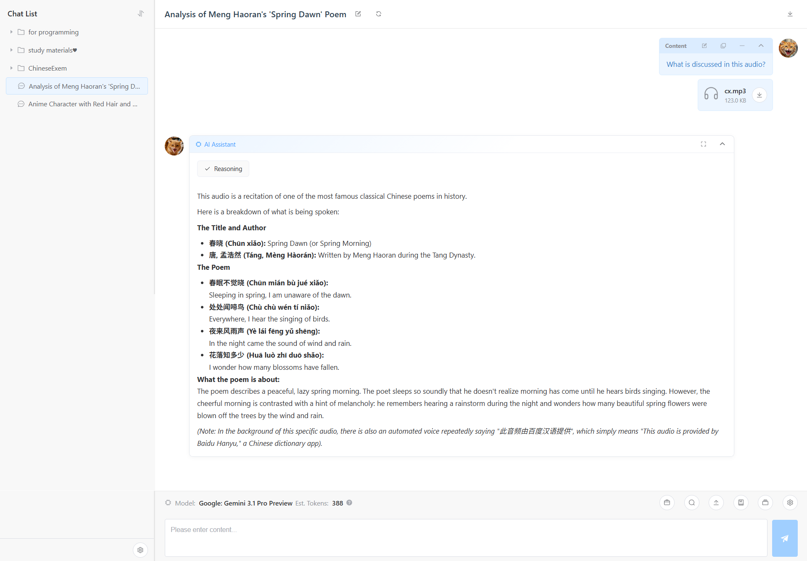

(5) **File Upload & Multimodal Output**

For text-type files, no model file modality support is required — the platform internally converts them to plain text. Additionally, image generation model output is supported.


### Advanced Features

(6) **Message Branching**

When editing a user message and selecting "Save & Regenerate", or clicking "Regenerate" on an AI message, the system does not overwrite the original content but instead creates a new message branch. Use the branch toggle on the message to switch between different versions — the full conversation history is preserved.


(7) **Context Compression**

When a conversation becomes too long, causing increased Token consumption or attention dilution, use the context compression feature. The compression prompt can be customized in global settings. Once triggered, the system automatically summarizes historical dialogue to free up context space.


(8) **Conversation Copying & Archiving**

- **Copy Conversation**: Duplicate the current conversation up to a specified message, allowing new exploration based on existing dialogue.
- **Batch Archive**: Select multiple conversations and move them into a folder at once.

<!-- TODO: 需要英文截图 → 参考中文图片：img/会话复制.png -->
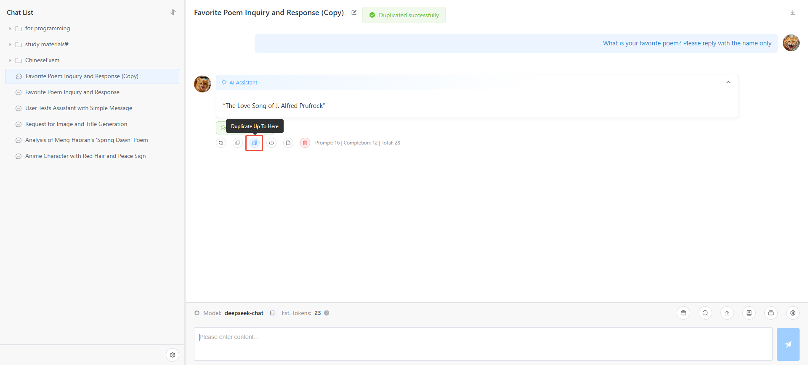
<!-- TODO: 需要英文截图 → 参考中文图片：img/批量归档.png -->
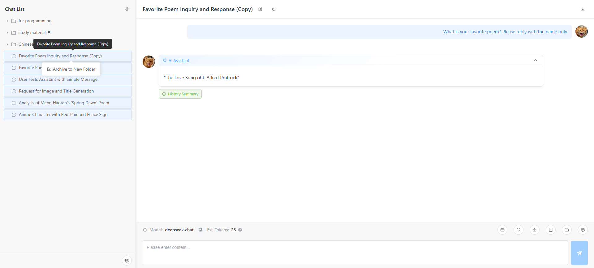

---

## 3. Global Settings

The global settings page manages system-level default parameters, including:

- Default model / Title generation model
- Default temperature, Top P, max retries, and other LLM parameters
- Global proxy address
- User avatar & AI avatar
- Editor preferences (Monaco Editor, etc.)
- Send message shortcut (Enter / Ctrl+Enter)
- Interface language (Chinese / English)

<!-- TODO: 需要英文截图 → 参考中文图片：img/全局配置页面.png -->
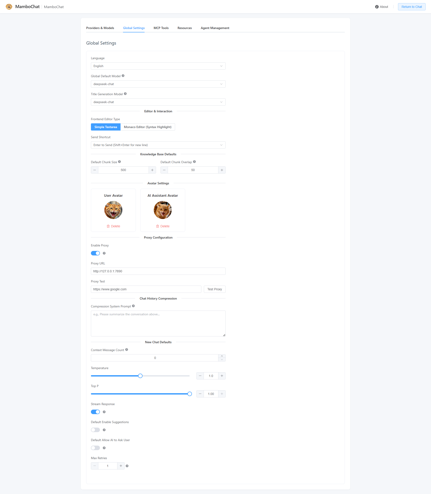

---

## 4. Resource Library

### System Prompts

(1) **Create Resource**

Create a new System Prompt resource in the Resource Center, write its content, and save.


(2) **Mount Resource**

In chat settings, mount an existing System Prompt resource to the current session. This is especially convenient when your system prompts have complex logic that needs to be reused across multiple sessions.


(3) **Version Control**

Resources support version management and rollback. You can actively save new versions and revert to any previous version at any time.


### Message Templates

A Message Template is a highly efficient, special type of System Prompt — it gets inserted into the latest user message, ensuring the model's attention is tightly focused on the template's content.

(1) **How It Works**

LLMs naturally focus on the beginning and end of context, while the middle tends to be overlooked. MamboChat's Message Templates place key settings in the latest message, and by setting "Participation Length" to 1, the template only takes effect for the current turn — avoiding history bloat while reinforcing specific settings.

(2) **Create & Mount**

Create a Message Template resource, then mount it above the input box in any chat session to activate it.


(3) **Flexible Usage**

Switch mounted templates dynamically during a conversation. For example, only mount a coding-related template when code output is needed, and unmount it when planning architecture.


### Skill Packs

Skills are packages used to extend [Agent](#7-agent-configuration--usage) capabilities — they define tools, prompts, and workflows.

(1) **Create Skill**

Create a new Skill-type resource in the Resource Center, and write a Markdown configuration file defining the skill's behavior following the [specification](https://agentskills.io/what-are-skills).


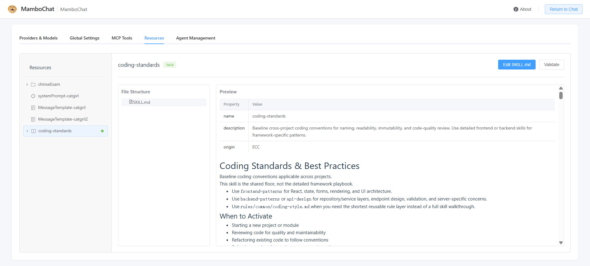

(2) **Import Skill**

Besides manual creation, Skills can be imported from:
- Local `.md` files or folders

<!-- TODO: 需要英文截图 → 参考中文图片：img/导入Skill-文件.png -->
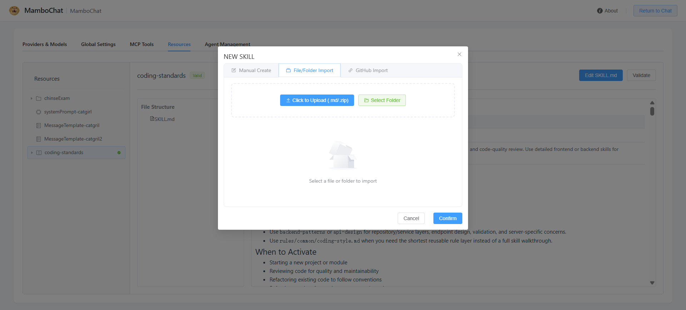
- GitHub repository URLs

<!-- TODO: 需要英文截图 → 参考中文图片：img/导入Skill-GitHub.png -->
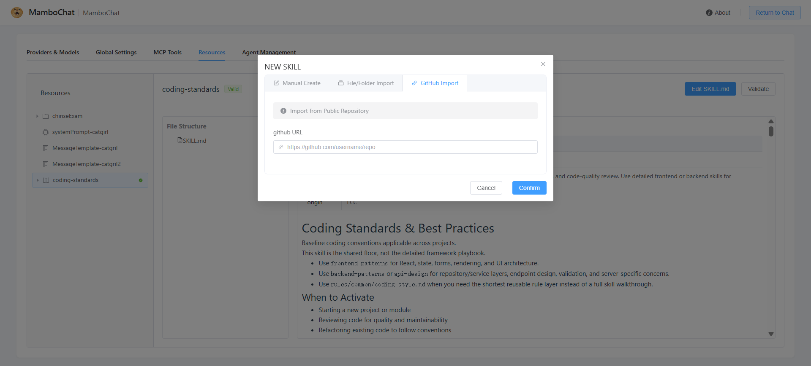

> Note: This feature depends on the `github` API stability. Verification may occasionally fail.

(3) **Mount to Agent**

Once created, attach the Skill in the DeepAgent settings to let the Agent use it.
<!-- TODO: 需要英文截图 → 参考中文图片：img/Agent中挂载Skill.png -->


---

## 5. Knowledge Base

(1) **Configure Vector Model**

Before using the Knowledge Base for the first time, configure an Embedding vector model in global settings. For higher dimension support, modify `SUP_DIM` in `kb_service.py` and restart the service.


(2) **Create Knowledge Base & Upload Documents**

After creating a Knowledge Base, upload documents in Markdown, TXT, PDF, Word, or other supported formats.

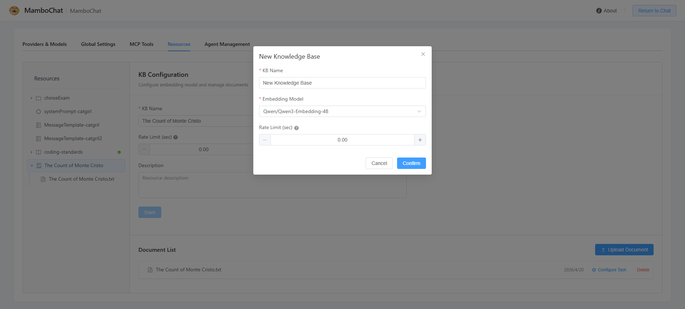
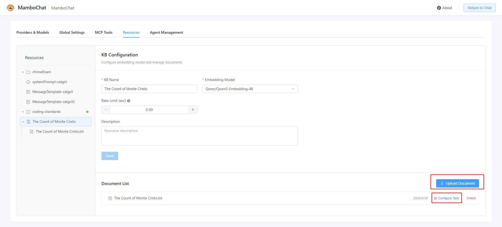

(3) **Configure Chunking Strategy & Start Embedding**

Configure document chunking strategy (chunk size, overlap length, etc.), start the vectorization embedding task, and wait for completion.


(4) **Verify Retrieval Results**

Use the retrieval test function to verify chunking quality. The system uses BM25 + Vector Search + RRF (Reciprocal Rank Fusion) hybrid retrieval, balancing keyword matching and semantic similarity.
Go to the chat session page -> Select from Resources -> KB Search.


(5) **AI Auto-Retrieval** (Recommended)

No need to manually search — simply mount the Knowledge Base to your chat session. The AI assistant will automatically call the Knowledge Base when needed and generate answers. Multiple Knowledge Bases can be mounted simultaneously.


---

## 6. MCP Tools

MCP (Model Context Protocol) is a standardized protocol that allows AI models to call external tools and services through a unified interface. By configuring MCP servers, you can extend [Agent](#7-agent-configuration--usage) with rich tool capabilities.

### Add MCP Server

(1) **Enter MCP Management Page**

In the system settings page, click the "Add" button in the "MCP Management" section.

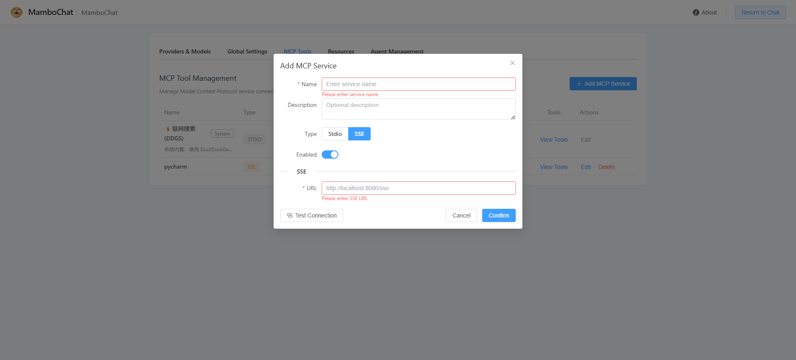

(2) **Select Transport Type & Fill in Configuration**

MCP supports two transport types:

| Transport Type | Description | Use Cases |
|---|---|---|
| **Stdio** | Communication via local command subprocess | Locally running MCP services (e.g., Python/Node scripts) |
| **SSE** | Communication via HTTP Server-Sent Events | Remote or service-mode MCP servers |

- **Stdio type**: Fill in `Command` (execution command, e.g., `python`, `node`, `uvx`), `Args` (command arguments), and `Env` (environment variables, e.g., API Key)
- **SSE type**: Fill in the service `URL`

(3) **Test Connection**

After filling in the configuration, click the "Test Connection" button to verify. Upon success, the number of tools provided by the server will be displayed.

### Manage MCP Servers

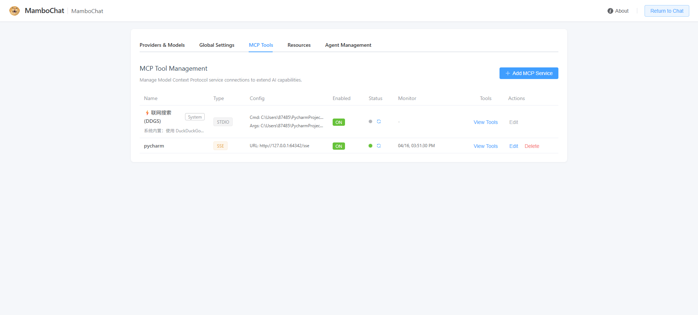

The MCP server list displays all configured server information, including:

- **Name & Description**
- **Transport Type** (STDIO / SSE)
- **Enabled Status** (ON / OFF)
- **Health Status**: Green indicates healthy, red indicates abnormal. Use the refresh button to re-check.
- **Last Test Time & Error Details**: When connection fails, view the specific error stack trace.

> Some system built-in MCP servers are marked as "System" type and cannot be edited or deleted.

### Manage Tools

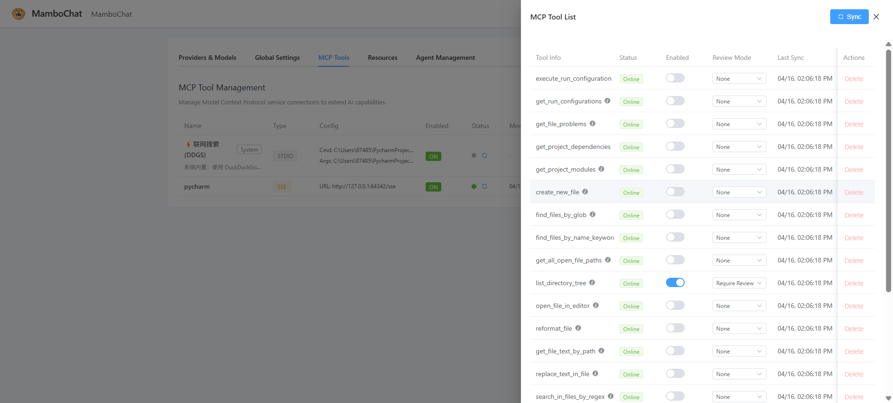

Each MCP server can expose multiple tools. Click "View Tools" to open the tool management drawer:

- **Sync Tools**: Pull the latest tool list from the MCP server
- **Tool Info**: Display tool name, description, and input parameter Schema
- **Online Status**: Indicates whether the tool is available (online / offline)
- **Enable/Disable**: Toggle whether individual tools are visible to the Agent
- **Review Mode**:
  - `none`: The tool can be directly called by the Agent without confirmation
  - `require_review`: The Agent requires user confirmation before calling the tool (Human-in-the-Loop)
- **Delete Tool**: Remove unnecessary tools (only offline tools can be deleted)

### Using in Agent

After creating an MCP server and ensuring its health status is normal, mount the MCP server in the [Agent](#7-agent-configuration--usage) configuration. Once mounted, the Agent will automatically acquire all enabled tools under that server and call them as needed during conversations.

### Using in Chat
In a chat session under Normal Mode, click the "View Tools" button to select and use tools.

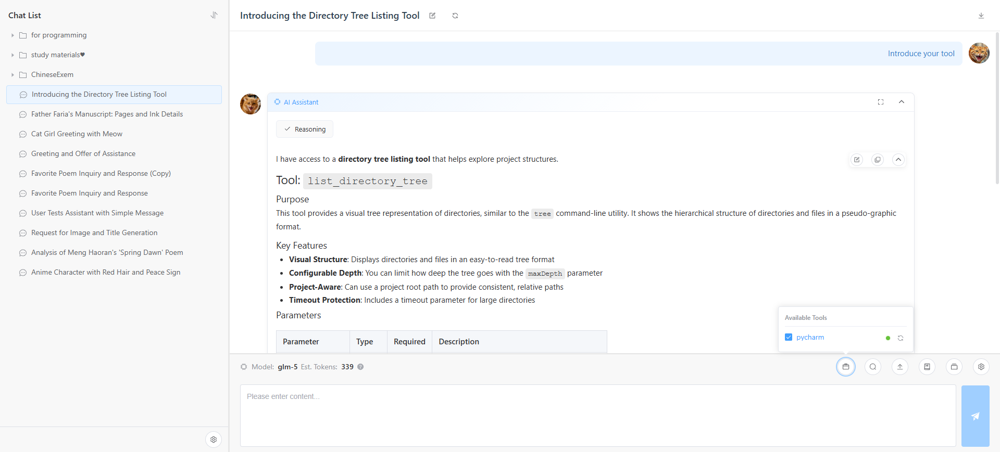

---

## 7. Agent Configuration & Usage

Agent is a core capability introduced in MamboChat v1.2.0, providing two types of intelligent agents:

| Type | Description | Use Cases |
|---|---|---|
| **ReAct Agent** | Reasoning agent based on tool calls. Regular chats also use this Agent, but it can be configured on the Agent page as a sub-Agent for DeepAgent | Tasks requiring search, knowledge base queries, MCP tool calls, etc. |
| **Deep Agent** | Complex functional agent based on the [deepagents](https://github.com/langchain-ai/deepagents) project, capable of file read/write and command execution | Code development, remote server operations |

### Create an Agent

(1) Go to "Agent Management" in the settings page, and click "New Agent".


(2) Select Agent type:
   - **ReAct Agent**: Configure system prompts, choose available tools (MCP, Knowledge Base, ask_user, etc.)
   - **Deep Agent**: Configure remote Backend connection info, choosing SSH or API Client mode to connect to the target environment


(3) Configure resources for the Agent: mount Knowledge Bases, Skill Packs, MCP servers, and other extensions.


### Use an Agent

Associate an Agent directly when creating a new chat. Once enabled, all conversations in that session will be driven by the Agent, automatically calling tools to complete complex tasks.


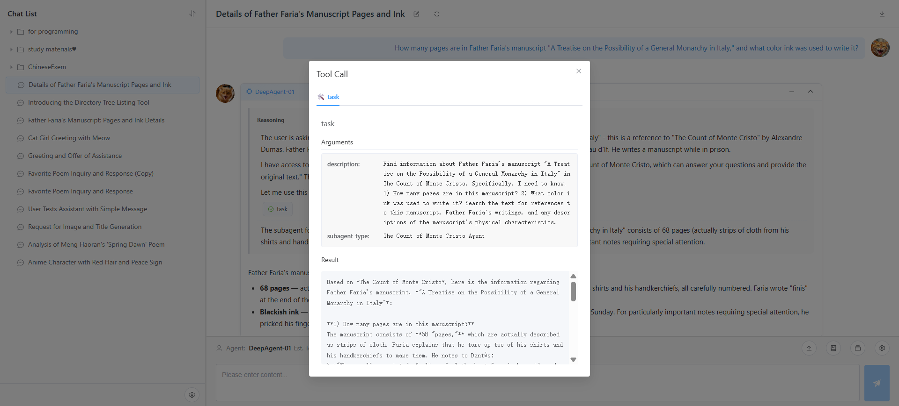

---

## 8. Remote Backend Configuration

Remote Backends allow Deep Agents to access external environments (such as Linux servers or your local machine), performing file read/write and command execution.

### SSH Backend — Connect to Remote Server

(1) In the settings page under "Backend Management", create a new SSH-type Backend. Fill in connection details: host address, port, username, and authentication method (password or key).


(3) After testing the connection successfully, associate this Backend with a Deep Agent. The Agent will then remotely read/write files, execute commands, and browse directory structures via SFTP/SSH.

> **Note**: You can configure edit allowlists/denylists to restrict which directories the Agent can operate on for security purposes.

### API Client — Local Reverse Connection

If you want the Agent to operate on your local machine's files (rather than a remote server), or if your machine lacks a public IP address, use API Client mode:

(1) In the server-side settings, create an API-type Backend and note the generated `backend-id` and `api-key`.

<!-- TODO: 需要英文截图 → 参考中文图片：img/新增APIClient类型Backend.png -->


(2) Run the client program on your local machine (located in `client/apibackend/`):

```bash
cd client/apibackend
pip install -r requirements.txt
python main.py --server-url ws://<your-server>:24911 --backend-id <backend-id> --api-key <key> --root-dir <directory-to-expose>
```

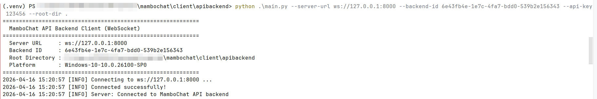

(3) Once the client connects successfully, the Deep Agent can operate your local file system just like a remote server.


## 9. Conversation Interruption — Human Intervention
- **Human-in-the-Loop (HITL)**: A review request pops up before tool execution, allowing the user to approve or reject before proceeding.

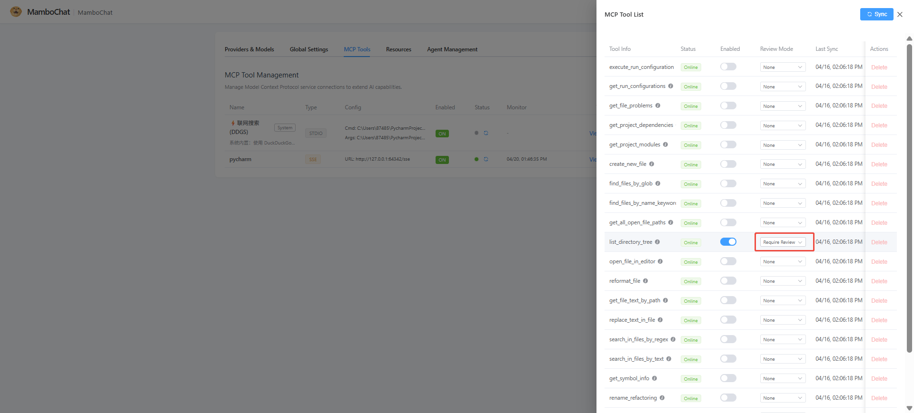
<!-- TODO: 需要英文截图 → 参考中文图片：img/HITL工具审核弹窗.png -->

- **Ask User**: The Agent can actively ask questions to gather information (text response or multiple choice).
<!-- TODO: 需要英文截图 → 参考中文图片：img/AskUser提问交互.png -->
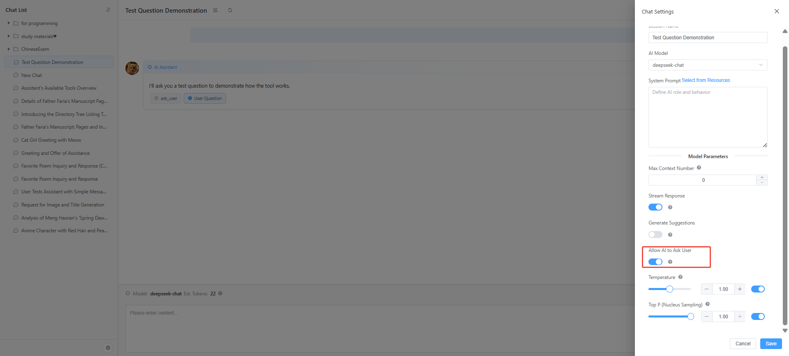
<!-- TODO: 需要英文截图 → 参考中文图片：img/AskUser提问交互2.png -->
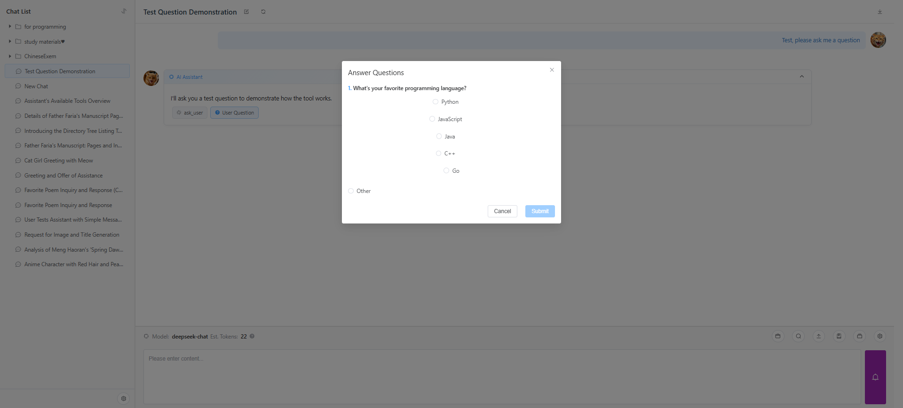
