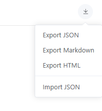
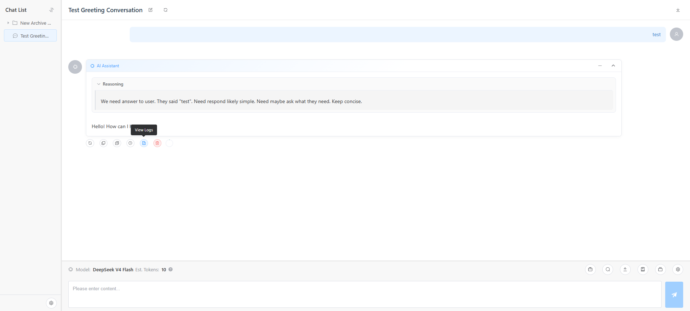
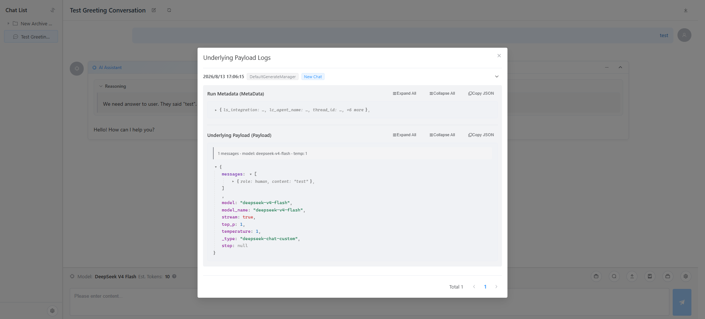

## 1. AI Model & Provider Configuration

### Configuring Providers and Models
(1) **Enter Settings**

Click the gear icon (configuration button) in the bottom-left corner to enter the system settings page.


(2) **Add Provider**

In the "Provider Management" section, click "Add Provider", then fill in the provider name, API Host, API Key, and other information.


(3) **Configure Model Parameters** (Optional)

After creating a provider, you can further configure model parameters. OpenRouter's models API typically returns detailed information, so manual configuration is often unnecessary; for other platforms, it is recommended to configure parameters here or enable multimodal image input.

> **Automatic Model Capability Detection**: When connecting providers such as GLM (`api.z.ai` / `open.bigmodel.cn`), DeepSeek (`api.deepseek.com`), or Kimi (`api.moonshot.cn`), the system automatically detects model capabilities (context length, image support, thinking mode) based on the API Host domain — manual configuration is usually unnecessary; for other platforms, manual configuration is still recommended.

You can also click the "Fetch Models" button to pull the model list from the provider and batch-import it. The list shows "Context" and "Modality" columns for easy verification. Special parameters like thinking mode have no standalone toggle — they are configured via "Dynamic Parameters" (e.g., DeepSeek Thinking Type), which can be enabled in chat settings or in the model configuration of the Agent editor.


---

## 2. Conversations

### Basic Operations

(1) **New Chat**

Right-click in the left chat list and select "New Chat".


(2) **Chat Settings**

In the Web interface (desktop layout), click the "Settings" icon in the toolbar above the input area (on mobile, the settings button at the right of the title bar). Here you can modify the model, configure the System Prompt, set the number of context messages, enable streaming, reply suggestions, allow the AI to ask questions, and configure model-supported extended parameters via the "Dynamic Parameters" area (e.g., DeepSeek thinking mode).


(3) **Folder Organization**

Right-click the chat list to create folders, then drag-and-drop chats into different folders for organized management.


### Multimodal Conversations

(4) **Image Upload & Parsing**

Before sending images, ensure that the current model has enabled image input modality — set the input modality to include `image` in the model configuration. You can then upload images via the input area, and the AI will analyze and respond to them.


Similarly, after configuring `file`, `audio`, and other modalities, multimodal models can respond to PDF files and multimedia content.
> Note: Requires the model itself to support these modalities.


(5) **File Upload & Multimodal Output**

For text-type files, no model file modality support is required — the platform internally converts them to plain text. Additionally, image generation model output is supported.


### Advanced Features

(6) **Message Branching**

When editing a user message and selecting "Save & Regenerate", or clicking "Regenerate" on an AI message, the system does not overwrite the original content but instead creates a new message branch. Use the branch toggle on the message to switch between different versions — the full conversation history is preserved.


(7) **Context Compression**

When a conversation becomes too long, causing increased Token consumption or attention dilution, use the context compression feature. The compression prompt can be customized in global settings. Once triggered, the system automatically summarizes historical dialogue to free up context space.


(8) **Conversation Copying & Archiving**

- **Copy Conversation**: Duplicate the current conversation up to a specified message, allowing new exploration based on existing dialogue.
- **Batch Archive**: Select multiple conversations and move them into a folder at once.


(9) **Web Search**

Click the "Web Search" button in the toolbar to cycle through three modes: Off / Read web pages only / Search + read. When enabled, the AI can search the web and read page content to answer. Session-level settings take priority; when unset, the global default mode is used (see [Global Settings](#3-global-settings)). Network requests can go through a proxy to access restricted sites.
- Read web pages only  

- Search via DGGS + read web pages  


(10) **Chat Import/Export**

Click the download icon at the right of the title bar to:
- **Export JSON**: export the chat as a JSON file (including file attachments) for backup and migration
- **Export Markdown / HTML**: export as readable document formats
- **Import JSON**: import a previously exported JSON file; the import creates a new chat at the root directory (duplicate names automatically get a suffix)


(11) **Message Log Viewing**

Click the "View Logs" button in an AI message's action bar to view the underlying message logs, including the raw request payload sent to the LLM and runtime metadata (MetaData), for a deeper understanding of the Agent's logic.  



---

## 3. Global Settings

The global settings page manages system-level default parameters, including:

- Default model / Title generation model
- Default temperature, Top P, max retries, and other LLM parameters
- New chat defaults (context message count, streaming, reply suggestions, allow AI questions, etc.)
- Web search: default mode (disabled / read pages only / search and read) and whether to use a global proxy
- Conversation history compression: custom "Compression System Prompt" (leave empty for the default prompt)
- Global proxy address (enable proxy / proxy URL / test connection)
- User avatar & AI avatar
- Editor preferences (plain text box / Monaco Editor), message display mode (stacked / interleaved)
- Send message shortcut (Enter / Ctrl+Enter)
- Interface language (Chinese / English)
- Database maintenance: clean the Checkpoints database


---

## 4. Resource Library

### System Prompts

(1) **Create Resource**

Create a new System Prompt resource in the Resource Center, write its content, and save.


(2) **Mount Resource**

In chat settings, mount an existing System Prompt resource to the current session. This is especially convenient when your system prompts have complex logic that needs to be reused across multiple sessions.


(3) **Version Control**

Resources support version management and rollback. You can actively save new versions and revert to any previous version at any time.


### Message Templates

A Message Template is a highly efficient, special type of System Prompt — it gets inserted into the latest user message, focusing the model's attention tightly on the template's content. This is especially effective for models with scattered attention, such as GEMINI.

(1) **How It Works**

LLMs naturally focus on the beginning and end of context, while the middle tends to be overlooked. MamboChat's Message Templates place key settings in the latest message, and the "Participation Length" controls how many turns it stays effective (set to 1 for the current turn only) — reinforcing specific settings without adding history bloat.

> Note: For long-running continuous generation tasks, this feature significantly reduces cache hit rates, because the KV cache of the latest Q&A pair is broken by this feature.

(2) **Create & Mount**

Create a Message Template resource, then mount it above the input box in any chat session to activate it.


(3) **Flexible Usage**

Switch mounted templates dynamically during a conversation. For example, only mount a coding-related template when code output is needed, and unmount it when planning architecture.


### Skill Packs

Skills are packages used to extend [Agent](#7-agent-configuration--usage) capabilities — they define tools, prompts, and workflows.

(1) **Create Skill**

Create a new Skill-type resource in the Resource Center, and write a Markdown configuration file defining the skill's behavior following the [specification](https://agentskills.io/what-are-skills).


(2) **Import Skill**

The "New Skill" dialog provides three tabs: Manual creation / File & folder import / GitHub import.
- **File/folder import**: upload local `.md` / `.zip` files or select a folder; supports import preview and name-conflict handling (overwrite / skip), and batch import (multiple Skills at once)

- **GitHub import**: import from a GitHub repository URL (supports `owner/repo` or `npx skills add owner/repo` forms)


Imported Skills support "Validate Spec" checking and SKILL.md content preview/editing.

(3) **Mount to Agent**

Once created, attach the Skill in the Agent settings to let the Agent use it.


---

## 5. Knowledge Base

(1) **Configure Vector Model**

Before using the Knowledge Base for the first time, configure an Embedding vector model in global settings. For higher dimension support, modify `SUP_DIM` in `kb_service.py` and restart the service.


(2) **Create Knowledge Base & Upload Documents**

After creating a Knowledge Base, upload documents in Markdown, TXT, PDF, Word, or other supported formats.


(3) **Configure Chunking Strategy & Start Embedding**

Configure document chunking strategy (chunk size, overlap length, etc.), start the vectorization embedding task, and wait for completion.


(4) **Verify Retrieval Results**

Use the retrieval test function to verify chunking quality. The system uses BM25 + Vector Search + RRF (Reciprocal Rank Fusion) hybrid retrieval, balancing keyword matching and semantic similarity.
Go to the chat session page -> Select from Resources -> KB Search.


(5) **AI Auto-Retrieval** (Recommended)

No need to manually search — simply mount the Knowledge Base to your chat session. The AI assistant will automatically call the Knowledge Base when needed and generate answers. Multiple Knowledge Bases can be mounted simultaneously.


---

## 6. MCP Tools

MCP (Model Context Protocol) is a standardized protocol that allows AI models to call external tools and services through a unified interface. By configuring MCP servers, you can extend [Agent](#7-agent-configuration--usage) with rich tool capabilities.

### Add MCP Server

(1) **Enter MCP Management Page**

In the system settings page, click the "Add" button in the "MCP Management" section.


(2) **Select Transport Type & Fill in Configuration**

MCP supports three transport types:

| Transport Type | Description | Use Cases |
|---|---|---|
| **Stdio** | Communication via a local command subprocess | Locally running MCP services (e.g., Python/Node scripts) |
| **SSE** | Communication via HTTP Server-Sent Events | Remote or service-mode MCP servers |
| **Streamable HTTP** | Communication via the HTTP streaming interface | MCP servers supporting the Streamable HTTP protocol |

- **Stdio type**: fill in `Command` (execution command, e.g., `python`, `node`, `uvx`), `Args` (command arguments), `Env` (environment variables, e.g., API Key), and `Cwd` (working directory)
- **SSE / Streamable HTTP type**: fill in the service `URL`; optionally configure `Headers` (request headers), `Timeout` / `SSE Read Timeout`, and "Enable Global Proxy"

(3) **Test Connection**

After filling in the configuration, click the "Test Connection" button to verify. Upon success, the number of tools provided by the server will be displayed.

### Manage MCP Servers


The MCP server list displays all configured server information, including:

- **Name & Description**
- **Transport Type** (STDIO / SSE / HTTP)
- **Enabled Status** (ON / OFF)
- **Health Status**: Green indicates healthy, red indicates abnormal. Use the refresh button to re-check.
- **Last Test Time & Error Details**: When connection fails, view the specific error stack trace.

### Manage Tools


Each MCP server can expose multiple tools. Click "View Tools" to open the tool management drawer:

- **Sync Tools**: Pull the latest tool list from the MCP server
- **Tool Info**: Display tool name, description, and input parameter Schema
- **Online Status**: Indicates whether the tool is available (online / offline)
- **Enable/Disable**: Toggle whether individual tools are visible to the Agent
- **Review Mode**:
  - `none`: The tool can be directly called by the Agent without confirmation
  - `require_review`: The Agent requires user confirmation before calling the tool (Human-in-the-Loop)
- **Delete Tool**: Remove unnecessary tools (only offline tools can be deleted)

> **MCP Smart Access**: After an Agent mounts an MCP server, how tools are exposed is determined by the "MCP Direct Tool Threshold" in the Agent configuration (default 15) — when the tool count is below the threshold, tools are exposed directly to the AI; above the threshold, it automatically switches to on-demand query mode to avoid blowing up the prompt.

### Using in Agent

After creating an MCP server and ensuring its health status is normal, mount the MCP server in the [Agent](#7-agent-configuration--usage) configuration. Once mounted, the Agent will automatically acquire all enabled tools under that server and call them as needed during conversations.

### Using in Chat

In a chat session under Normal Mode, click the "View Tools" button to select and use tools.


---

## 7. Agent Configuration & Usage

Agent is a core capability of MamboChat, providing two types of intelligent agents:

| Type | Description | Use Cases |
|---|---|---|
| **Mambo Agent** | A complex functional agent with file read/write, command execution, nested sub-agent calls, real-time file display, AI safety pre-review, long-term memory, automatic conversation compression, resource version snapshots, etc. | Code development, remote server operations, complex task execution |
| **ReAct Agent** | A reasoning agent based on tool calls; can mount Knowledge Bases, MCP tools, Skills, and other extensions | Tasks requiring search, knowledge base queries, MCP tool calls, etc. |

### Create an Agent

(1) Go to "Agent Management" in the settings page — Agents are organized in a tree structure (folders supported). Click "New Agent" to create one.


(2) Select the Agent type and complete the basic configuration: bind a model, configure the System Prompt, and mount resources / MCP tools and other extensions.


### Use an Agent

Associate an Agent directly when creating a new chat. Once enabled, all conversations in that session will be driven by the Agent, automatically calling tools to complete complex tasks; tool calls are displayed as bubbles.


> **Mambo Agent's exclusive capabilities** (real-time file display, AI safety pre-review, long-term memory, automatic conversation compression, resource version snapshots, MCP smart access, etc.), importing/exporting `.mamboagent` packages, and Backend (SSH / API / Resource / Local) configuration, see the [Mambo Agent Guide](MamboAgent_EN.md).

---

## 8. Conversation Interruption — Human Intervention
- **Human-in-the-Loop (HITL)**: A review request pops up before tool execution, allowing the user to approve or reject before proceeding ("Approve / Modify and approve / Reject"; multiple tools can be batch-reviewed).


- **AI Safety Pre-review**: Mambo Agent can be configured with AI safety review (see the [Mambo Agent Guide](MamboAgent_EN.md)); the AI pre-reviews tool calls first, and dangerous operations are flagged with a 🛡️ badge showing the review result (passed / failed) before requiring your confirmation.
- **Ask User**: The Agent can actively ask the user for information (text response or multiple choice).


---

## 9. mambo Command-Line Tool

`mambo` is the command-line tool bundled with MamboChat. It lets you manage providers/models, resources, Skills, MCP, and Agent configurations like operating a file system — ideal for quick terminal configuration, and it can also be handed directly to an LLM.

### Startup & Connection

- The desktop client has a built-in `mambo` command; in a source environment, use `python -m backend.mambo_cli`
- Defaults to `http://127.0.0.1:8000`; specify another address via the `--base-url` argument or the `MAMBO_BASE_URL` environment variable

```bash
mambo --base-url http://<server>:8000 <domain> <action> [options]
```

### Subcommand Overview

| Domain | Common Operations |
|---|---|
| `provider` | list / add / update / delete / test (test connectivity) |
| `model` | list / add / update / delete / set-default (set the default model, auto-completes capability info) |
| `settings` | get / set / unset (global settings) |
| `resource` | ls / cat / write / mkdir / mv / rm / find (manage resources like a file system) |
| `skill` | list / create / validate / import / delete |
| `mcp` | list / add / update / delete / test / sync / tools (sync and toggle tools) |
| `agent` | list / create / update / mount / export / import (`.mamboagent` packages) / subagent |
| `backend` | list / add / update / delete / test / ssh-key (view the system SSH public key) |

### Common Examples

```bash
# List all resources
mambo resource ls /

# Export an Agent as a .mamboagent package
mambo agent export myAgent --output ./my-agent.mamboagent

# Import an Agent package
mambo agent import --file ./my-agent.mamboagent

# View the system SSH public key (for passwordless login)
mambo backend ssh-key

# Sync an MCP server's tool list
mambo mcp sync my-mcp-server
```

> Reference rules: name/path takes priority, UUID as fallback; `resource` and `agent` support `/directory/name` path addressing.
