## 1. AI 模型与服务商配置

### 配置服务商及模型
(1) **进入配置页面**

点击页面右上角的配置按钮（齿轮图标），进入系统配置页面。

<!-- TODO: 截图: 配置按钮与进入配置页面 -->


(2) **新增服务商**

在"服务商管理"区域点击"新增服务商"，填写服务商名称、API Host 和 API Key 等信息。

<!-- TODO: 截图: 新增服务商表单 -->
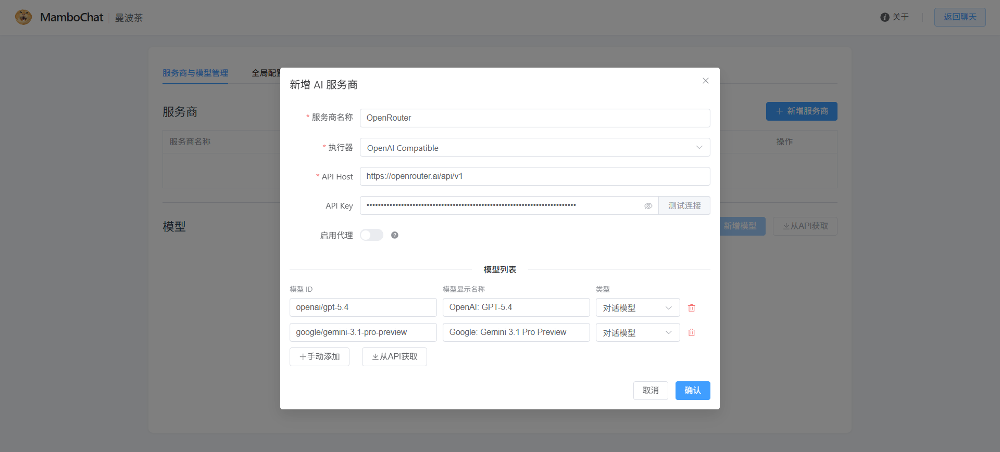

(3) **配置模型参数**（可选）

创建服务商后，可以进一步配置模型参数。OpenRouter 平台的 models 接口返回的模型信息较为详尽，通常无需额外手动配置；对于其他平台，建议在此步骤中补充模型参数或启用多模态的图片输入功能。

<!-- TODO: 截图: 模型参数配置面板 -->
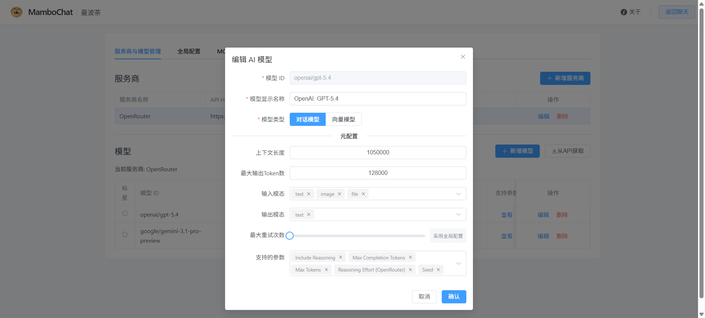

---

## 2. 进行会话

### 基础操作

(1) **新建会话**

在左侧会话列表中点击右键，选择"新建会话"；也可以直接点击会话列表顶部的"+"按钮。

<!-- TODO: 截图: 新建会话操作 -->
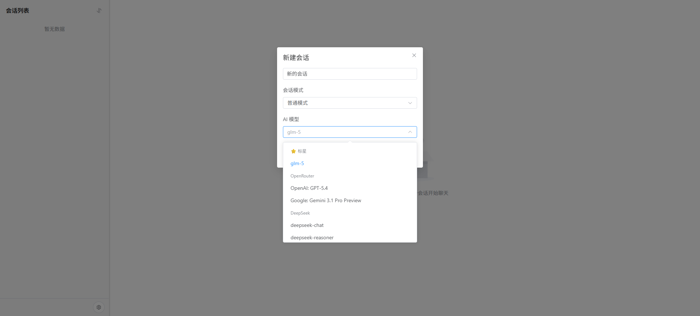

(2) **会话设置**

点击会话标题右侧的设置图标，可以为当前会话配置系统提示词（System Prompt）、挂载资源（知识库/提示词模板）、启用 MCP 服务器等。

<!-- TODO: 截图: 会话设置面板 -->
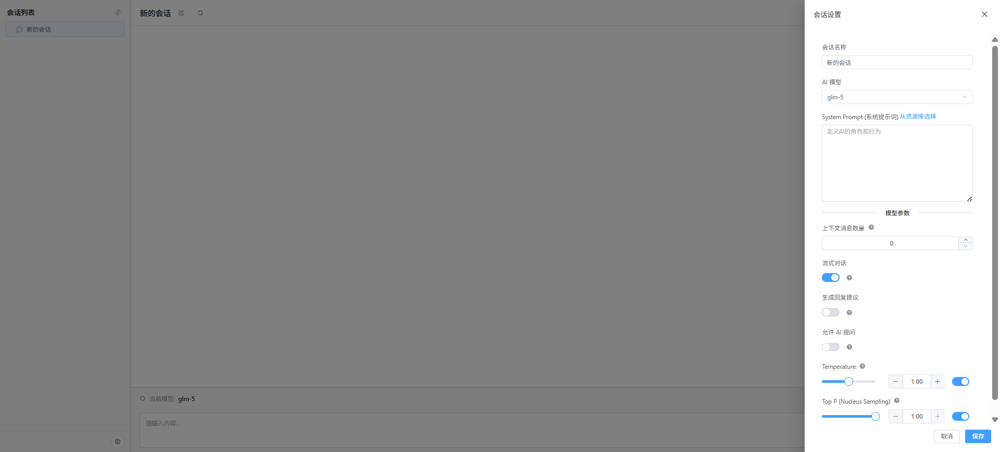

(3) **文件夹分组管理**

右键点击会话列表可创建文件夹，通过拖拽将会话放入不同文件夹进行分组管理。

<!-- TODO: 截图: 文件夹分组与会话拖拽 -->
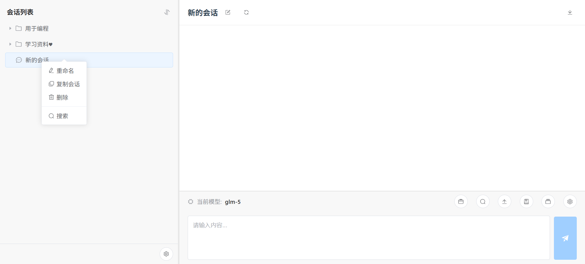

### 多模态对话

(4) **图片上传与多模态解析**

发送图片前需要确保当前模型已启用图片输入模态：在模型配置中将输入模态设为包含 `image`。之后即可在输入框旁上传图片，AI 将对图片内容进行分析和回复。

<!-- TODO: 截图: 图片上传与 AI 图片回复 -->
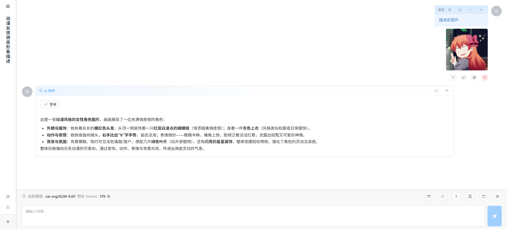

(5) **文件上传与多模态输出**

支持上传文本类型文件供 AI 阅读，也支持生图模型输出图片。

<!-- TODO: 截图: 文件上传与图片输出 -->
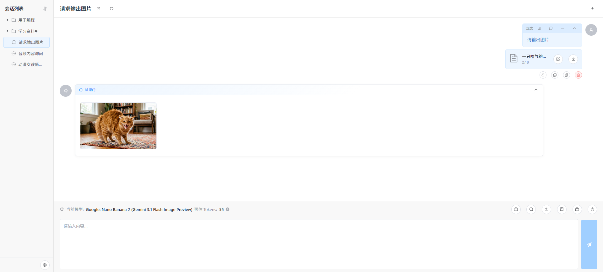

### 高级对话功能

(6) **消息分支编辑**

编辑消息或重新生成时，系统不会覆盖原始内容，而是生成一条新的消息分支。可以通过消息上的分支切换按钮在不同版本之间切换，完整保留对话历史。

<!-- TODO: 截图: 消息分支切换 -->
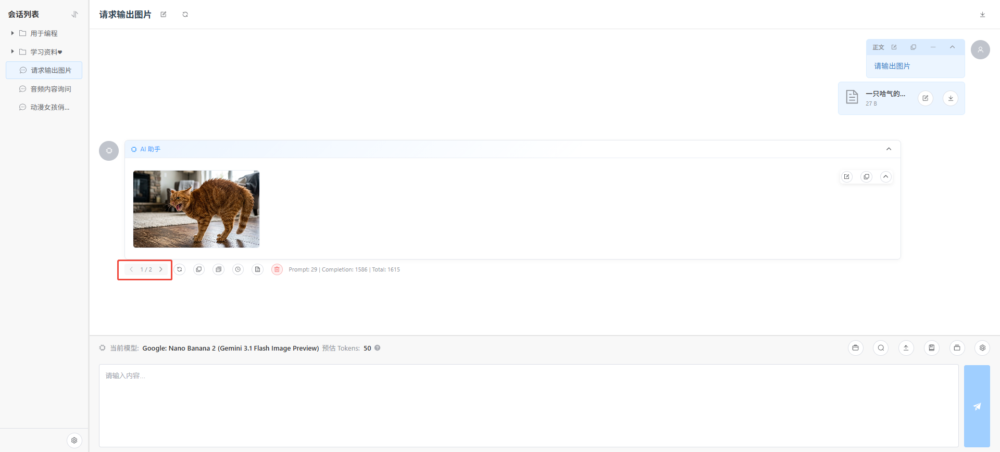

(7) **上下文压缩**

当对话过长导致 Token 消耗增加或注意力稀释时，可以使用上下文压缩功能。压缩提示词可在全局配置中自定义。触发后系统将自动摘要历史对话，释放上下文空间。

<!-- TODO: 截图: 压缩上下文前后的对比效果 -->
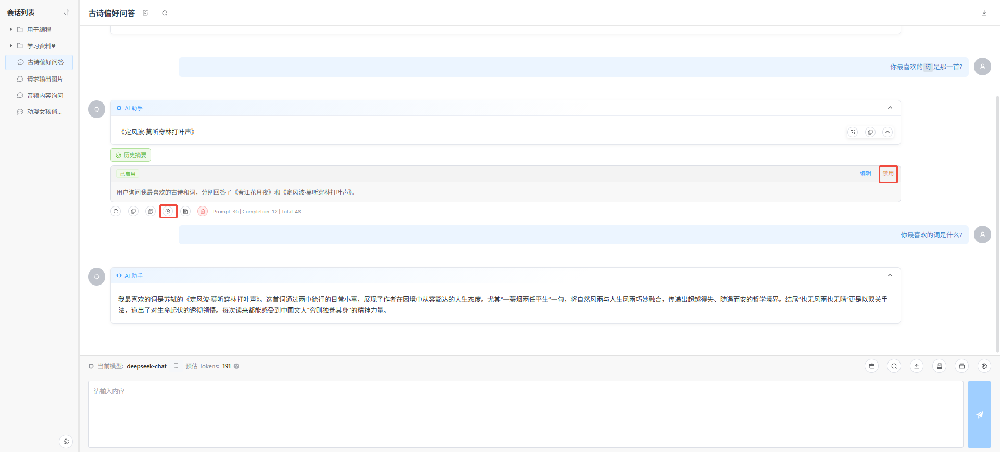

(8) **会话复制与归档**

- **复制会话**：可将当前会话复制到指定消息处，基于已有对话进行新的探索。
- **批量归档**：选中多个会话后统一移动到指定文件夹。

<!-- TODO: 截图: 会话复制与批量归档 -->


---

## 3. 全局配置

全局配置页面用于设置系统级默认参数，包括：

- 默认模型 / 标题生成模型
- 默认温度、Top P、最大重试次数等 LLM 参数
- 全局代理地址
- 用户头像与 AI 头像
- 编辑器偏好（Monaco Editor 等）
- 发送消息快捷键（Enter / Ctrl+Enter）
- 界面语言（中文 / English）

<!-- TODO: 截图: 全局配置页面 - 基础设置 -->


<!-- TODO: 截图: 全局配置页面 - 头像与高级设置 -->


---

## 4. 资源库功能

### 系统提示词资源

(1) **新建资源**

在资源中心创建一个新的系统提示词资源，编写内容并保存。

<!-- TODO: 截图: 创建系统提示词资源 -->
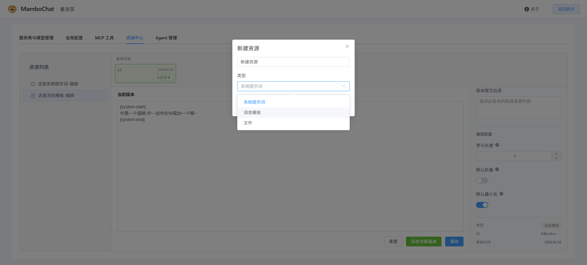

(2) **挂载资源**

在会话设置中，将已创建的系统提示词资源挂载到当前会话。当系统提示词逻辑复杂且需要在多个会话间复用时，此功能尤为便捷。

<!-- TODO: 截图: 挂载系统提示词资源 -->
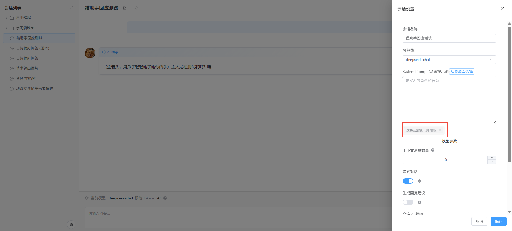

(3) **版本控制**

资源支持版本管理与回滚，修改后会自动保存为新版本，随时可回退到任意历史版本。

<!-- TODO: 截图: 资源版本管理界面 -->
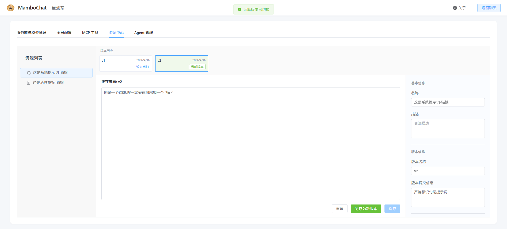

### 消息模板资源

消息模板是一种更高效、特殊的 System Prompt——它将被插入到最新一轮用户消息中，使模型注意力高度集中在模板设定的内容上。

(1) **原理说明**

大模型的注意力天然集中在上下文的头部和尾部，中间部分容易被忽略。MamboChat 的消息模板将关键设定放在最新消息中，且可通过"参与长度"控制其生效轮次（设为 1 时仅当前轮生效），从而在不增加历史冗余的前提下强化特定设定。

(2) **新建与挂载**

创建消息模板资源后，在会话页面的输入框上方挂载该模板即可生效。

<!-- TODO: 截图: 挂载消息模板 -->
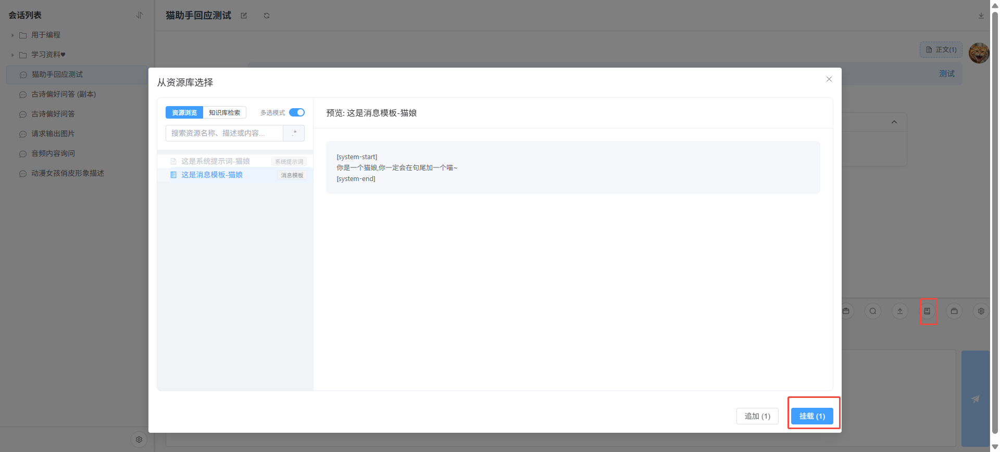

(3) **灵活使用**

随着会话进行，可以在输入框上灵活切换挂载的消息模板。例如：仅在需要代码输出时挂载编程相关模板，日常对话时取消挂载。

<!-- TODO: 截图: 切换挂载的消息模板 -->
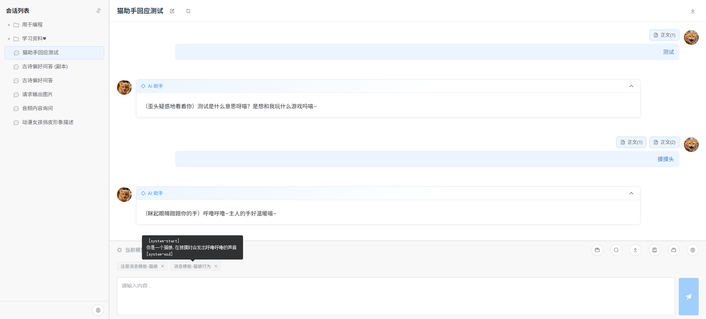

### Skill 技术包

Skill 是用于扩展 Agent 能力的技能包，可以定义一组工具、提示词和工作流程。

(1) **创建 Skill**

在资源中心新建一个 Skill 类型的资源，按照规范编写 YAML 配置文件定义技能的行为。

<!-- TODO: 截图: 创建新 Skill -->
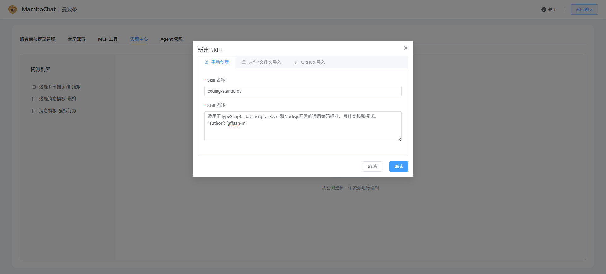

(2) **导入 Skill**

除了手动创建外，还支持以下导入方式：
- 从本地 `.yaml` 文件导入
- 从 ZIP 压缩包导入
- 从 GitHub 仓库 URL 导入

<!-- TODO: 截图: 导入 Skill（ZIP/GitHub） -->


(3) **挂载到 Agent**

创建完成后，在 Agent 设置中将 Skill 挂载即可让 Agent 使用该技能。

<!-- TODO: 截图: Agent 中挂载 Skill -->
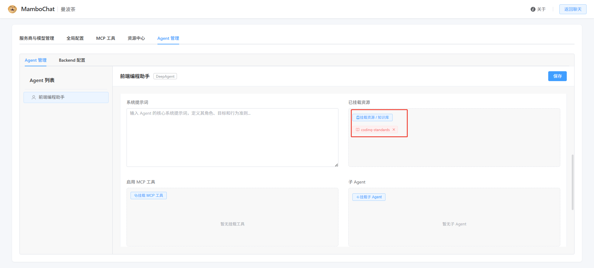

---

## 5. 知识库

(1) **配置向量模型**

首次使用知识库前，需在全局设置中配置一个 Embedding 向量模型。如需支持更高维度，可修改后端 `kb_service.py` 中的 `SUP_DIM` 并重启服务。

<!-- TODO: 截图: 向量模型配置 -->


(2) **创建知识库并上传文档**

创建知识库后，可上传 Markdown、TXT、PDF、Word 等多种格式的文档。

<!-- TODO: 截图: 创建知识库与上传文档 -->


(3) **配置切分策略并启动嵌入**

为知识库配置文档切分策略（切片大小、重叠长度等），启动向量化嵌入任务并等待完成。

<!-- TODO: 截图: 切分策略配置与嵌入进度 -->
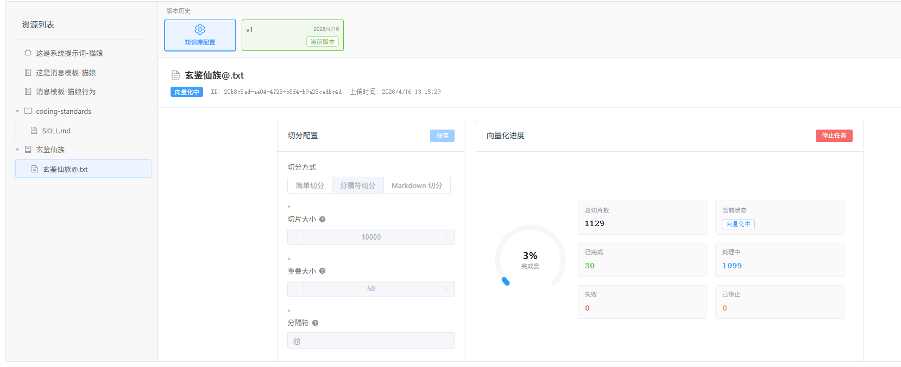

(4) **验证检索效果**

使用检索测试功能验证切分效果是否正常。系统采用 BM25 + 向量检索 + RRF（倒数排名融合）混合检索算法，兼顾关键词匹配与语义相似度。

<!-- TODO: 截图: 检索测试结果 -->
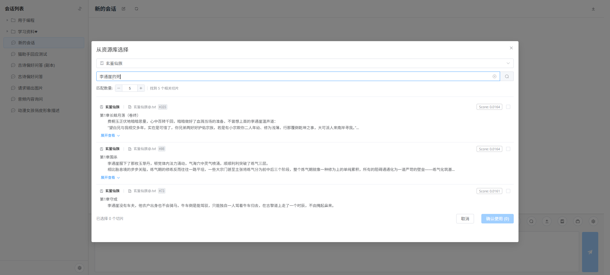

(5) **AI 自行检索（推荐）**

无需手动执行检索，只需将知识库挂载到会话，AI 助手会在需要时自动调用知识库进行检索并生成回答。支持同时挂载多个知识库。

<!-- TODO: 截图: 在会话中挂载知识库 -->
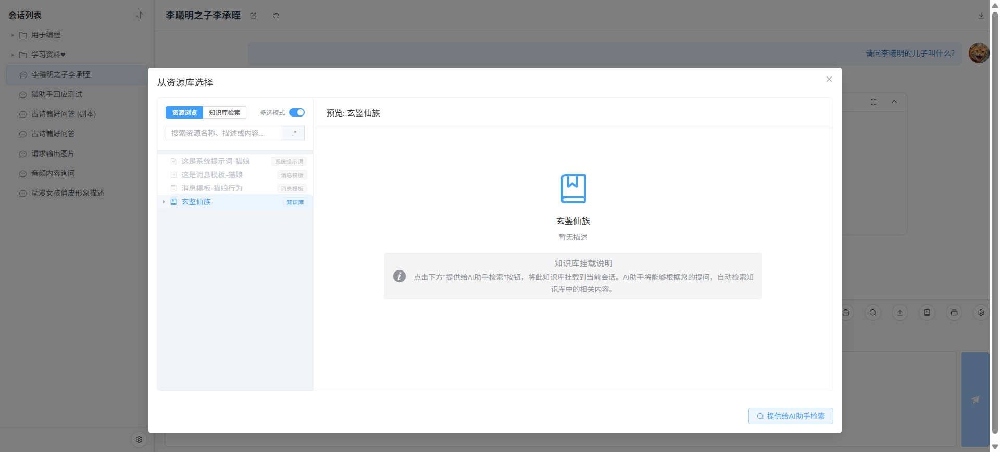

<!-- TODO: 截图: AI 自动检索知识库并回答的效果 -->
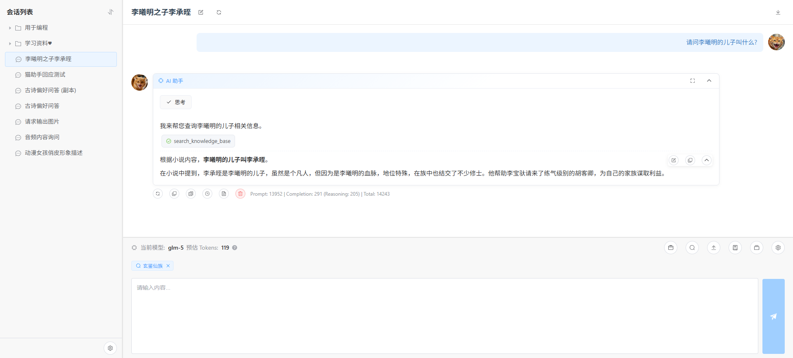

---

## 6. Agent 配置与使用

Agent 是 MamboChat v1.2.0 引入的核心能力，提供两种类型的智能体：

| 类型 | 说明 | 适用场景 |
|---|---|---|
| **ReAct Agent** | 基于工具调用的推理型 Agent | 需要调用搜索、知识库、MCP 工具等完成任务 |
| **Deep Agent** | 基于 [deepagents](https://github.com/langchain-ai/deepagents) 项目的代码型 Agent，具备文件读写、命令执行能力 | 代码开发、远程服务器运维 |

### 创建 Agent

(1) 进入配置页面的"Agent 管理"区域，点击新建 Agent。

<!-- TODO: 截图: 新建 Agent 入口 -->


(2) 选择 Agent 类型：
   - **ReAct Agent**：配置系统提示词、选择可用工具（MCP、知识库、ask_user 等）
   - **Deep Agent**：配置远程 Backend 连接信息，可选择 SSH 或 API Client 方式连接目标环境

<!-- TODO: 截图: Agent 类型选择与基础配置 -->
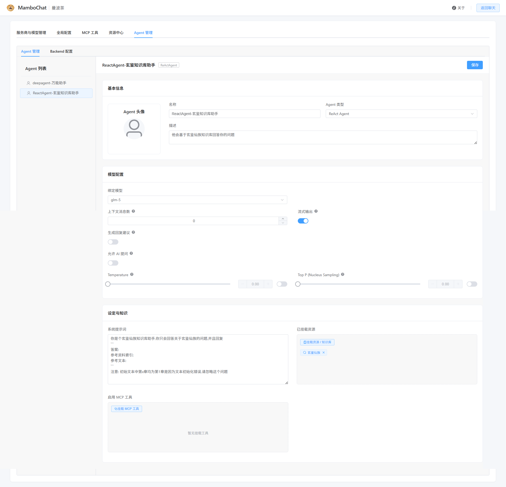

(3) 为 Agent 配置资源：挂载知识库、Skill 技术包、MCP 服务器等扩展能力。

<!-- TODO: 截图: Agent 资源挂载面板 -->


### 使用 Agent

在会话设置中启用 Agent，或在新建会话时直接关联 Agent。启用后，该会话的所有对话将由 Agent 驱动，自动调用工具完成复杂任务。

<!-- TODO: 截图: 在会话中启用 Agent -->
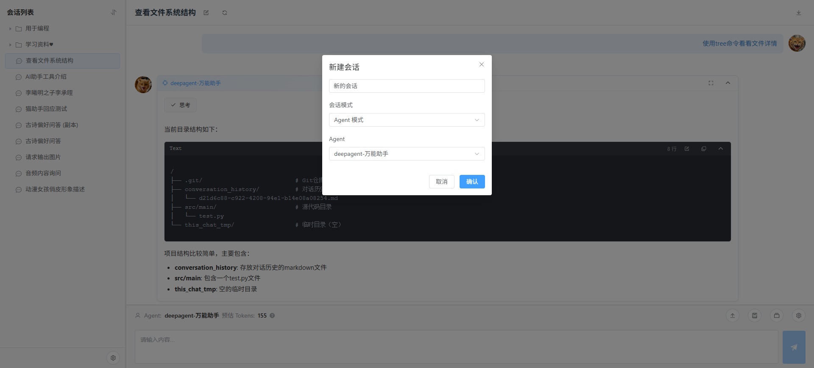

<!-- TODO: 截图: Agent 执行任务时的工具调用过程展示 -->
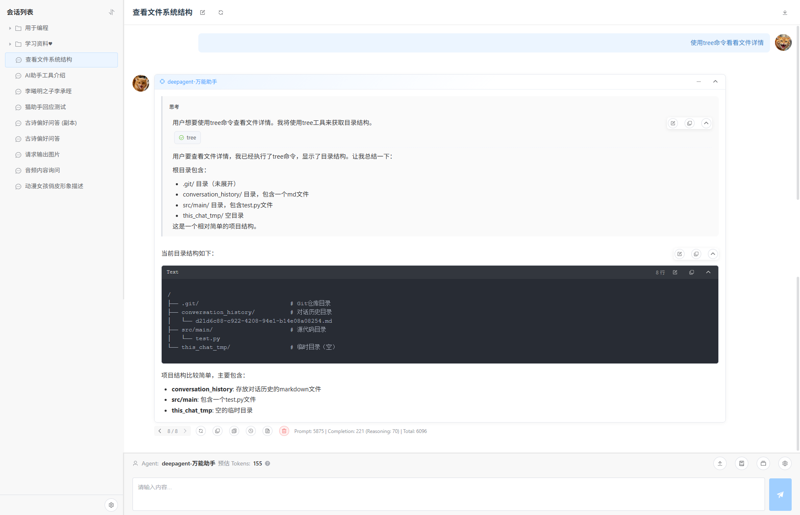

### Deep Agent 特有功能

- **Human-in-the-Loop (HITL)**：可在工具执行前弹出审核请求，由用户确认或拒绝后再继续。
- **Ask User**：Agent 可主动向用户提问获取信息（文本回答或多选）。

<!-- TODO: 截图: HITL 工具审核弹窗 -->
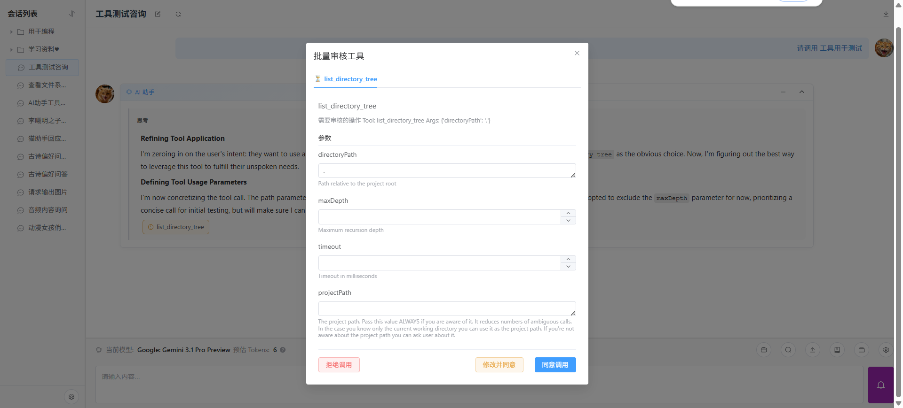

<!-- TODO: 截图: Ask User 提问交互 -->
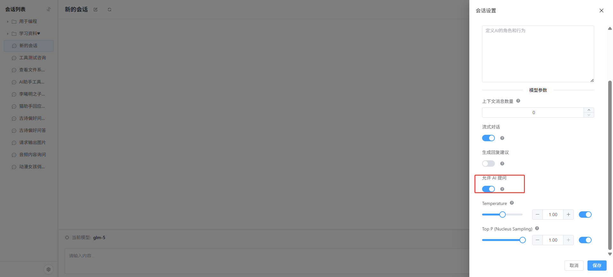

---

## 7. 远程 Backend 配置

远程 Backend 让 Deep Agent 能够访问外部环境（如 Linux 服务器或本地电脑），进行文件读写和命令执行。

### SSH Backend — 连接远程服务器

(1) 在配置页面的"Backend 管理"中新增 SSH 类型 Backend。

<!-- TODO: 截图: 新增 SSH Backend -->


(2) 填写连接信息：主机地址、端口、用户名、认证方式（密码或密钥）。

<!-- TODO: 截图: SSH 连接信息填写 -->


(3) 测试连接成功后，将该 Backend 关联到 Deep Agent 即可使用。Agent 将通过 SFTP/SSH 远程读写文件、执行命令、浏览目录结构。

> **注意**：可配置编辑白名单/黑名单限制 Agent 可操作的目录范围，保障安全。

### API Client — 本地反向连接

如果希望 Agent 操作的是你本地电脑的文件（而非远程服务器），或者你的机器没有公网 IP，可以使用 API Client 模式：

(1) 在服务端配置页面新增 API 类型 Backend，记录生成的 `backend-id` 和 `api-key`。

<!-- TODO: 截图: 新增 API Client 类型 Backend -->
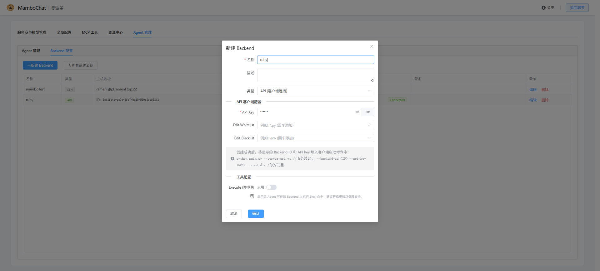

(2) 在本地电脑上运行客户端程序（位于项目 `client/apibackend/` 目录）：

```bash
cd client/apibackend
pip install -r requirements.txt
python main.py --server-url ws://<你的服务器>:24911 --backend-id <backend-id> --api-key <key> --root-dir <要暴露的目录>
```

(3) 客户端连接成功后，Deep Agent 即可像操作远程服务器一样操作你本地的文件系统。

<!-- TODO: 截图: API Client 运行状态与连接成功提示 -->
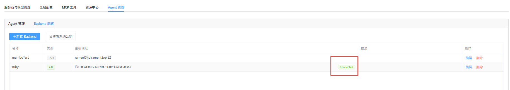
