## 1. AI 模型与服务商配置

### 配置服务商及模型
(1) **进入配置页面**

点击页面左下角的配置按钮（齿轮图标），进入系统配置页面。  
   
(2) **新增服务商**

在"服务商管理"区域点击"新增服务商"，填写服务商名称、API Host 和 API Key 等信息。

  


(3) **配置模型参数**（可选）

创建服务商后，可以进一步配置模型参数。OpenRouter 平台的 models 接口返回的模型信息较为详尽，通常无需额外手动配置；对于其他平台，建议在此步骤中补充模型参数或启用多模态的图片输入功能。

> **模型能力自动识别**：接入 GLM（`api.z.ai` / `open.bigmodel.cn`）、DeepSeek（`api.deepseek.com`）、Kimi（`api.moonshot.cn`）等服务商时，系统会根据 API Host 域名自动识别模型能力（上下文长度、是否支持看图、是否支持思考模式），通常无需手动填写；其他平台仍建议手动补充。

也可以点击"获取模型"按钮从服务商拉取模型列表并批量导入，模型列表会展示"上下文"与"模态"列，方便核对能力信息。模型的思考模式等特殊参数没有独立开关，通过"动态参数"配置（如 DeepSeek Thinking Type），可在会话设置或 Agent 编辑器的模型配置中启用。


---

## 2. 进行会话

### 基础操作

(1) **新建会话**

在左侧会话列表中点击右键，选择"新建会话"；


(2) **会话设置**

Web 界面（桌面布局）中，点击输入区上方工具栏的"设置"图标（移动端为标题栏右侧的设置按钮），可以为当前会话修改模型、配置系统提示词（System Prompt）、上下文消息数量、流式对话、生成回复建议、允许 AI 提问等，并可通过"动态参数"区配置模型支持的扩展参数（如 DeepSeek 思考模式）。


(3) **文件夹分组管理**

右键点击会话列表可创建文件夹，通过拖拽将会话放入不同文件夹进行分组管理。


### 多模态对话

(4) **多模态上传与多模态解析**

发送图片前需要确保当前模型已启用图片输入模态：在模型配置中将输入模态设为包含 `image`。之后即可在输入框旁上传图片，AI 将对图片内容进行分析和回复。  
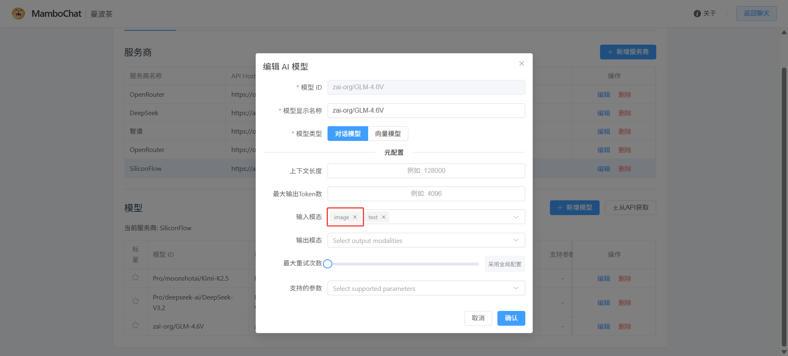  


同理,在配置 `file` 模态 及 `audio` 等多模态后,多模态模型可以响应PDF文件和多媒体文件
> 注意:需要模型本身支持  

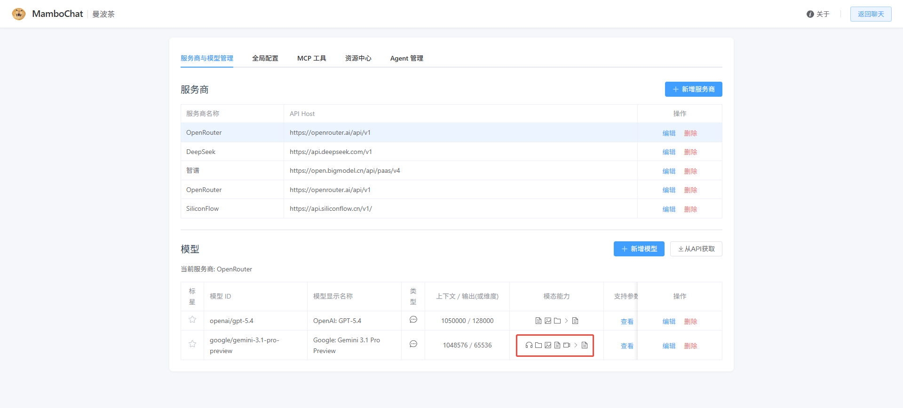  
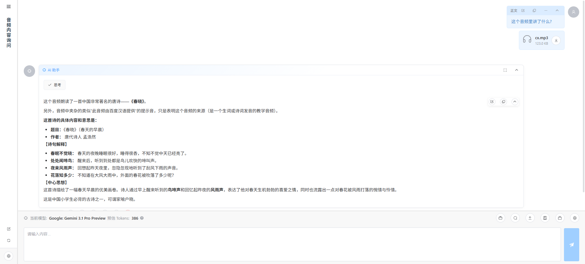  

(5) **文件上传与多模态输出**

对于文本类型文件,无需大模型支持文件模态,平台内部将会将其转为纯文本模式传入,同时我们也支持生图模型输出图片。

  

### 高级对话功能

(6) **消息分支编辑**

编辑用户消息并选择`保存并重新生成`或点击ai消息的`重新回答`时，系统不会覆盖原始内容，而是生成一条新的消息分支。可以通过消息上的分支切换按钮在不同版本之间切换，完整保留对话历史。


(7) **上下文压缩**

当对话过长导致 Token 消耗增加或注意力稀释时，可以使用上下文压缩功能。压缩提示词可在全局配置中自定义。触发后系统将自动摘要历史对话，释放上下文空间。


(8) **会话复制与归档**

- **复制会话**：可将当前会话复制到指定消息处，基于已有对话进行新的探索。
- **批量归档**：选中多个会话后统一移动到指定文件夹。

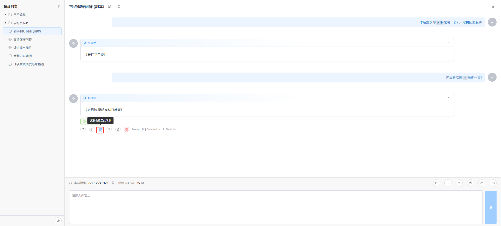  
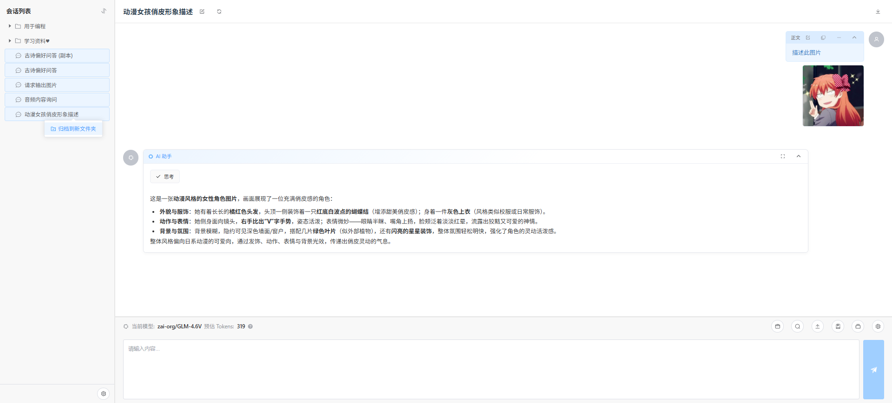  

(9) **联网搜索**

点击工具栏的"联网搜索"按钮可循环切换三种模式：关闭 / 仅读取网页 / 搜索+读取。开启后，AI 可以自行检索网页并阅读内容来回答。会话级设置优先，未设置时使用全局默认模式（见[全局配置](#3-全局配置)）；网络请求支持走代理访问受限站点。
- 仅读取网页  
  
- 利用DGGS进行检索 + 读取网页  
   

(10) **会话导入导出**

点击标题栏右侧的下载图标，可以：
- **导出 JSON**：将会话导出为 JSON 文件（含文件附件），用于备份与迁移
- **导出 Markdown / HTML**：导出为便于阅读的文档格式
- **导入 JSON**：选择导出的 JSON 文件导入，导入后生成新会话并置于根目录（重名自动添加后缀）  
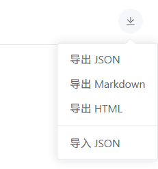  

(11) **报文查看**

点击 AI 消息操作栏的"查看日志"按钮，可以查看该消息的底层报文日志，包括发送给大模型的原始请求报文（Payload）与运行元数据（MetaData），便于深入理解 Agent 的逻辑。  
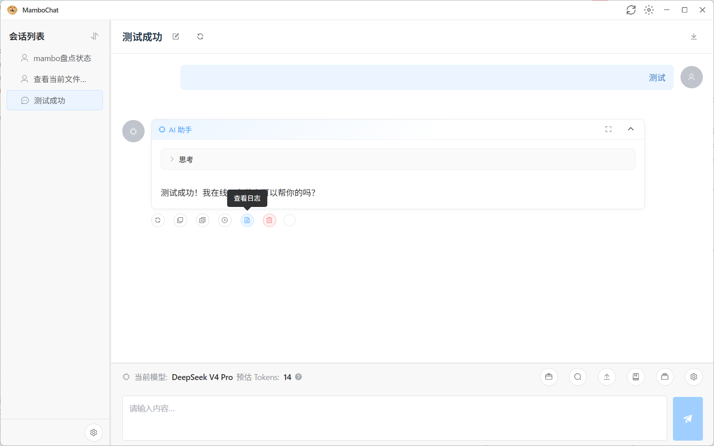  
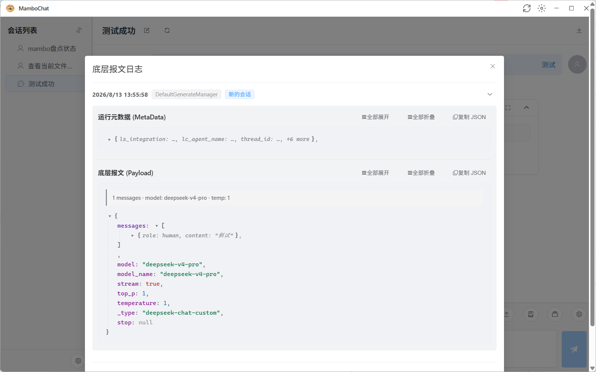  

---

## 3. 全局配置

全局配置页面用于设置系统级默认参数，包括：

- 默认模型 / 标题生成模型
- 默认温度、Top P、最大重试次数等 LLM 参数
- 新会话默认参数（上下文消息数量、流式对话、回复建议、允许 AI 提问等）
- 网页搜索：默认模式（不启用 / 仅读取网页 / 搜索并读取）与是否使用全局代理
- 对话历史压缩：自定义"生成压缩历史 System Prompt"（留空使用默认提示词）
- 全局代理地址（启用代理 / 代理 URL / 测试连接）
- 用户头像与 AI 头像
- 编辑器偏好（普通文本框 / Monaco Editor）、消息显示模式（堆叠 / 交错）
- 发送消息快捷键（Enter / Ctrl+Enter）
- 界面语言（中文 / English）
- 数据库维护：清理 Checkpoints 数据库

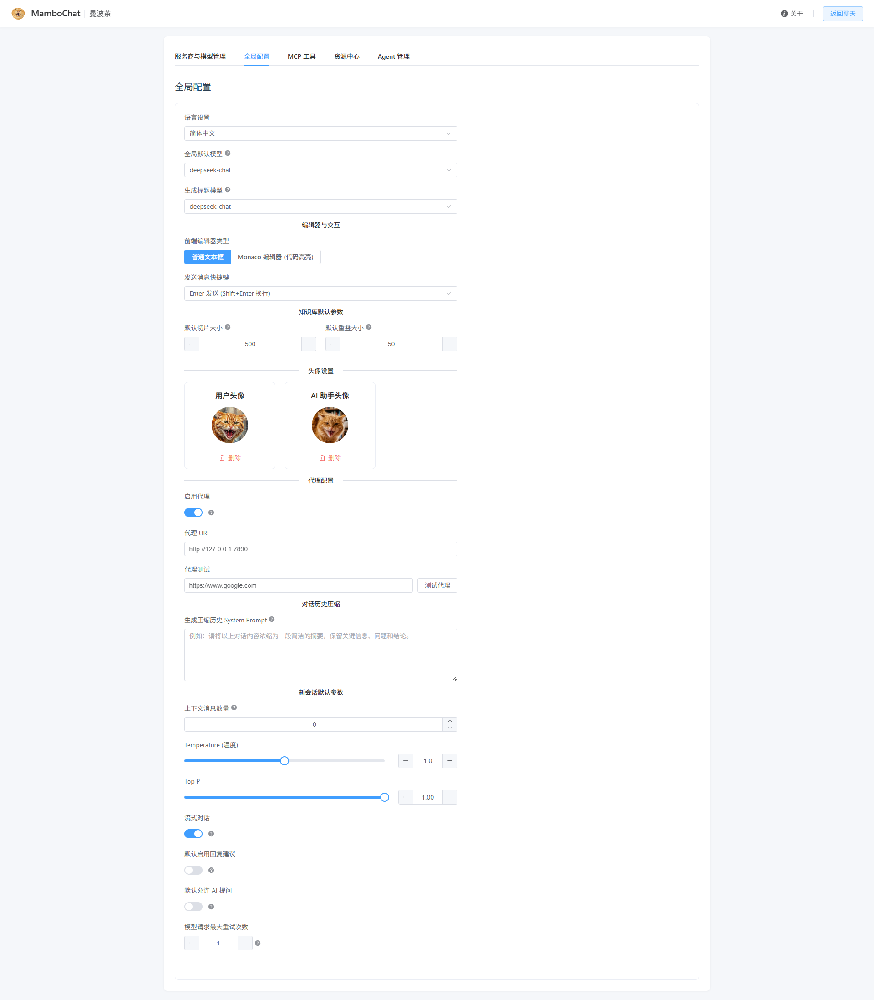

---

## 4. 资源库功能

### 系统提示词资源

(1) **新建资源**

在资源中心创建一个新的系统提示词资源，编写内容并保存。


(2) **挂载资源**

在会话设置中，将已创建的系统提示词资源挂载到当前会话。当系统提示词逻辑复杂且需要在多个会话间复用时，此功能尤为便捷。


(3) **版本控制**

资源支持版本管理与回滚，你可以主动保存为新版本，并可随时回退到历史版本。


### 消息模板资源

消息模板是一种更高效、特殊的 System Prompt——它将被插入到最新一轮用户消息中，使模型注意力高度集中在模板设定的内容上。这对某些注意力相当涣散的模型如GEMINI尤为有效;

(1) **原理说明**

大模型的注意力天然集中在上下文的头部和尾部，中间部分容易被忽略。MamboChat 的消息模板将关键设定放在最新消息中，且可通过"参与长度"控制其生效轮次（设为 1 时仅当前轮生效），从而在不增加历史冗余的前提下强化特定设定。

> 注意: 若是长程持续生成任务,使用此功能将会使得缓存命中率显著下降,这是因为最新的一对问答对的KvCache会被此功能破坏

(2) **新建与挂载**

创建消息模板资源后，在会话页面的输入框上方挂载该模板即可生效。


(3) **灵活使用**

随着会话进行，可以在输入框上灵活切换挂载的消息模板。例如：仅在需要代码输出时挂载代码规范的相关模板，而在规划架构时取消挂载。


### Skill 技能包

Skill 是用于扩展 [Agent](#7-agent-配置与使用) 能力的技能包，可以定义一组工具、提示词和工作流程。

(1) **创建 Skill**

在资源中心新建一个 Skill 类型的资源，按照[规范](https://agentskills.io/what-are-skills)编写 Markdown配置文件定义技能的行为。

  
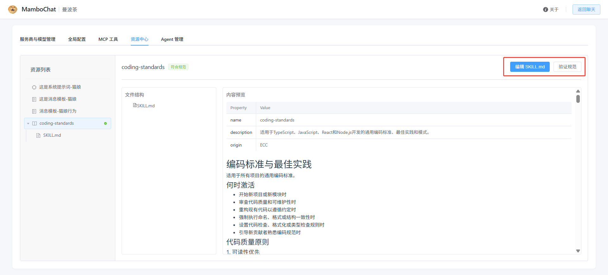  
(2) **导入 Skill**
新建 SKILL 对话框提供三个选项卡：手动创建 / 文件与文件夹导入 / GitHub 导入。
- **文件/文件夹导入**：上传本地 `.md` / `.zip` 文件或选择文件夹，支持导入预览与同名冲突处理（覆盖 / 跳过），并支持批量导入（一次导入多个 Skill）
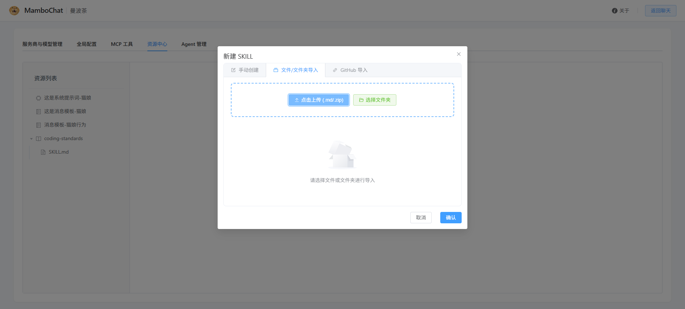
- **GitHub 导入**：从 GitHub 仓库 URL 导入（支持 `owner/repo` 或 `npx skills add owner/repo` 形式）  
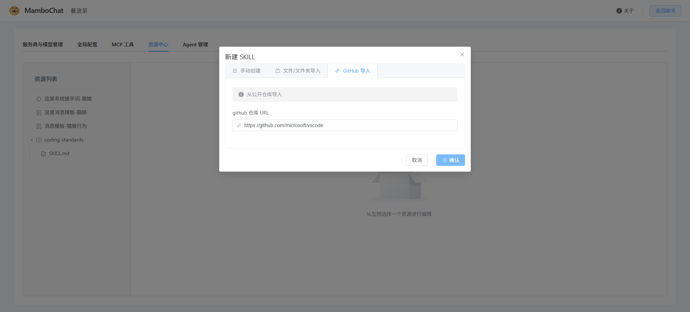  


导入的 Skill 支持"验证规范"检查与 SKILL.md 内容预览/编辑。

(3) **挂载到 Mambo Agent**

创建完成后，在 Agent 设置中将 Skill 挂载即可让该 Agent 使用技能。  


---

## 5. 知识库

(1) **配置向量模型**

首次使用知识库前，需在全局设置中配置一个 Embedding 向量模型。如需支持其他维度，可修改后端 `kb_service.py` 中的 `SUP_DIM` 并重启服务。


(2) **创建知识库并上传文档**

创建知识库后，可上传 Markdown、TXT、PDF、Word 等多种格式的文档。

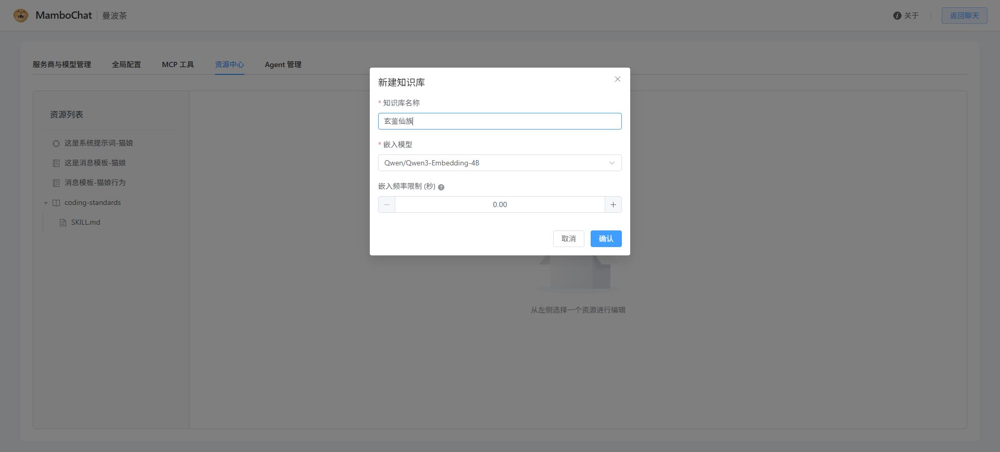  
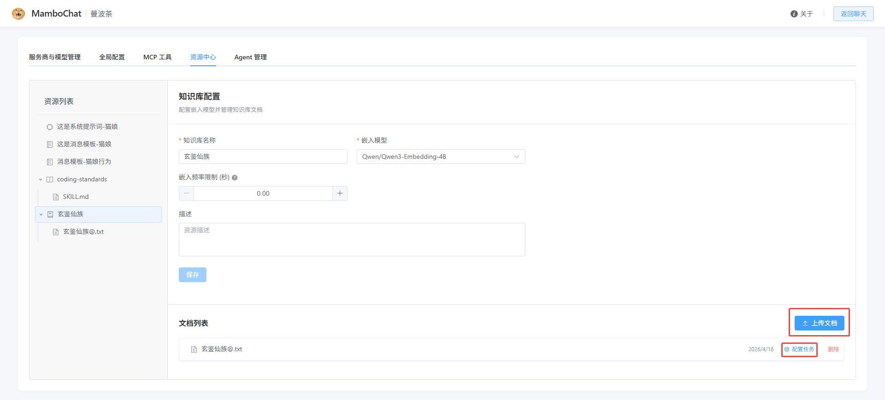

(3) **配置切分策略并启动嵌入**

为知识库配置文档切分策略（切片大小、重叠长度等），启动向量化嵌入任务并等待完成。


(4) **验证检索效果**

使用检索测试功能验证切分效果是否正常。系统采用 BM25 + 向量检索 + RRF（倒数排名融合）混合检索算法，兼顾关键词匹配与语义相似度。
在会话页面->从资源库选择->知识库检索  


(5) **AI 自行检索（推荐）**

无需手动执行检索，只需将知识库挂载到会话，AI 助手会在需要时自动调用知识库进行检索并生成回答。支持同时挂载多个知识库。


---

## 6. MCP 工具

MCP（Model Context Protocol）是一种标准化协议，允许 AI 模型通过统一接口调用外部工具和服务。通过配置 MCP 服务器，可以为 [Agent](#7-agent-配置与使用) 扩展丰富的工具能力。

### 新增 MCP 服务器

(1) **进入 MCP 管理页面**

在系统配置页面的"MCP 管理"区域，点击"新增"按钮。  
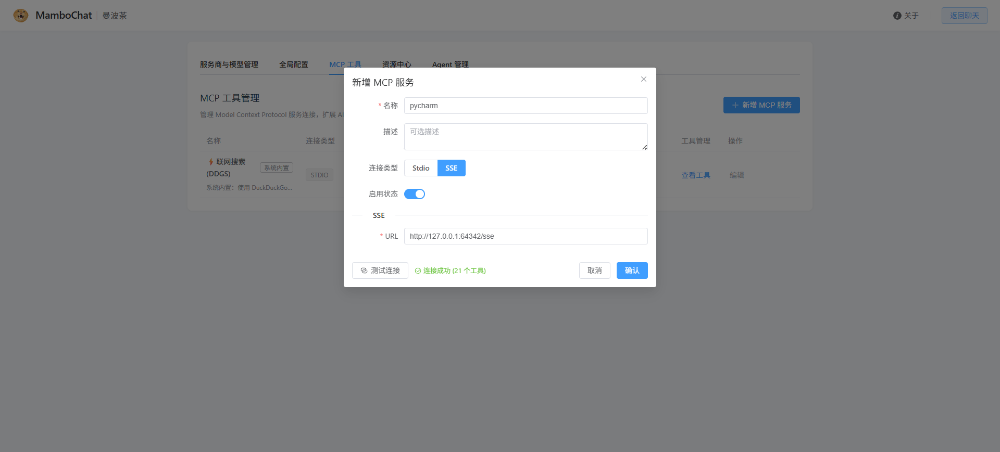  
(2) **选择传输类型并填写配置**

MCP 支持三种传输方式：

| 传输类型 | 说明 | 适用场景 |
|---|---|---|
| **Stdio** | 通过本地命令启动子进程通信 | 本地运行的 MCP 服务（如 Python/Node 脚本） |
| **SSE** | 通过 HTTP Server-Sent Events 通信 | 远程或已作为服务运行的 MCP 服务端 |
| **Streamable HTTP** | 通过 HTTP 流式接口通信 | 支持 Streamable HTTP 协议的 MCP 服务端 |

- **Stdio 类型**：需填写 `Command`（执行命令，如 `python`、`node`、`uvx`）、`Args`（命令参数）、`Env`（环境变量，如 API Key 等）和 `Cwd`（工作目录）
- **SSE / Streamable HTTP 类型**：需填写服务的 `URL` 地址，可选配置 `Headers`（请求头）、`Timeout` / `SSE Read Timeout`（超时）以及"启用全局代理"

(3) **测试连接**

填写完成后可点击"测试连接"按钮验证配置是否正确。测试成功后会显示该服务器提供的工具数量。

### 管理 MCP 服务器
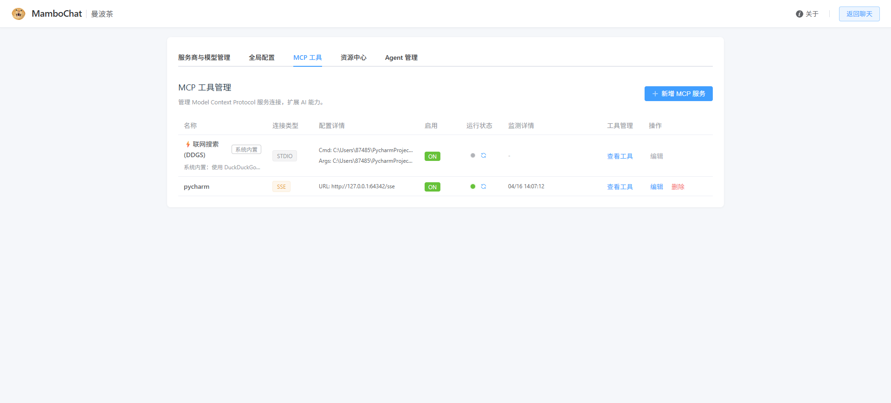  
MCP 服务器列表展示所有已配置的服务器信息，包括：

- **名称与描述**
- **传输类型**（STDIO / SSE / HTTP）
- **启用状态**（ON / OFF）
- **健康状态**：绿色表示健康，红色表示异常，可通过刷新按钮重新检测
- **最后测试时间与错误详情**：连接失败时可查看具体错误堆栈

### 管理工具
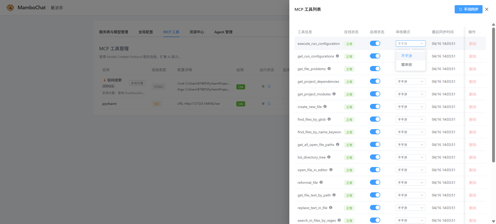  
每个 MCP 服务器可以暴露多个工具。点击"查看工具"打开工具管理抽屉：

- **同步工具**：从 MCP 服务器拉取最新的工具列表
- **工具信息**：显示工具名称、描述和输入参数 Schema
- **在线状态**：标识工具是否可用（online / offline）
- **启用/禁用**：通过开关控制单个工具是否对 Agent 可见
- **审核模式**：
  - `none`：工具可直接被 Agent 调用，无需确认
  - `require_review`：Agent 调用该工具前需要用户确认（Human-in-the-Loop）
- **删除工具**：移除不需要的工具（仅离线工具可删除）

> **MCP 智能接入**：Agent 挂载 MCP 服务器后，工具的暴露方式由 Agent 配置中的"MCP 直连工具阈值"决定（默认 15）——工具数量低于阈值时直接暴露给 AI，超过阈值时自动切换为按需查询模式，避免撑爆提示词。

### 在 Agent 中使用

创建完 MCP 服务器并确保其健康状态正常后，在 [Agent](#7-agent-配置与使用) 配置中将该 MCP 服务器挂载即可。挂载后 Agent 将自动获取该服务器下所有已启用的工具，并在对话中根据需要调用。


### 在 Chat 中使用
在会话页面-普通模式,点击查看工具按钮选择使用  
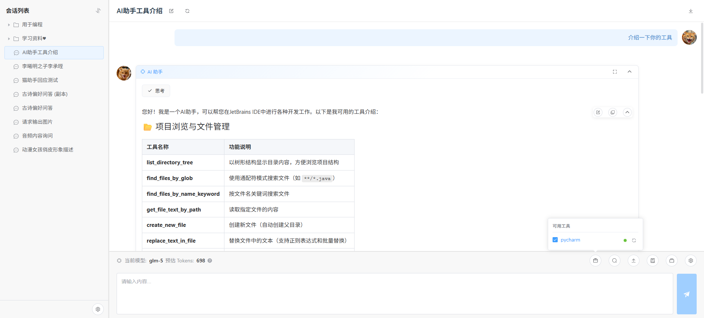

---

## 7. Agent 配置与使用

Agent 是 MamboChat 的核心能力，提供两种类型的智能体：

| 类型 | 说明 | 适用场景 |
|---|---|---|
| **[Mambo Agent](https://github.com/RAmenLch/mambo_agents)** | 具备文件读写、命令执行、嵌套子智能体调用等能力的复杂功能型 Agent，支持实时文件展示、AI 安全预审、长期记忆、对话自动压缩、资源版本快照等能力 | 代码开发、远程服务器运维、复杂任务执行 |
| **ReAct Agent** | 基于工具调用的推理型 Agent，可挂载知识库、MCP 工具、Skill 等扩展能力 | 需要调用搜索、知识库、MCP 工具等完成任务 |

### 创建 Agent

(1) 进入配置页面的"Agent 管理"区域，Agent 以树形目录组织（支持文件夹分类），点击"新建 Agent"创建。


(2) 选择 Agent 类型并完成基础配置：绑定模型、配置系统提示词、挂载资源 / MCP 工具等扩展能力。


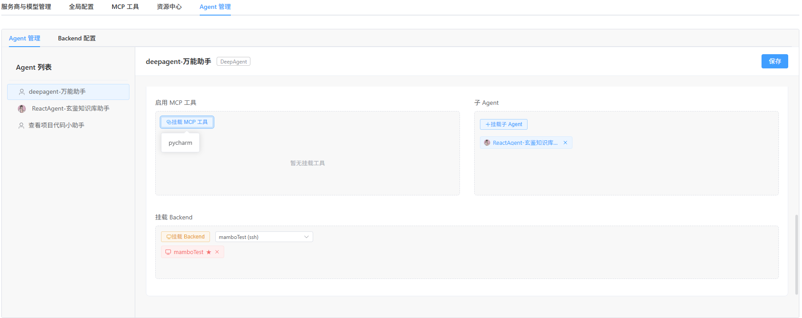

### 使用 Agent

在新建会话时直接关联 Agent。启用后，该会话的所有对话将由 Agent 驱动，自动调用工具完成复杂任务；工具调用过程以气泡形式展示。


> **Mambo Agent 的专属能力（实时文件展示、AI 安全预审、长期记忆、对话自动压缩、资源版本快照、MCP 智能接入等）、导入导出 `.mamboagent` 包，以及 Backend（SSH / API / Resource / Local）配置，详见 [Mambo Agent 使用教程](MamboAgent.md)。**


## 8. 会话中断-人为干预
- **Human-in-the-Loop (HITL)**：可在工具执行前弹出审核请求，由用户确认或拒绝后再继续（支持"同意调用 / 修改并同意 / 拒绝调用"，多个工具可批量审核）。
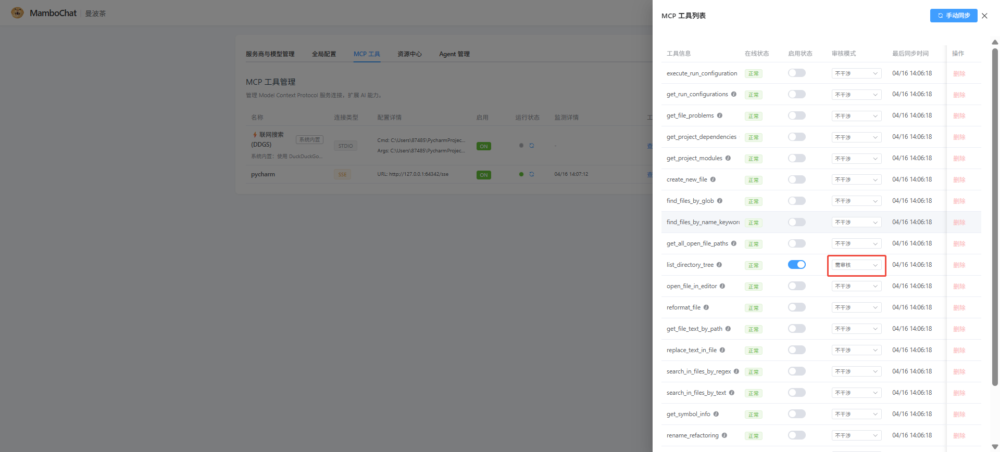  
  
- **AI 安全预审**：Mambo Agent 可配置 AI 安全审核（见 [Mambo Agent 使用教程](MamboAgent.md)），AI 先预审工具调用，危险操作会以 🛡️ 徽标展示审核结果（通过 / 未通过）后才需要你确认。
- **Ask User**：Agent 可主动向用户提问获取信息（文本回答或多选）。
  
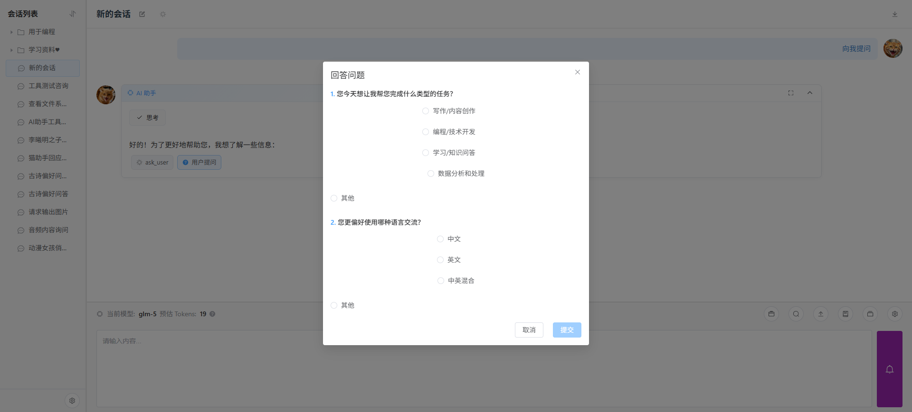  

## 9. mambo 命令行工具

`mambo` 是 MamboChat 自带的命令行工具，可以像操作文件系统一样管理服务商/模型、资源、Skill、MCP 与 Agent 配置，适合在终端中快速配置，也可以直接交给 LLM 使用。

### 启动与连接

- 桌面客户端内置 `mambo` 命令；源码环境可使用 `python -m backend.mambo_cli`
- 默认连接 `http://127.0.0.1:8000`，可通过 `--base-url` 参数或环境变量 `MAMBO_BASE_URL` 指定其他地址

```bash
mambo --base-url http://<服务器>:8000 <domain> <action> [options]
```

### 子命令概览

| 领域 | 常用操作 |
|---|---|
| `provider` | list / add / update / delete / test（测试连通性） |
| `model` | list / add / update / delete / set-default（设置默认模型，自动补全模型能力信息） |
| `settings` | get / set / unset（全局设置） |
| `resource` | ls / cat / write / mkdir / mv / rm / find（像文件系统一样管理资源） |
| `skill` | list / create / validate / import / delete |
| `mcp` | list / add / update / delete / test / sync / tools（同步与开关工具） |
| `agent` | list / create / update / mount / export / import（`.mamboagent` 包）/ subagent |
| `backend` | list / add / update / delete / test / ssh-key（查看系统 SSH 公钥） |

### 常用示例

```bash
# 列出全部资源
mambo resource ls /

# 导出 Agent 为 .mamboagent 包
mambo agent export 我的Agent --output ./my-agent.mamboagent

# 导入 Agent 包
mambo agent import --file ./my-agent.mamboagent

# 查看系统 SSH 公钥（配置免密登录）
mambo backend ssh-key

# 同步 MCP 服务器工具列表
mambo mcp sync my-mcp-server
```

> 引用规则：名称/路径优先，UUID 兜底；resource 与 agent 支持 `/目录/名称` 路径寻址。
